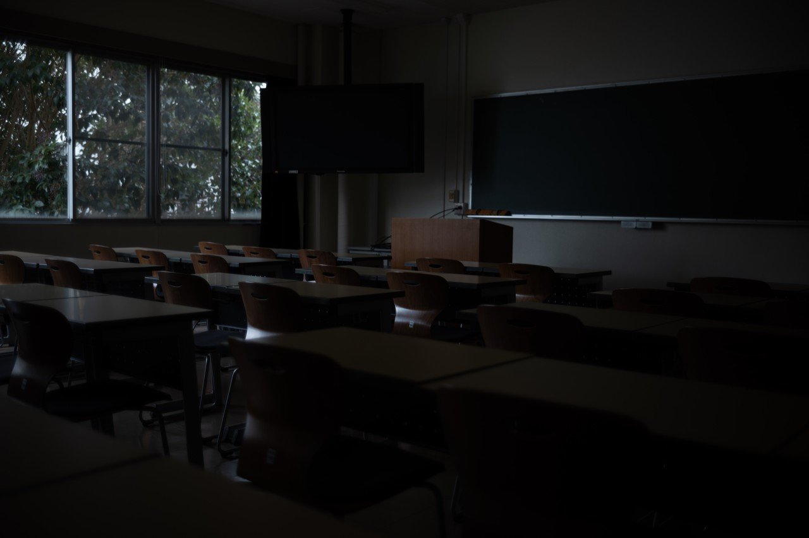
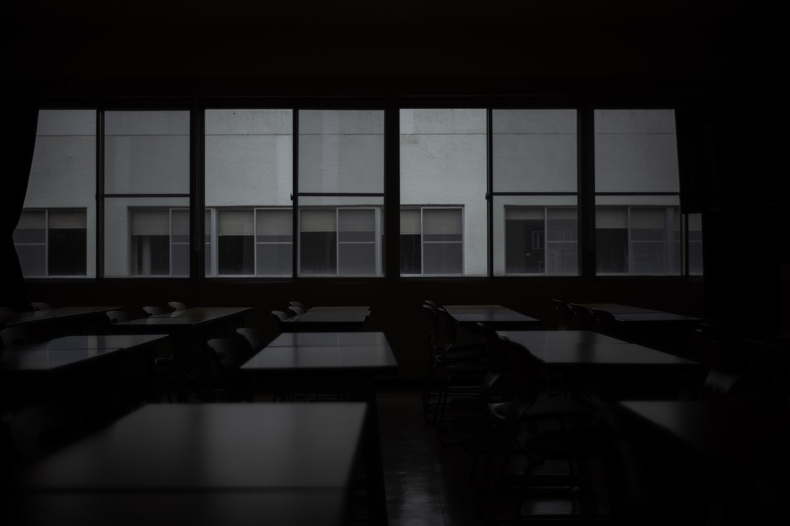
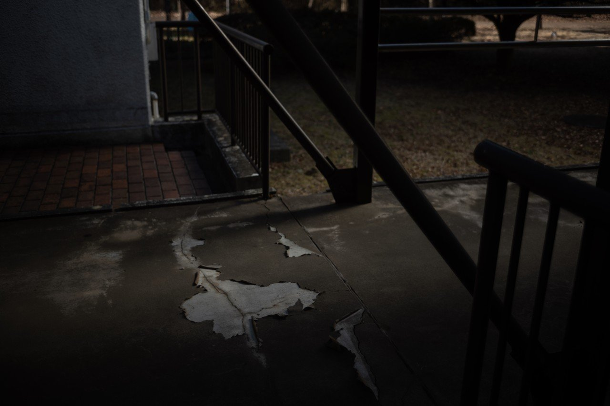
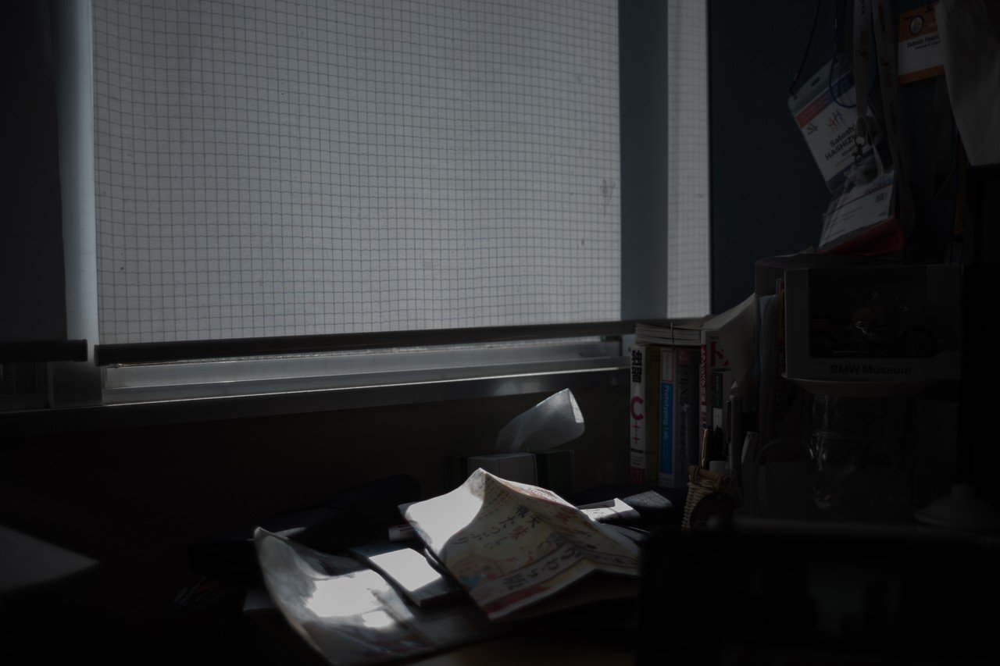
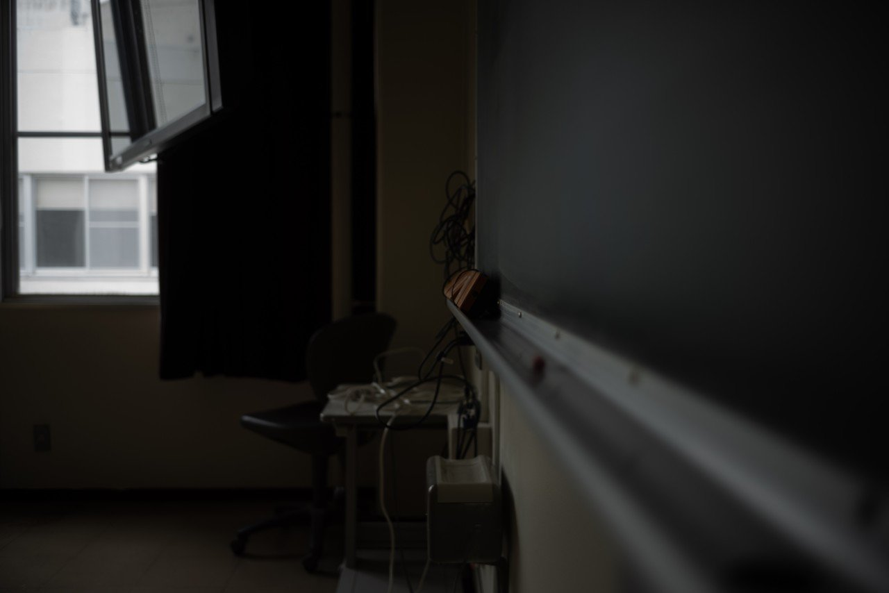
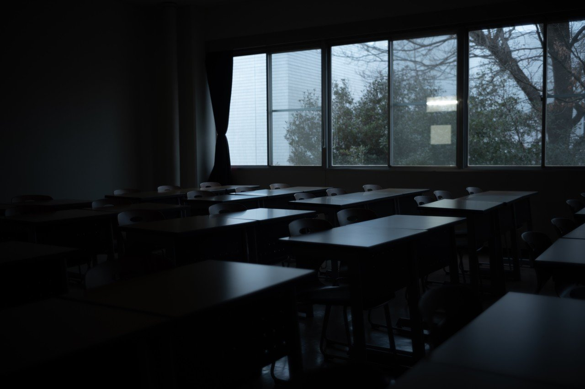

# どうして教室や学校の風景にエモさを感じてしまうんだろう

121

[%22%20d%3D%22M-100-100h300v300h-300z%22%2F%3E%3C%2Fsvg%3E)](/ochyai)

[落合陽一](/ochyai)

2019年1月17日 11:53

購読中

 そこに自分がいたわけではないのに，記憶と感覚を動かされる様式がある．    日本というローカルを作る要素としての様式としての学校．廊下と窓のフレーム． 窓の向こうが見えているわけではないのに，ブラインドの向こうを想像する． 人はいないのに窓の外を眺めていた授業中を思い出す． 廊下側の席に座った記憶が蘇る．ここにいたわけではないのに． 漏れる光の柔らかさと廊下の長さから行き交う人々を想起する． ゼミ室の雑多さから生活を思い出す． 老朽化した床に人の刻み込んだ蓄積を感じる． ここを走ったときの靴の裏の感覚を思い出す．ここを走ったことはないのに． 日差しの中に眠気が蘇る． このロッカーにものを詰めたことはないのに．あのゴミ袋に入っているものは知らないのに． 何が書かれて消されたのかは知らないのに，一人一人の頭の中には書いて消した風景がある． 整然とした机というフレームにはまっていた自分を想起するメディアとしての様式美があるのかもしれない．

## 高評価して応援しよう！

高評価

%22%20d%3D%22M-100-100h300v300h-300z%22%2F%3E%3C%2Fsvg%3E)%22%20d%3D%22M-100-100h300v300h-300z%22%2F%3E%3C%2Fsvg%3E)%22%20d%3D%22M-100-100h300v300h-300z%22%2F%3E%3C%2Fsvg%3E)

3人

  

* [#写真](https://note.com/hashtag/写真)
* [#落合陽一](https://note.com/hashtag/落合陽一)
* [#落合陽一公式](https://note.com/hashtag/落合陽一公式)

121

1

いつも応援してくださる皆様に落合陽一は支えられています．本当にありがとうございます．

チップで応援

[%22%20d%3D%22M-100-100h300v300h-300z%22%2F%3E%3C%2Fsvg%3E)](/ochyai)

[落合陽一](/ochyai)

フォロー中

メディアアーティストで光や音や物性や計算機メディアの研究をしているような感覚的物書きで博士持ちのスナップ写真家です．多様性社会を目指す波動使いの准教授．noteは作家としての個人的な発信です．ご連絡はリンク先のお問い合わせまで．　<https://yoichiochiai.com>