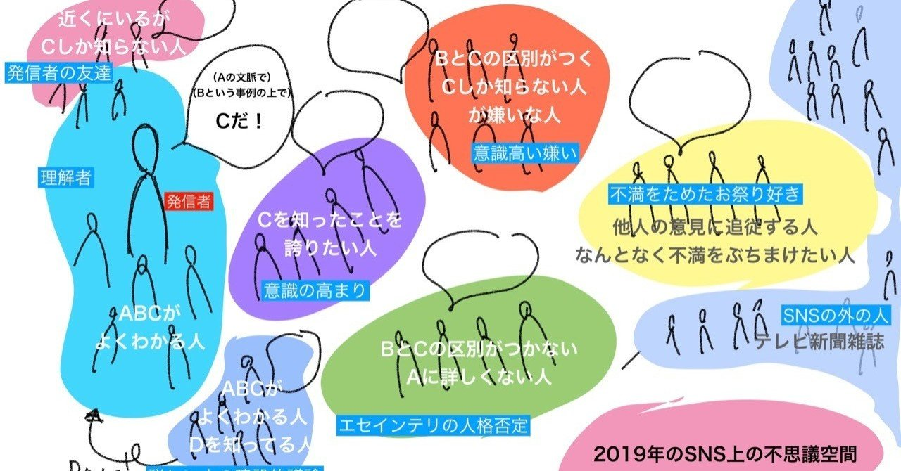

  

# なぜSNS上で文脈にそぐわない切り取られ方をされて燃え始めるのか考えてみた（随時更新）

681

[%22%20d%3D%22M-100-100h300v300h-300z%22%2F%3E%3C%2Fsvg%3E)](/ochyai)

[落合陽一](/ochyai)

2019年1月17日 12:22

購読中

[**落合陽一の見ている風景と考えていること｜落合陽一｜note**
*落合陽一が日々見る景色と気になったトピックを写真付きの散文調で書きます．落合陽一が見てる景色や考えてることがわかるエッセイ*
*note.mu*](https://note.mu/ochyai/m/m41f58d360230)

落合陽一です．最近身の回りの方々が文脈にそぐわない切り取られ方をしてSNSで叩かれることが増えたなぁと思うようになったので情報発信とそれにまつわる人々の構図を考えていました．なんか腹落ちしたところもあったのでシェアします（異論反論新しい考え方投げ入れ歓迎）

**追記，西尾さん解説**

[**新概念の伝播 - 西尾泰和のScrapbox***なぜSNS上で文脈にそぐわない切り取られ方をされて燃え始めるのか考えてみた（随時更新）｜落合陽一｜note https:/**scrapbox.io*](https://scrapbox.io/nishio/%E6%96%B0%E6%A6%82%E5%BF%B5%E3%81%AE%E4%BC%9D%E6%92%AD)

最近身の回りでよくある光景を図示してみます（手書きですみません）

まず赤でラベル付けした**「発信者」（左端）**が情報を発信します．この人は**「Aという業界なり文脈の人」で，「（その業界ではよく知る）Bという事例」などを知った上で「Cだ！」という発言やら表現やらをします．**これは同じ業界の人たちの間で広く共有されている「A」や「B」がある場合はよくある事例です．改めて「A」や「B」の説明はされないことはほとんど．「A」を学ぶのにはそれなりに体系だった知識が必要で，「B」はググったりすればすぐ出てくる事例で，たとえば文脈「A」を勉強して事例を追いかけていれば「B」と「C」の区別はつくのだけれどぱっと見の印象だと「B」と「C」の区別がつかない．査読するときとかはBとCの区別が大切になるのですが，それを含め青い領域の人々は日々考えながらAの領域を練り上げています．

それでもフォロワーが少ないうちは青い領域から出てこないので周りと意見交換しながら建設的に話が進みます．**時折出てくる詳しい人は間違ってたら情報を提供するなり新しい切り口を教えてくれるなりします（下の薄紫の領域）．**これは他分野の人とコラボが始まったり良い事例です．翻訳者が出てきたりします．しかし，説明し尽くす時間はないし，テレビメディアの時間制限のようなものでもあり，それがあらゆる文脈を懇切丁寧に説明されるには字数制限のあるSNSメディアは向いていません．

SNS上のフォロワーは取捨選択が難しいので，徐々に紫色のラベル付けした人が増えていきます．**紫の人たちは自称情報感度が高い人たちなのですが，自分の中で考えを反芻したりしないので，AやBのことを無視してCだけに飛びつきます．この紫にリーチして彼らの動きが見えるようになってくるとそれを快く思わないオレンジと緑の領域の人が出てきます．**最近こんなことをぼんやり考えていたのでtwitterにつぶやいていました．

**オレンジの人とは本当は仲良くできるはずなんだけど，紫が溜まると仲良くなりにくくなる．これはなかなか難しい．緑の人々はすでに自分の専門分野での知見に頭がいっぱいになってるのでAの文脈について理解しにくく，BとCの違いがわからない**から自分の価値基準でマウンティングをとることが多いんですが**，字数制限のない世界で話せばそんなに意見の相違は発生しないという実感**があります．しかし，何か自分の分野への鬱屈した思いなのか緑の領域の人は比較的攻撃的なケースが多いです．

だいたい同じ業界の人たちの中では変に受け取られたりしないし，本を一冊読めば伝わるようなメッセージがなぜかSNSでは燃え始めるきっかけとなるのは**オレンジの人がネタにして喋り始めるか，緑の人が（一見正しそうに見える）誤解があるマウンティングを始めること**でしょう．でも緑の人はその業界の慣習で生きていることが多かったり，マウンティングを取ることで納得してしまうタイプの人で建設的議論を他の業界の人と始めるまでのハードルが高いことが多いです．

最近考えていることとしては，**オレンジや緑の人が人格否定しないSNSをどうやって構築できるのか？**　ということと，**オレンジの人と緑の人と仲良くなるにはどうしたらいいか**ということです．前者はきっと**そういう風習を皆で作っていく**しかないかと思うんですが，**後者は対話が必要**だと考えています．

**オレンジの人は実はあんまり遠いところにいないので，俯瞰してみれば意外と仲良くなれる．緑の人々には薄紫の領域を経由して対話するしかないのかもしれない，**と思っています．

しかし，SNSというのは広いようで意外と狭い空間なのでそこに時間が取られるくらいなら青い領域と一番右端の領域だけにリーチしてればいいんじゃないか？　という考え方もありますが，SNSのメディアの良さも感じている身なので，そういう切り捨てでなく何とか良い情報伝達の方法はないか？　と日々考えている最中だったりします．

ちなみに**一番割りに合わないのはピンクの人で，なんか一緒にいると燃えるってやつ**．一番割りに合わないのは自分がピンクの領域に入ったときだなぁと僕は思います．そういうときは黙っているのが一番だと言われていますが，本当にそうなのかなぁ？

**ちなみに黄色の領域の人々をけしかけてPVを稼いでお金を稼ぐタイプの人**が**緑色**の中によく含まれていて，**Aという文脈を本質的に理解していないが，BとCのギャップを表面上をなぞって書くことで黄色の人たちに伝えてマイナスの共感を得る．それで生計を立てたりフォロワーを獲得したりする人々がいる．この辺はネットの全体的な問題だなぁと思っていますが，それを分かった上で楽しむのがSNSなんじゃないかなぁと思うのです．ここは一人一人のリテラシーが重要だと思います．**

まだ考えがまとまってるわけじゃないのですが，とりあえずここまで共有．

**仲間を増やすことが重要な理由を考えたとき，この図でいうと「青色と薄紫の仲間」を増やしていくことが良い情報発信者になる秘訣**だからだと考えている現れなのかもしれない．

[**落合陽一の見ている風景と考えていること｜落合陽一｜note**
*落合陽一が日々見る景色と気になったトピックを写真付きの散文調で書きます．落合陽一が見てる景色や考えてることがわかるエッセイ*
*note.mu*](https://note.mu/ochyai/m/m41f58d360230)

ここから先は有料部分です

ダウンロード

 

copy

## 高評価して応援しよう！

高評価

%22%20d%3D%22M-100-100h300v300h-300z%22%2F%3E%3C%2Fsvg%3E)%22%20d%3D%22M-100-100h300v300h-300z%22%2F%3E%3C%2Fsvg%3E)

2人

  

* [#落合陽一](https://note.com/hashtag/落合陽一)
* [#落合陽一公式](https://note.com/hashtag/落合陽一公式)

681

15

いつも応援してくださる皆様に落合陽一は支えられています．本当にありがとうございます．

チップで応援

[%22%20d%3D%22M-100-100h300v300h-300z%22%2F%3E%3C%2Fsvg%3E)](/ochyai)

[落合陽一](/ochyai)

フォロー中

メディアアーティストで光や音や物性や計算機メディアの研究をしているような感覚的物書きで博士持ちのスナップ写真家です．多様性社会を目指す波動使いの准教授．noteは作家としての個人的な発信です．ご連絡はリンク先のお問い合わせまで．　<https://yoichiochiai.com>