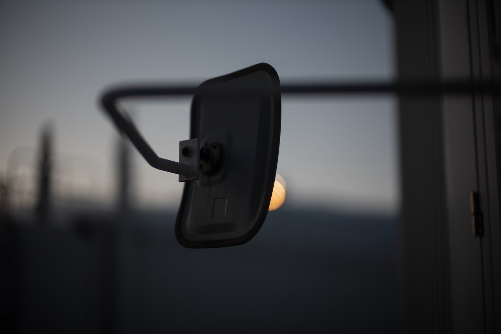
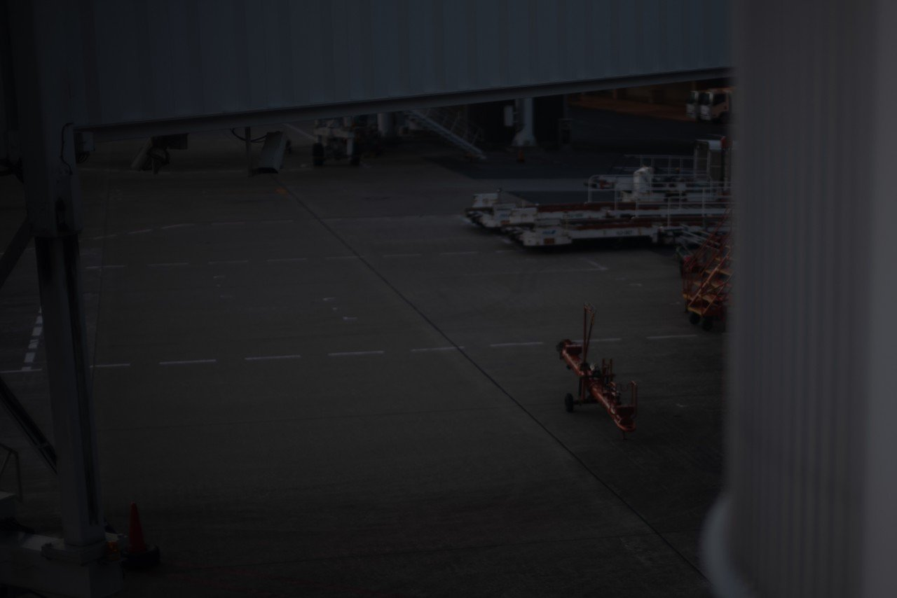
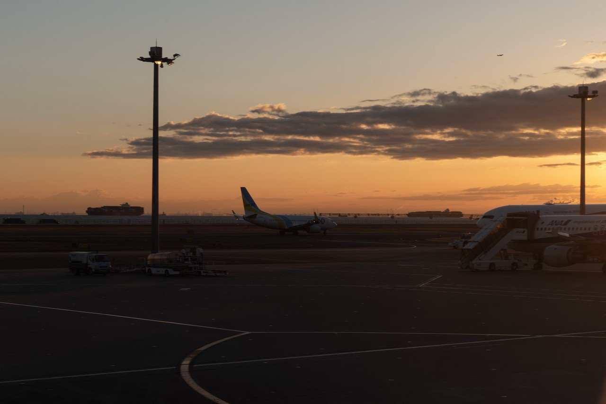
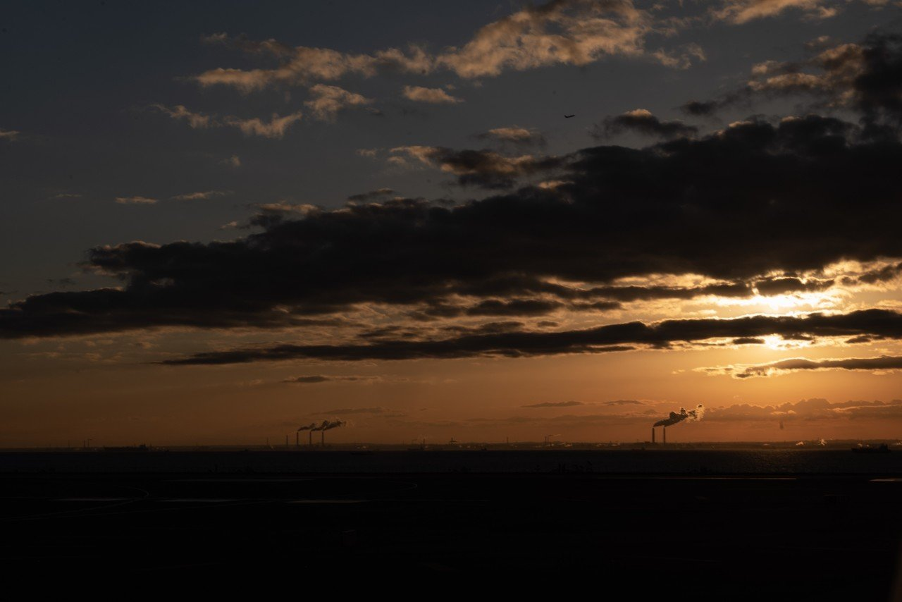
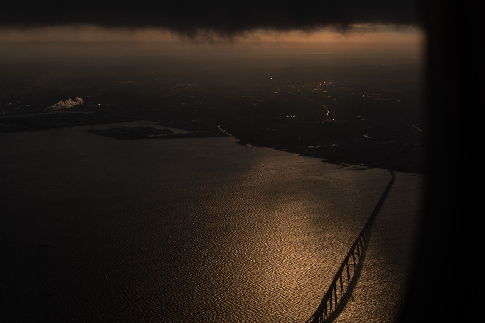

# 朝焼けの空港が好きだ

116

[%22%20d%3D%22M-100-100h300v300h-300z%22%2F%3E%3C%2Fsvg%3E)](/ochyai)

[落合陽一](/ochyai)

2019年1月21日 09:12

購読中

 朝の飛行機に乗って，朝焼けの空港から朝焼けの空へ飛び立つ瞬間が好きだ    夜明けの空港は機械の駆動音で満ちている 鉄の冷たさを感じる コンクリと燃料と鉄の地平 離陸準備が始まる 夜が明けてくる 夜明けの時間の中をいくつもの飛行機が行き交っていく とにかく空港の空は広い 飛び立てばもうすぐ雲の上だ，水面がまるで金属のような反射光沢だ そして雲の上はいつも晴れだ

## 高評価して応援しよう！

高評価

%22%20d%3D%22M-100-100h300v300h-300z%22%2F%3E%3C%2Fsvg%3E)

1人

  

* [#写真](https://note.com/hashtag/写真)
* [#落合陽一](https://note.com/hashtag/落合陽一)
* [#落合陽一公式](https://note.com/hashtag/落合陽一公式)

116

3

いつも応援してくださる皆様に落合陽一は支えられています．本当にありがとうございます．

チップで応援

[%22%20d%3D%22M-100-100h300v300h-300z%22%2F%3E%3C%2Fsvg%3E)](/ochyai)

[落合陽一](/ochyai)

フォロー中

メディアアーティストで光や音や物性や計算機メディアの研究をしているような感覚的物書きで博士持ちのスナップ写真家です．多様性社会を目指す波動使いの准教授．noteは作家としての個人的な発信です．ご連絡はリンク先のお問い合わせまで．　<https://yoichiochiai.com>