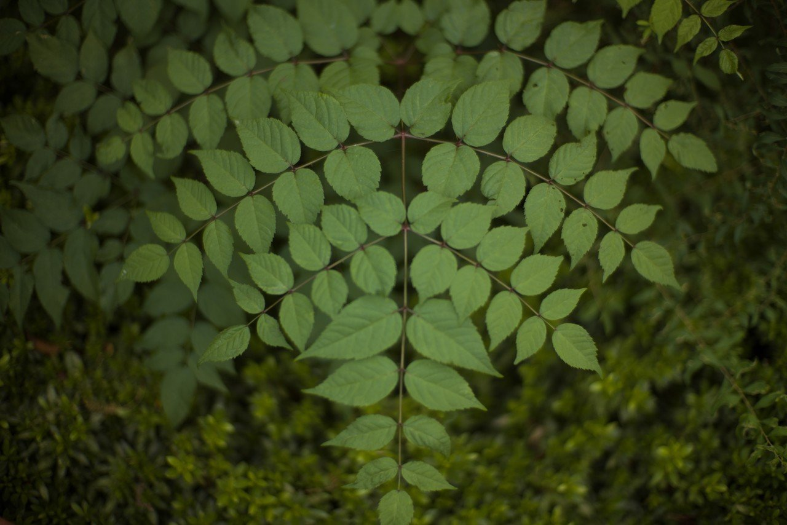
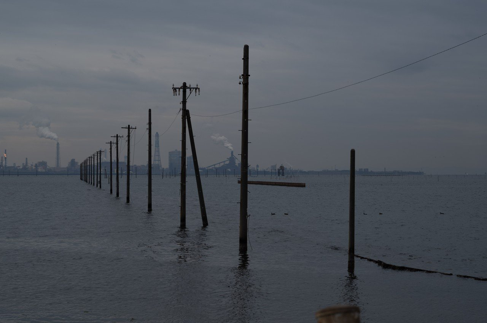
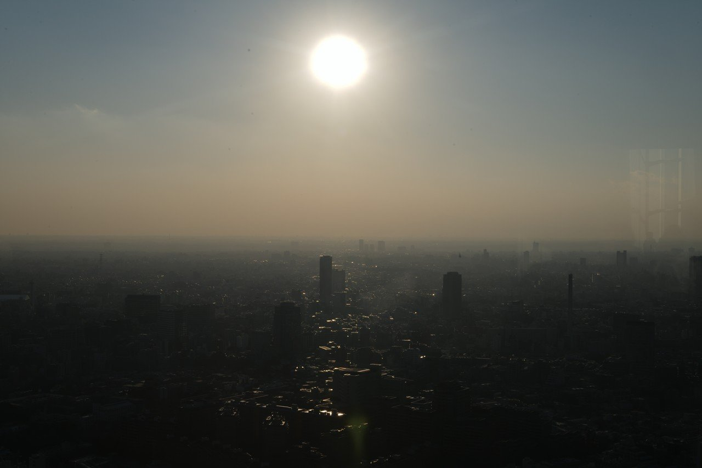
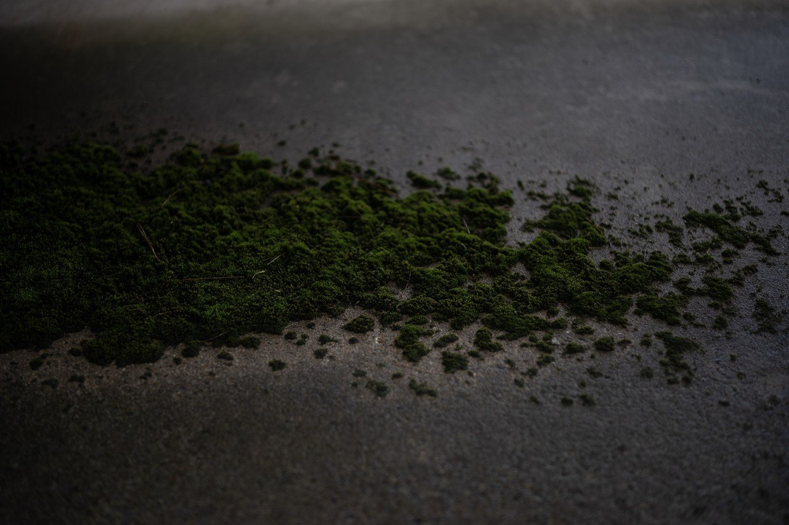
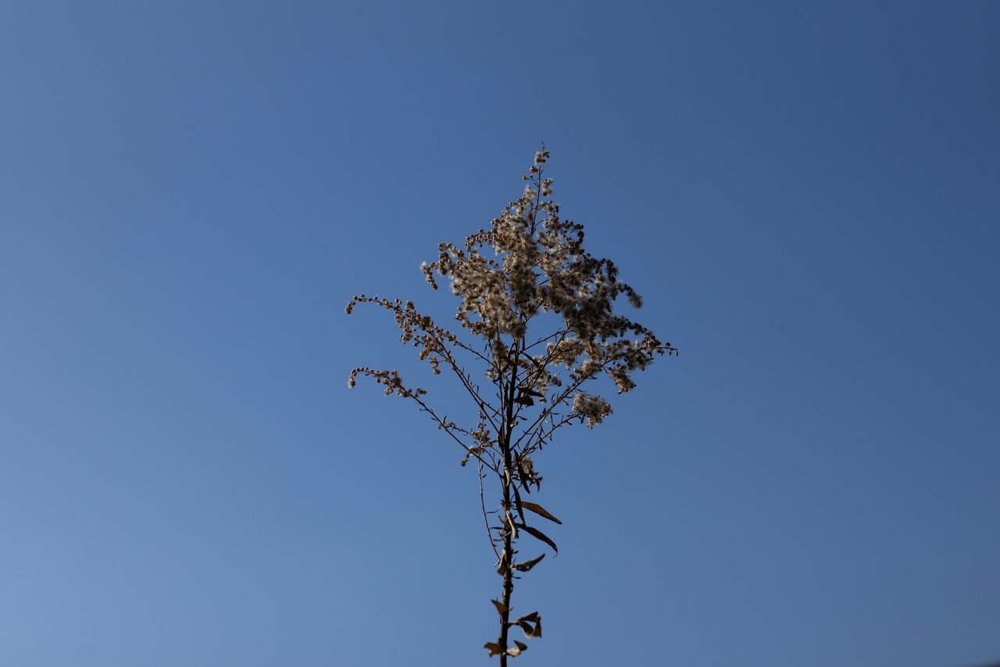

# 重力に抗すること，ネットワーク，或いは自然への憧憬

94

[%22%20d%3D%22M-100-100h300v300h-300z%22%2F%3E%3C%2Fsvg%3E)](/ochyai)

[落合陽一](/ochyai)

2019年1月25日 10:44

購読中

 重力に抗する形が好きだ．縦と横に伸びようとする力と自然との対立を感じる．    縦に伸びる感覚を感じさせるものとして塔が好きなのも同じ理由だろう． 横につながるネットワークも好きだ．電線が好きな理由も近しいと思う． 植物の成長もその構造や伸びを感じるから好きだ．プログラムを感じる． 撤退したインフラは枯れ葉のようで植物との類似性がある． 高い位置から見下ろしたときの自然は計算機自然と工業自然のミックスを感じる． コケを見るのが好きなのと似ている． 空に向かって伸びるエネルギーとネットワークに思いを馳せながら今日もデジタルの目で自然を眺めている．

## 高評価して応援しよう！

高評価

%22%20d%3D%22M-100-100h300v300h-300z%22%2F%3E%3C%2Fsvg%3E)%22%20d%3D%22M-100-100h300v300h-300z%22%2F%3E%3C%2Fsvg%3E)

2人

  

* [#写真](https://note.com/hashtag/写真)
* [#落合陽一](https://note.com/hashtag/落合陽一)
* [#落合陽一公式](https://note.com/hashtag/落合陽一公式)

94

3

いつも応援してくださる皆様に落合陽一は支えられています．本当にありがとうございます．

チップで応援

[%22%20d%3D%22M-100-100h300v300h-300z%22%2F%3E%3C%2Fsvg%3E)](/ochyai)

[落合陽一](/ochyai)

フォロー中

メディアアーティストで光や音や物性や計算機メディアの研究をしているような感覚的物書きで博士持ちのスナップ写真家です．多様性社会を目指す波動使いの准教授．noteは作家としての個人的な発信です．ご連絡はリンク先のお問い合わせまで．　<https://yoichiochiai.com>