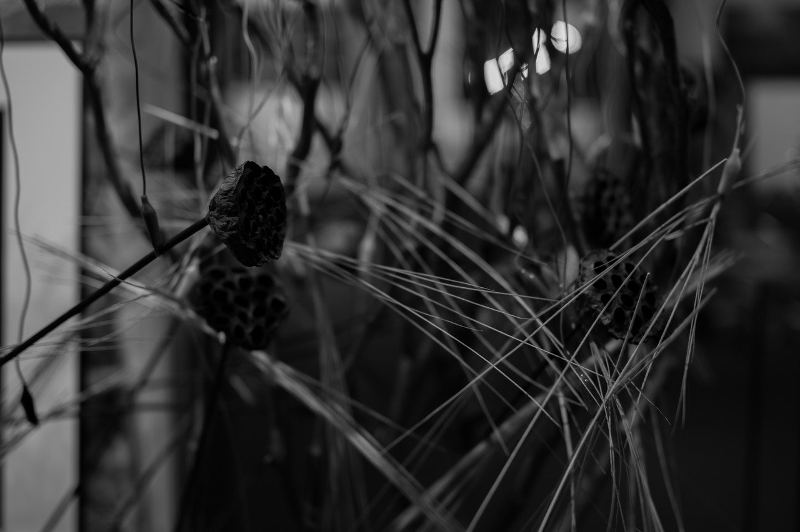
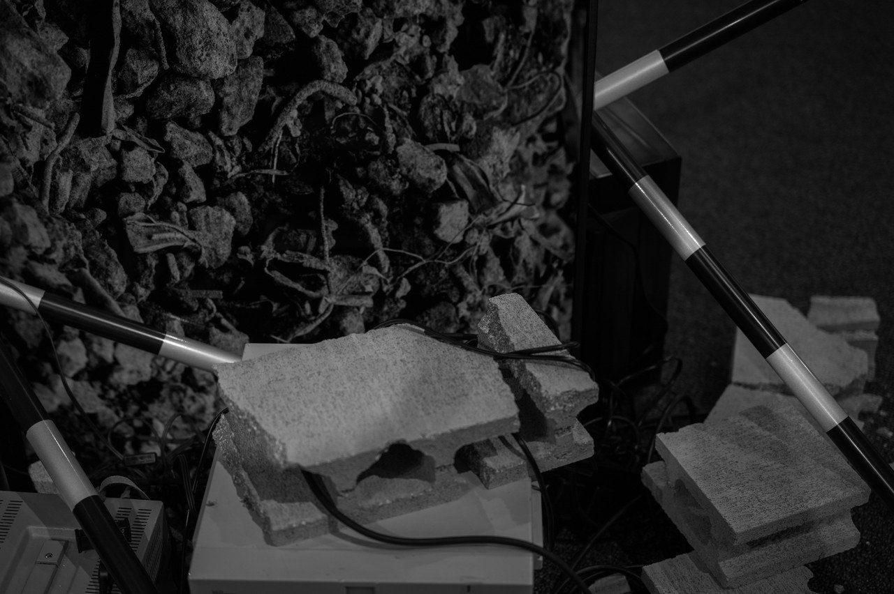
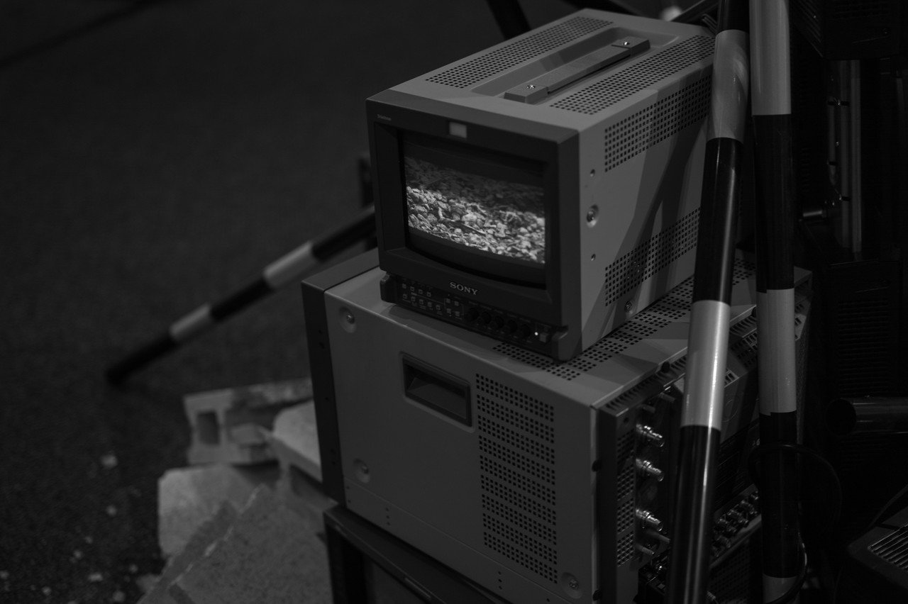
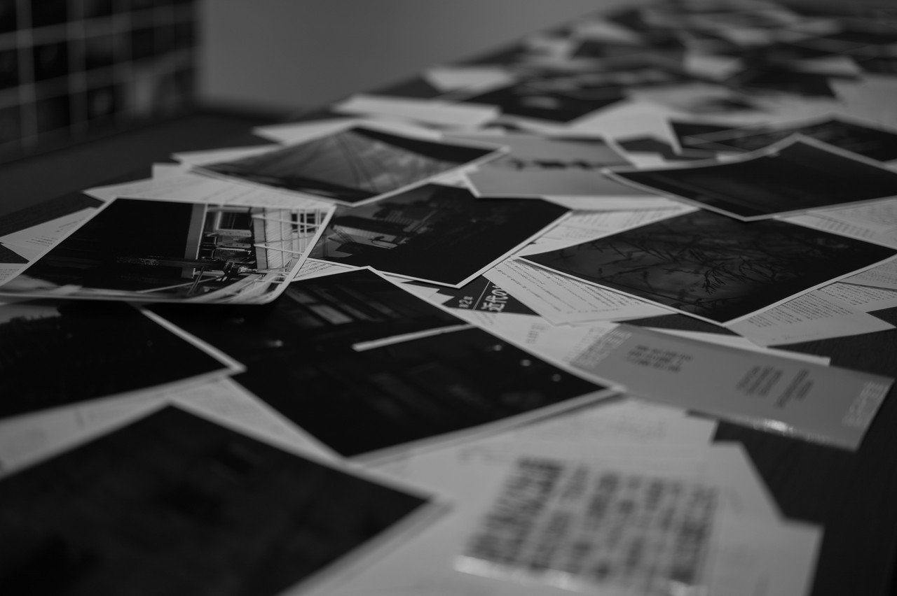
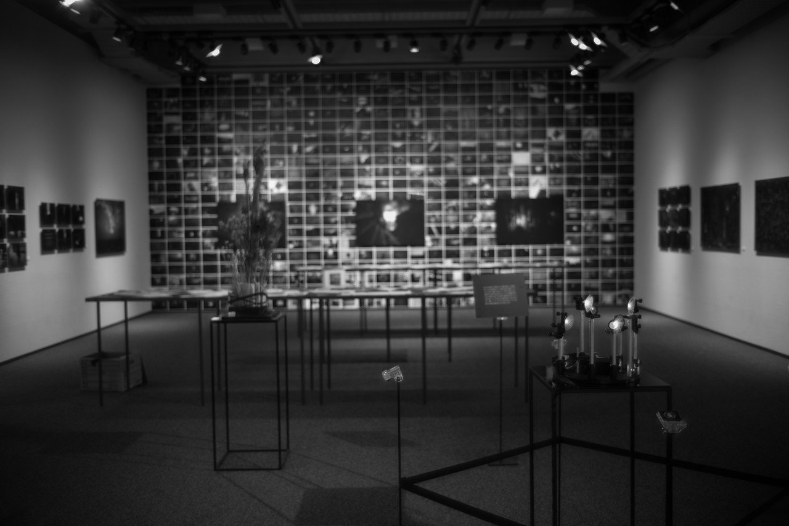
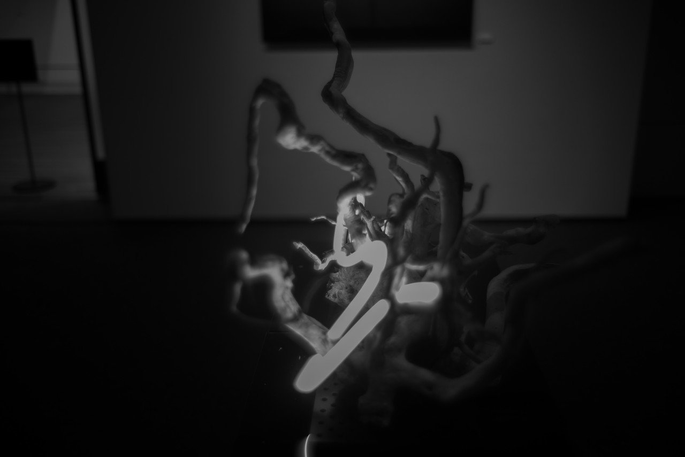
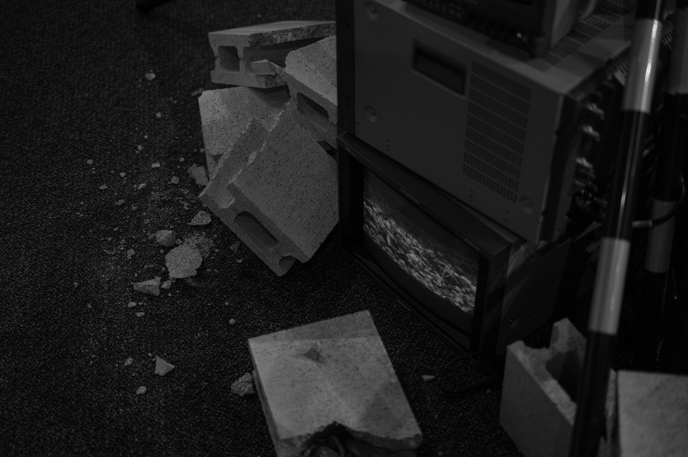
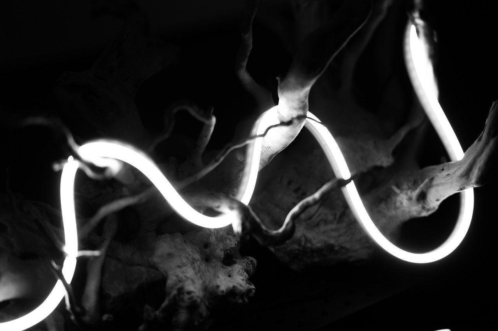
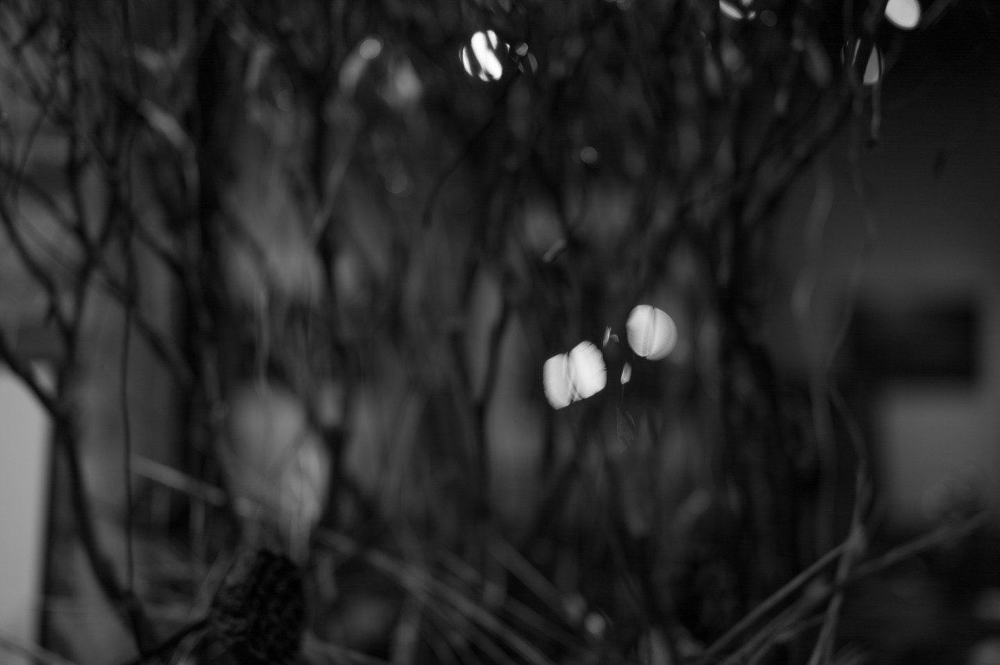
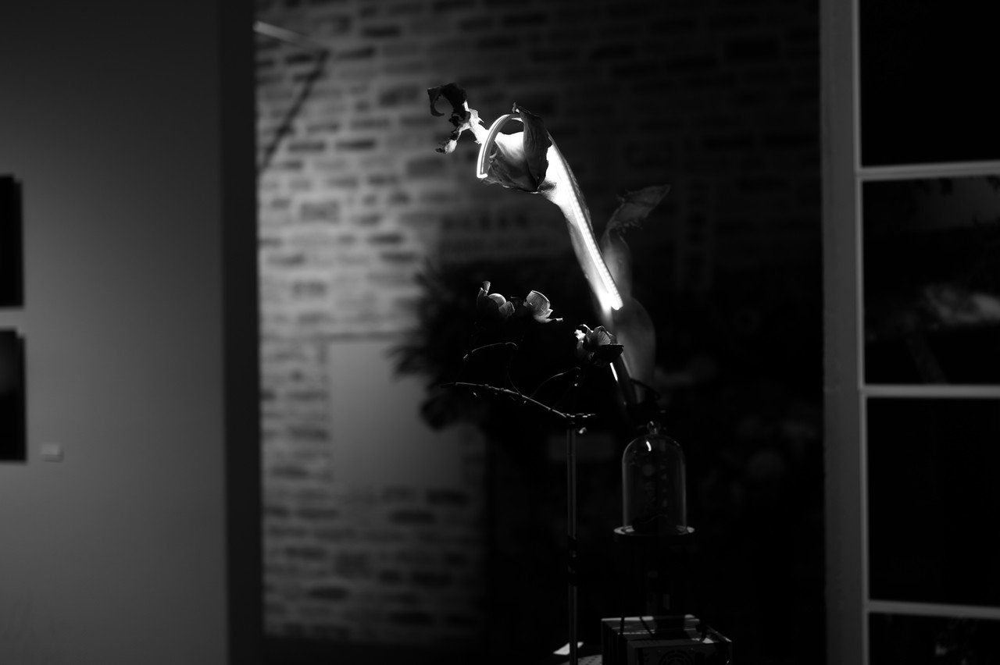

# 質量への憧憬1

103

[%22%20d%3D%22M-100-100h300v300h-300z%22%2F%3E%3C%2Fsvg%3E)](/ochyai)

[落合陽一](/ochyai)

2019年1月28日 09:17

購読中

 光と質量について考えながら写真とインスタレーションも作る    全体を通底するのはタルボットへのオマージュとデジタルネイチャーでの自然の鉛筆とは何か 枯れ木にミノムシクリップが付く世界があってもいい 解像感が8kに至るとき，物質とアナログとデジタルの関係性はどうなるだろうか ものを書きながら風景を撮り続ける 目が動き，光が動いたことを立体にする ブラウン管は解像度は低いが解像感がなぜか高い そんなことを考えながら日々を生きてきた残滓 ナムジュンパイクの頃の映像と物資の質感は8kモニタと対比すると質量への憧憬を感じる プリント量からも質量を感じる 光がオブジェクトを撫でる 光がオブジェクトに漂う 物質であるはずのコンクリートが一番解像感が低い 3次元空間に作る光のオルタナティブプロセス 質量と質感 重さと光 光を纏う枯れ木が照らす 質量への憧憬

## 高評価して応援しよう！

高評価

  

* [#写真](https://note.com/hashtag/写真)
* [#落合陽一](https://note.com/hashtag/落合陽一)
* [#落合陽一公式](https://note.com/hashtag/落合陽一公式)

103

3

いつも応援してくださる皆様に落合陽一は支えられています．本当にありがとうございます．

チップで応援

[%22%20d%3D%22M-100-100h300v300h-300z%22%2F%3E%3C%2Fsvg%3E)](/ochyai)

[落合陽一](/ochyai)

フォロー中

メディアアーティストで光や音や物性や計算機メディアの研究をしているような感覚的物書きで博士持ちのスナップ写真家です．多様性社会を目指す波動使いの准教授．noteは作家としての個人的な発信です．ご連絡はリンク先のお問い合わせまで．　<https://yoichiochiai.com>