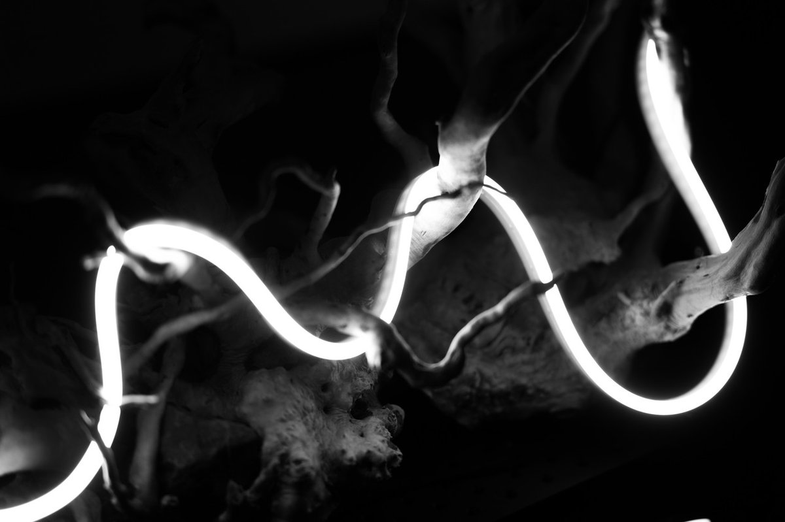
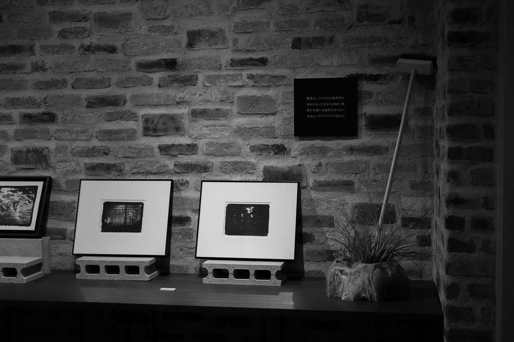
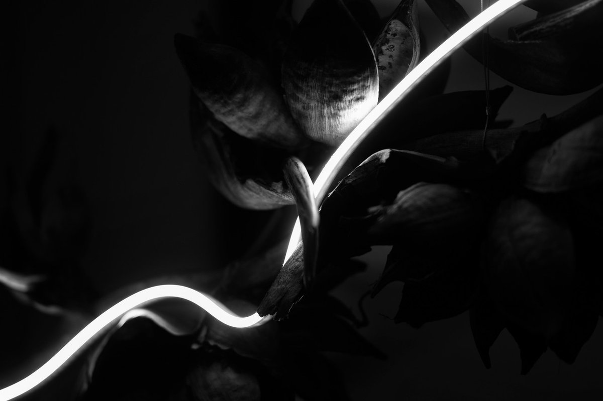
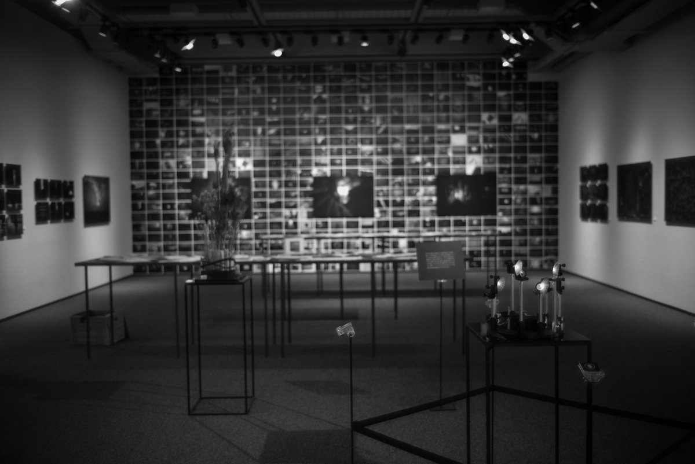

  

# 【個展】「質量への憧憬」展1/24-2/6

129

[%22%20d%3D%22M-100-100h300v300h-300z%22%2F%3E%3C%2Fsvg%3E)](/ochyai)

[落合陽一](/ochyai)

2019年2月1日 10:30

購読中

[**落合陽一の見ている風景と考えていること｜落合陽一｜note**
*落合陽一が日々見る景色と気になったトピックを写真付きの散文調で書きます．落合陽一が見てる景色や考えてることがわかるエッセイ*
*note.mu*](https://note.mu/ochyai/m/m41f58d360230)

↑Magazineやってます．長い記事が月3本くらいと写真とエッセイみたいな感じです．（今月分はあと2本書いている）

## はじめに

個展が始まりました！！ レセプションでは多くの人々にご来場いただきありがとうございました！（日頃お世話になっている皆様にお会いできて嬉しかったです！）

展覧会のまとめなどは会期が終わったら書こうと思っていますが，この記事では見所などをまとめておこうと思います．

## 1．とにかく作品点数が多い

今回は作品に質量を感じるはず．この辺の記事は下記のリンクを参考に．

[**写真家としての落合陽一が見せる質量と物質感。「質量への憧憬」展がamana squareで開幕**
*メディア・アート作品の制作、実世界志向コンピューティングの研究、教育活動、書籍執筆など多岐にわたる活動を行う落合陽一。その*
*bijutsutecho.com*](https://bijutsutecho.com/magazine/news/report/19222)

[**落合陽一──デジタル世代のノスタルジア。質量への愛着を追い求めて。***ファッション誌『VOGUE JAPAN』の公式サイト。第一線で活躍する映画監督やアーティスト、クリエイターなど、注目すべき**www.vogue.co.jp*](https://www.vogue.co.jp/lifestyle/interview/2019-01-24/yoichi-ochiai)

例えば上の壁に貼られた画像の総ピクセル数が8万×8万とかあるので80kディスプレイ状態．とにかく解像感が高め．

## 2．写真だけでなく立体もある

これとか正面から見ると後ろの玉ボケ画像の集まりとならんでそういう風に写るように配置してあったり，

現場で写真をとるとオルタナティブプロセスみたいに写るようになっています．この辺は現場に行かないと分からないことが多いかも．

## 3．メディアアートへの憧憬

タルボットの自然の鉛筆，キースソニア・ナムジュンパイクへのオマージュで空間が構成されてるので，その文脈で切り取るとピクセルから見た質量への憧憬を感じることができます．

ソルトプリントと箒だったり，

8kディスプレイとブラウン管だったり，

ネオンでなくLEDと枯れ木のインスタレーションだったり．

## 4．会期は2月6日まで

いよいよ会期は2月6日まで．寒い日が続きますが，お気をつけてお越しください！ ちょっとアクセスが悪いですがその分だけ風景が綺麗な場所です．コーヒーもうまいし．

無料で行えているのは1000円ドネーションして頂いている方とアマナさんのおかげです！（コーヒーもドネーションもクレカ限定なのでフォトプリント欲しいけどクレカ族でない方はプリペイドなどのご準備を）

個展が終わったらスタッフへの感謝も含めまとめ記事を書こうと思っていますが，中間報告としては以上です！ お越しになった方も，これからお越しになる方もありがとうございます🙇‍♂️

↓Magazineやってます．長い記事が月3本くらいと写真とエッセイみたいな感じです．（今月分はあと2本書いている）

[**落合陽一の見ている風景と考えていること｜落合陽一｜note**
*落合陽一が日々見る景色と気になったトピックを写真付きの散文調で書きます．落合陽一が見てる景色や考えてることがわかるエッセイ*
*note.mu*](https://note.mu/ochyai/m/m41f58d360230)

ここから先は有料部分です

ダウンロード

 

copy

## 高評価して応援しよう！

高評価

%22%20d%3D%22M-100-100h300v300h-300z%22%2F%3E%3C%2Fsvg%3E)

1人

  

* [#落合陽一](https://note.com/hashtag/落合陽一)
* [#落合陽一公式](https://note.com/hashtag/落合陽一公式)

129

2

いつも応援してくださる皆様に落合陽一は支えられています．本当にありがとうございます．

チップで応援

[%22%20d%3D%22M-100-100h300v300h-300z%22%2F%3E%3C%2Fsvg%3E)](/ochyai)

[落合陽一](/ochyai)

フォロー中

メディアアーティストで光や音や物性や計算機メディアの研究をしているような感覚的物書きで博士持ちのスナップ写真家です．多様性社会を目指す波動使いの准教授．noteは作家としての個人的な発信です．ご連絡はリンク先のお問い合わせまで．　<https://yoichiochiai.com>