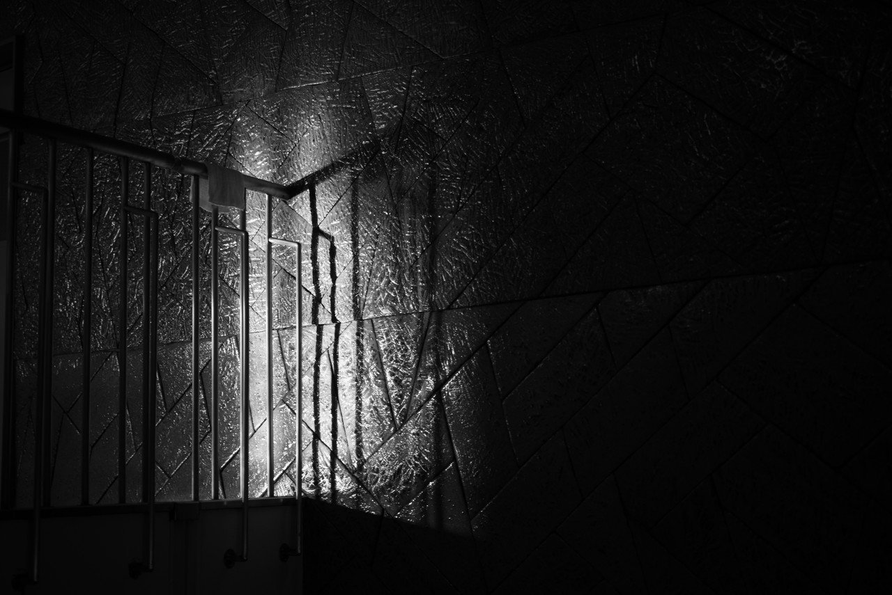
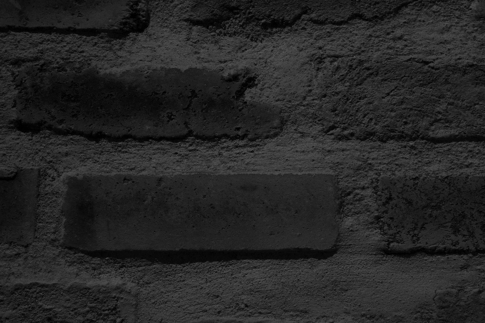

# 2次元に張り付いたものから感じる触覚を目で感じる

196

[%22%20d%3D%22M-100-100h300v300h-300z%22%2F%3E%3C%2Fsvg%3E)](/ochyai)

[落合陽一](/ochyai)

2019年2月8日 09:35

購読中

 影，植物，錆，水滴，円形や空，2次元に張り付いたものを目で撫でていくことで感じる手触り．    2.5次元を感じる枯れ木，草や凹凸を目で感じながら手で感じる． レンガの手触り，暖かい触覚に冷たい質量． 錆から漂う匂いと手触り． セメントと塗り． ガラスと透過から感じる影の質感 柔らかさとかたさの2.5次元． 水面の向こうに感じる光と影．2次元に向こうにある空間性． 水が拡散するぬるさとガラスの冷たさ． 空がひび割れている．さわれないのにざらつく．

## 高評価して応援しよう！

高評価

%22%20d%3D%22M-100-100h300v300h-300z%22%2F%3E%3C%2Fsvg%3E)

1人

  

196

6

いつも応援してくださる皆様に落合陽一は支えられています．本当にありがとうございます．

チップで応援

[%22%20d%3D%22M-100-100h300v300h-300z%22%2F%3E%3C%2Fsvg%3E)](/ochyai)

[落合陽一](/ochyai)

フォロー中

メディアアーティストで光や音や物性や計算機メディアの研究をしているような感覚的物書きで博士持ちのスナップ写真家です．多様性社会を目指す波動使いの准教授．noteは作家としての個人的な発信です．ご連絡はリンク先のお問い合わせまで．　<https://yoichiochiai.com>