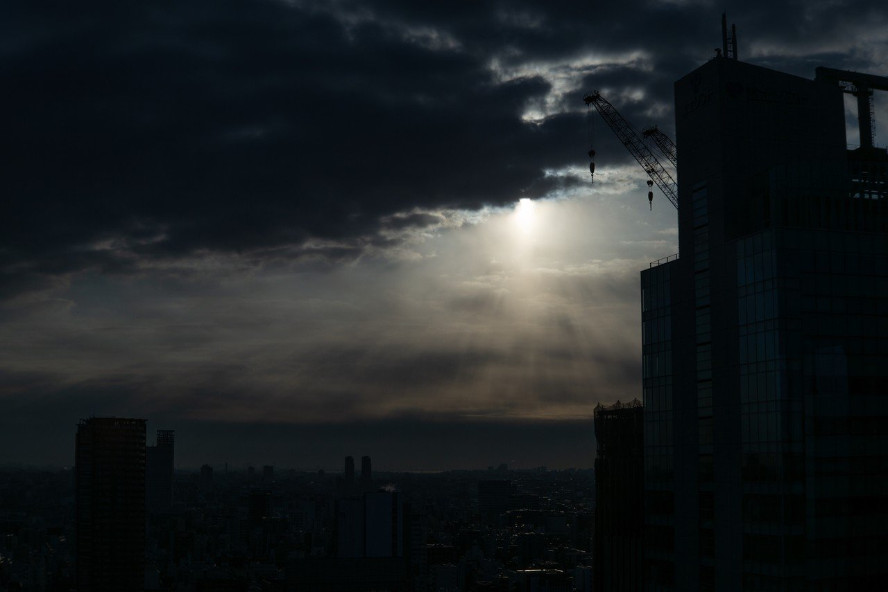
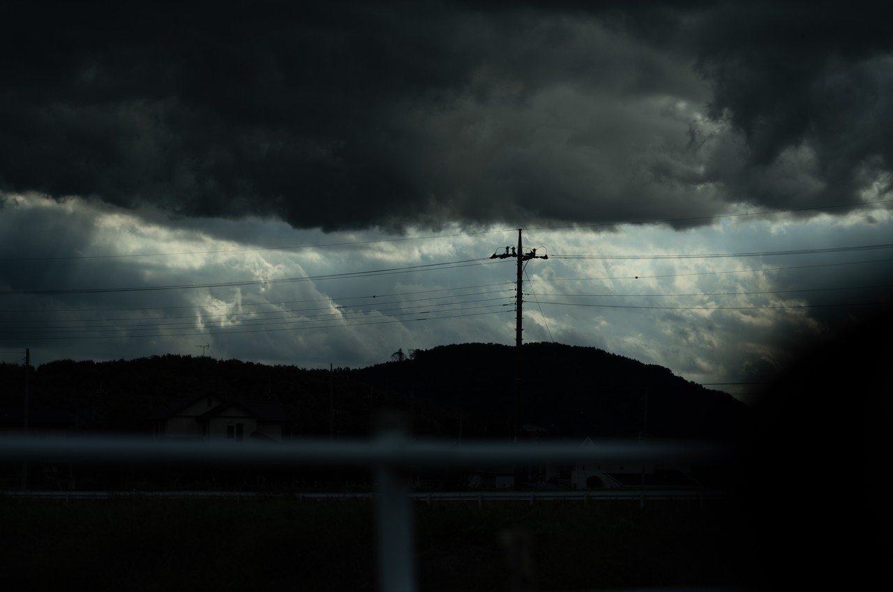
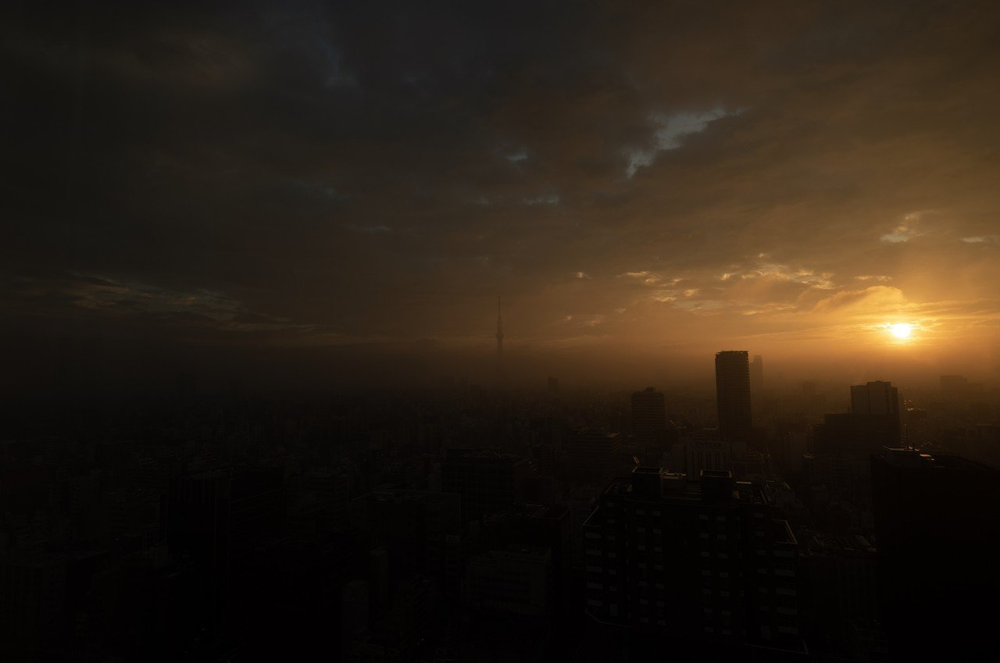
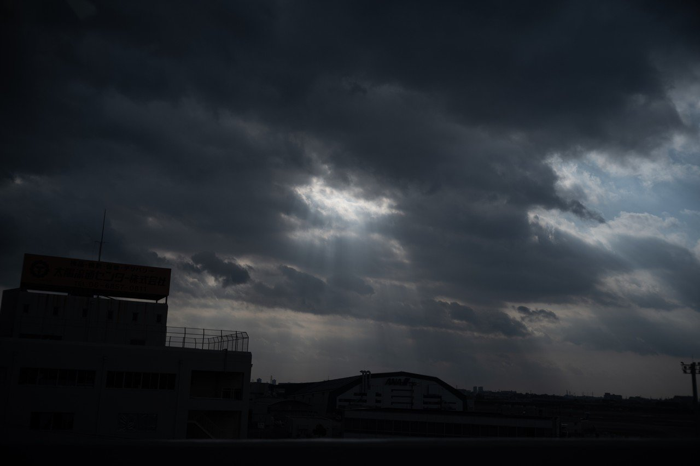

# 今日も煙たい空を探して

232

[%22%20d%3D%22M-100-100h300v300h-300z%22%2F%3E%3C%2Fsvg%3E)](/ochyai)

[落合陽一](/ochyai)

2019年2月15日 11:58

購読中

 日々の生活の中で煙たい空と闇の中に漂う拡散した光を探している．    構造物やフレームが人工的な質感を与え，映る空気が気配を作る． 雲や空のグラデーションが持つ計算機的自然観が混ざり合う風景が好きだ． 時に風化を感じる風の谷のブレードランナー． 夜明けの眠たさと湿度を肌で感じる．手触りを持った光景を探す． 夏の空の湿度を感じながら匂いを空想する． 夕暮れが近い．また1日が終わる． 朝が来る．光が雲の亀裂からさす瞬間を探している． 工業社会にさす光明． ひんやりとした光と暖かな闇を探して日々を眺めている．

## 高評価して応援しよう！

高評価

%22%20d%3D%22M-100-100h300v300h-300z%22%2F%3E%3C%2Fsvg%3E)%22%20d%3D%22M-100-100h300v300h-300z%22%2F%3E%3C%2Fsvg%3E)

2人

  

* [#落合陽一](https://note.com/hashtag/落合陽一)
* [#落合陽一公式](https://note.com/hashtag/落合陽一公式)

232

4

いつも応援してくださる皆様に落合陽一は支えられています．本当にありがとうございます．

チップで応援

[%22%20d%3D%22M-100-100h300v300h-300z%22%2F%3E%3C%2Fsvg%3E)](/ochyai)

[落合陽一](/ochyai)

フォロー中

メディアアーティストで光や音や物性や計算機メディアの研究をしているような感覚的物書きで博士持ちのスナップ写真家です．多様性社会を目指す波動使いの准教授．noteは作家としての個人的な発信です．ご連絡はリンク先のお問い合わせまで．　<https://yoichiochiai.com>