# 風の谷のブレードランナー中編

70

[%22%20d%3D%22M-100-100h300v300h-300z%22%2F%3E%3C%2Fsvg%3E)](/ochyai)

[落合陽一](/ochyai)

2019年2月16日 11:06

購読中

 気だるさを持った空気とゴテゴテとした照明に感じる人間の欲やノスタルジアと無機的に向き合う．    朝にトイピアノの音が聞きたい．[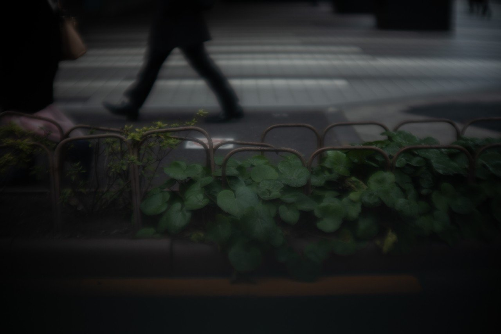](https://assets.st-note.com/production/uploads/images/10011769/picture_pc_8bbc2d48fa6fc4073ce5aa1ffa04b77b.jpeg) 寒空が地面に張り付いている．[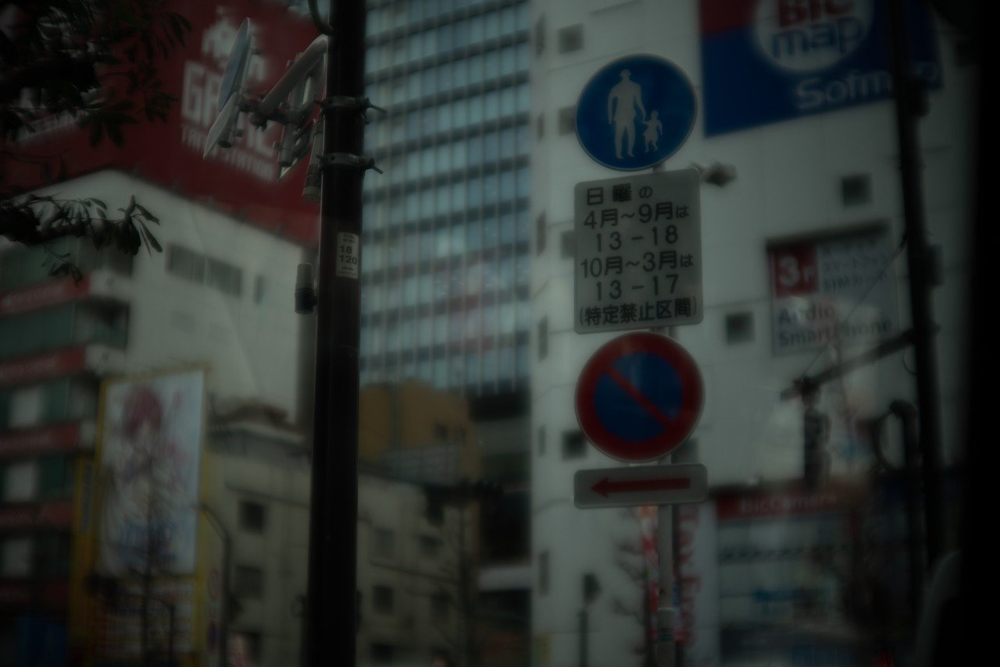](https://assets.st-note.com/production/uploads/images/10011771/picture_pc_966c03143f752e4891195d6ad4b39cb2.jpeg) 看板から発せられるメッセージが都市をプログラミングしている．[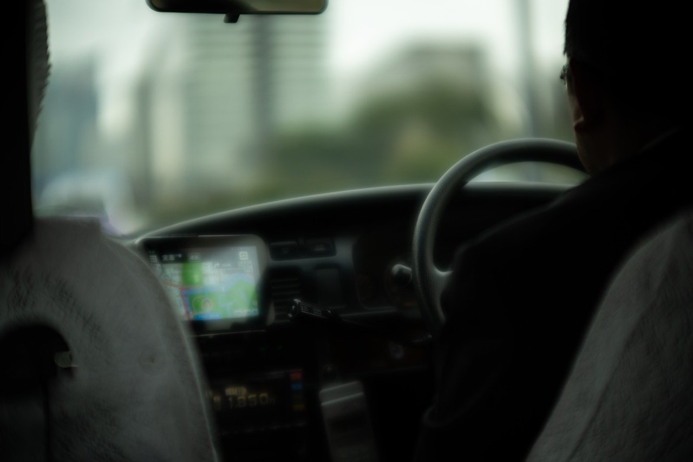](https://assets.st-note.com/production/uploads/images/10011758/picture_pc_2de01ae08aaeefbae893e63c0555b043.jpeg) 気だるい空気をフロントガラス越しにみながら春を待っている． 春の足音を闇の中に感じる． 拡散光源が柔和した光景が渦を巻いて網膜へやってくる．[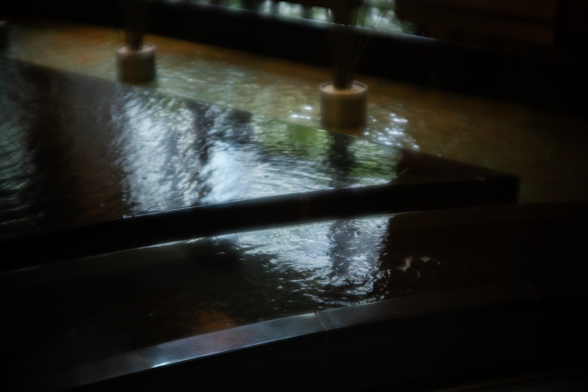](https://assets.st-note.com/production/uploads/images/10011770/picture_pc_40cd1c2125e5629f97fae6f851fadb73.jpeg) こんにちは波動．水面の彩りがソフトフォーカス．[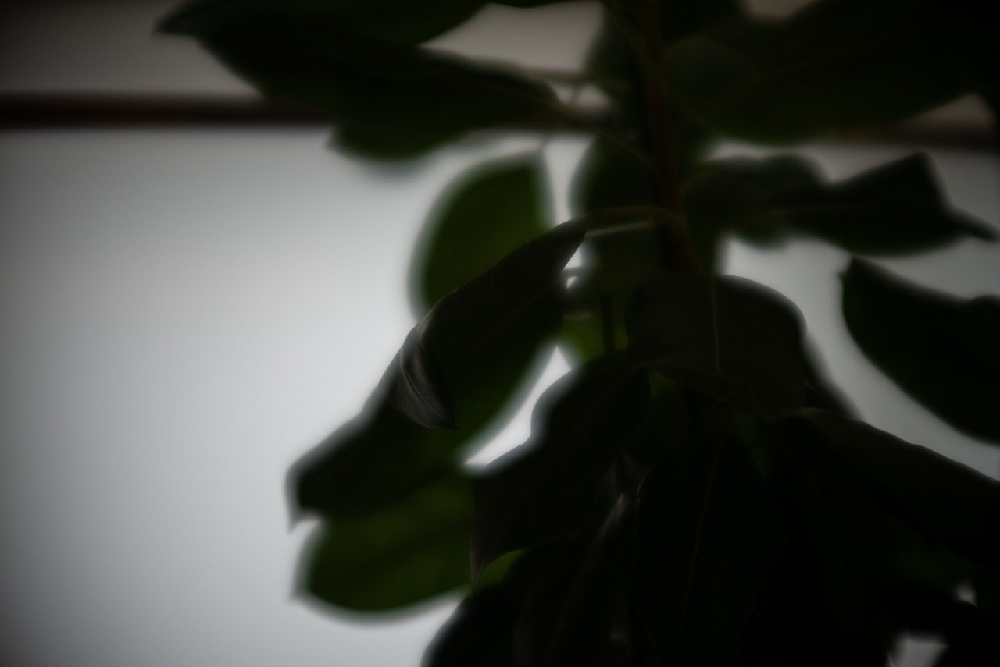](https://assets.st-note.com/production/uploads/images/10011766/picture_pc_60d4ee1b56a211ae904dce7ca3c7c82b.jpeg) 空の拡散照明を受け止めて光合成する君の緑色が好きなんだよね． このサイロを昇降して光の渦の中から出て行く． 人の纏うオーラが集まる瞬間．闇と光． 年輪を感じる眼差しが，目を見ていないのに背中に感じている． 太陽が地平線の向こうに行ってしまう前に．[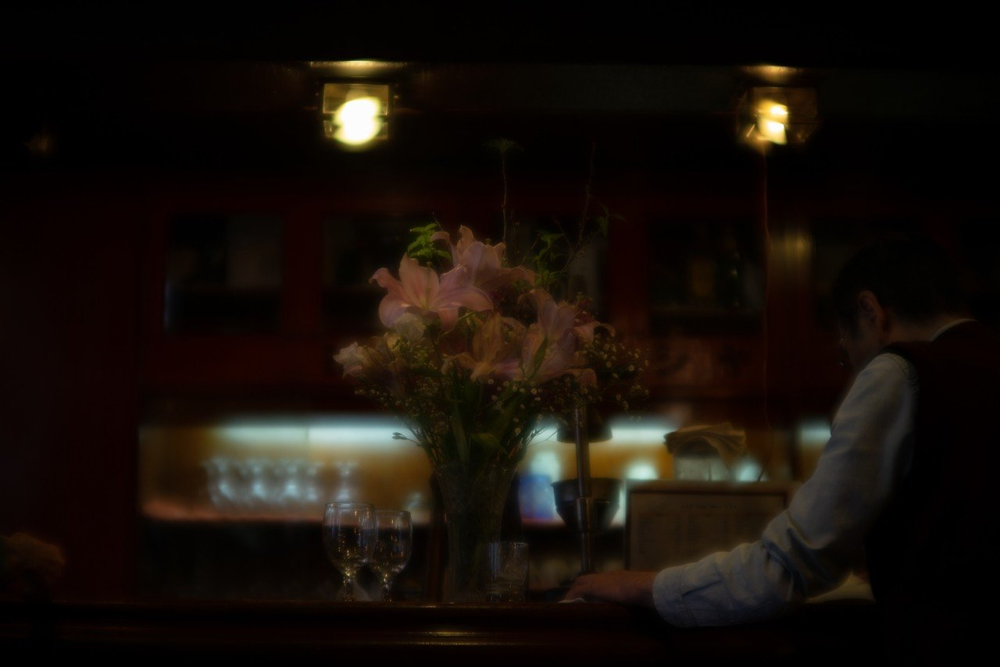](https://assets.st-note.com/production/uploads/images/10011753/picture_pc_c696b63bd1cc32914bfec3b3679fc72c.jpeg) 夕闇がくる準備をしている． 黄昏を経たらあっという間に違う世界に来てしまった．[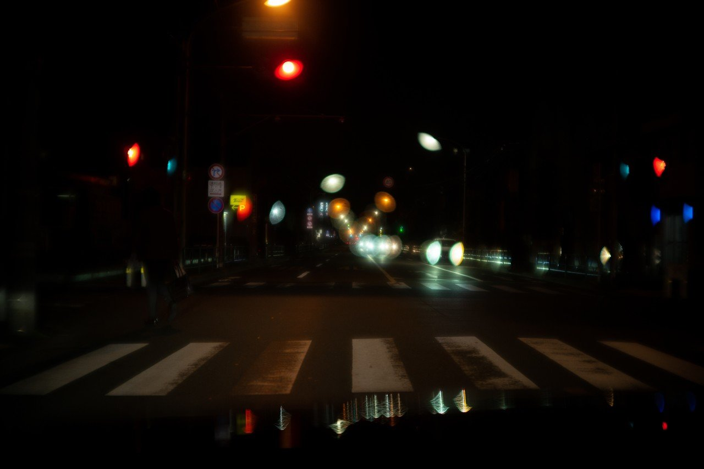](https://assets.st-note.com/production/uploads/images/10011754/picture_pc_9ffb37423b1681e3e3666295352d81bf.jpeg) 夜の底が黒くなった．人工照明があるから感じる黒さ．[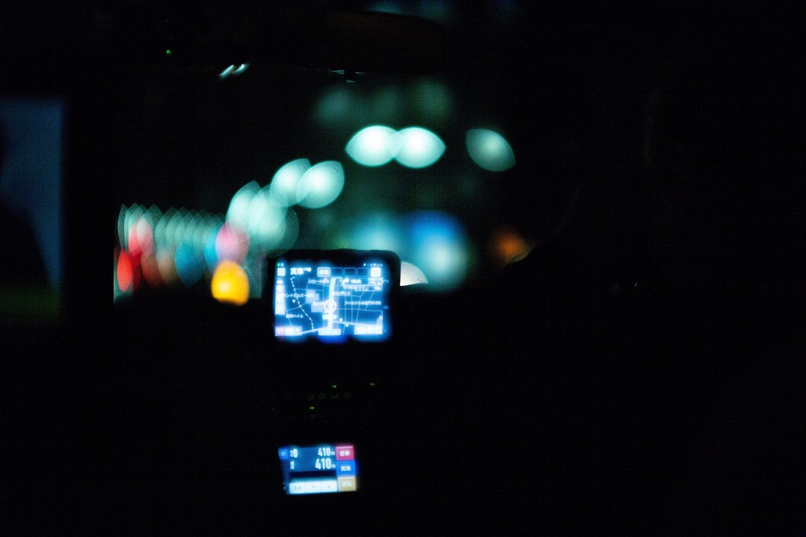](https://assets.st-note.com/production/uploads/images/10011773/picture_pc_cbb42aaf72368cfd51449ac79921a8ad.jpeg) 夜の灯が渦を巻くのは．[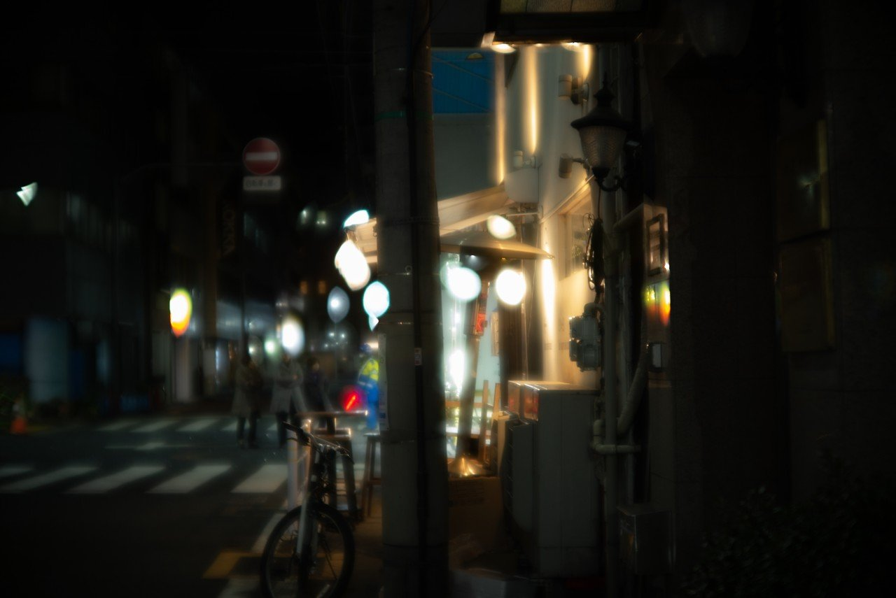](https://assets.st-note.com/production/uploads/images/10011763/picture_pc_de83992c09d22b959f446294e503eaca.jpeg) 暖色から感じるのはアルコールの匂いか？[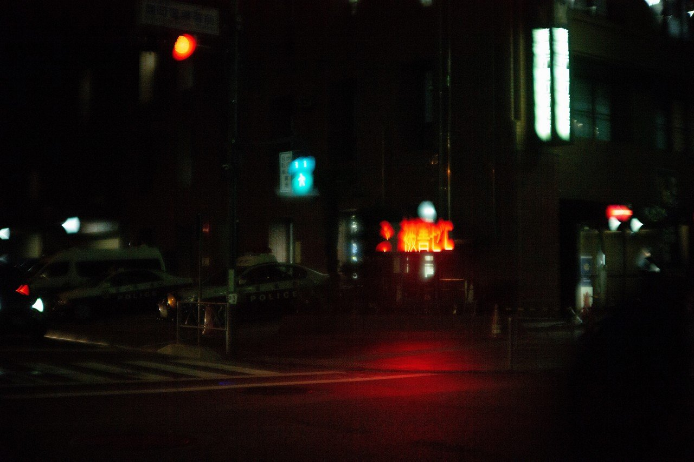](https://assets.st-note.com/production/uploads/images/10011768/picture_pc_0078a45af0b0a7463f54bd1c8d3f19a3.jpeg) 交通情報から血が流れている． 眩しいほどに昼が恋しいのか．[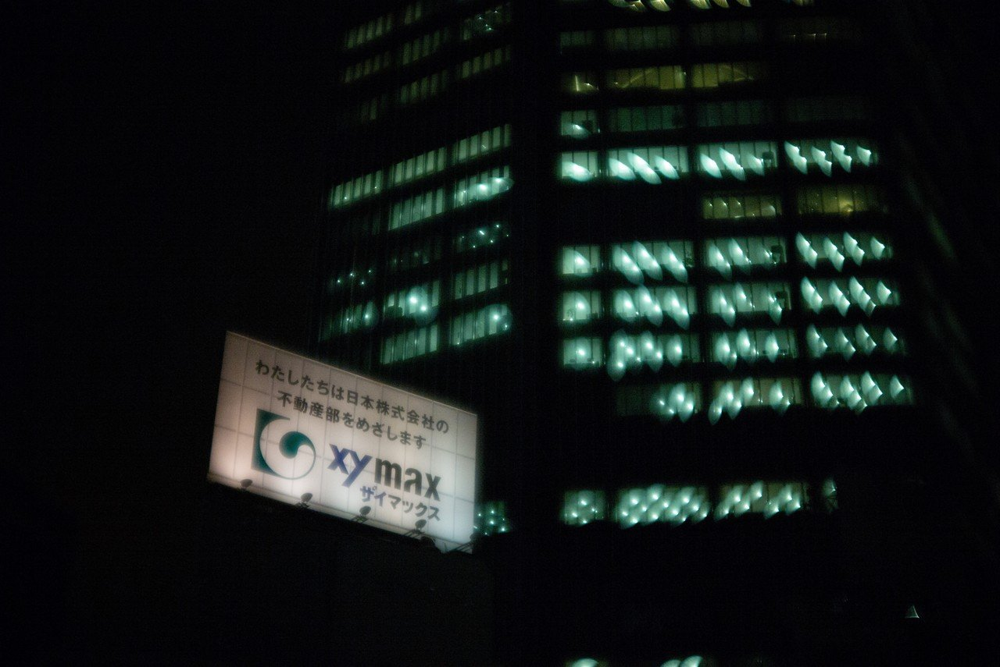](https://assets.st-note.com/production/uploads/images/10011767/picture_pc_967b2a4bde4539cb885765678c3fca01.jpeg) 眠らない社会を容積率が支える． 路地裏からそんなことを考え続けている．

## 高評価して応援しよう！

高評価

%22%20d%3D%22M-100-100h300v300h-300z%22%2F%3E%3C%2Fsvg%3E)

1人

  

* [#写真](https://note.com/hashtag/写真)
* [#落合陽一](https://note.com/hashtag/落合陽一)
* [#落合陽一公式](https://note.com/hashtag/落合陽一公式)

70

4

いつも応援してくださる皆様に落合陽一は支えられています．本当にありがとうございます．

チップで応援

[%22%20d%3D%22M-100-100h300v300h-300z%22%2F%3E%3C%2Fsvg%3E)](/ochyai)

[落合陽一](/ochyai)

フォロー中

メディアアーティストで光や音や物性や計算機メディアの研究をしているような感覚的物書きで博士持ちのスナップ写真家です．多様性社会を目指す波動使いの准教授．noteは作家としての個人的な発信です．ご連絡はリンク先のお問い合わせまで．　<https://yoichiochiai.com>