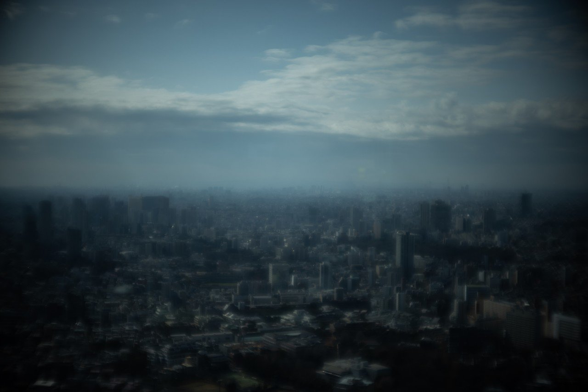
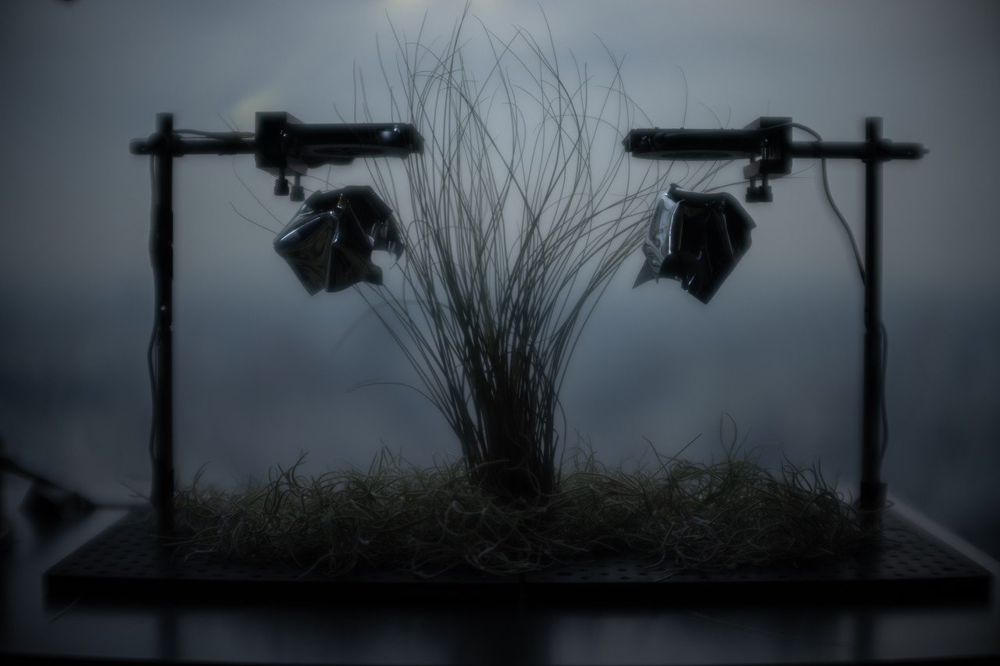
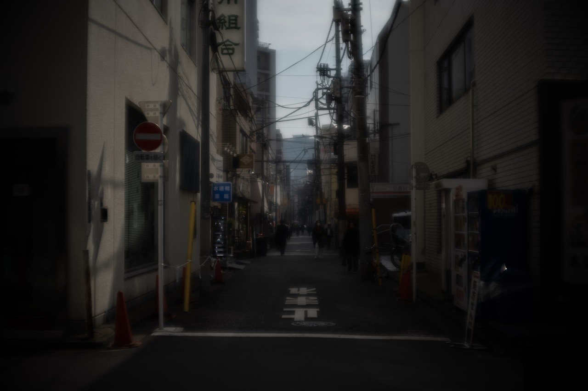
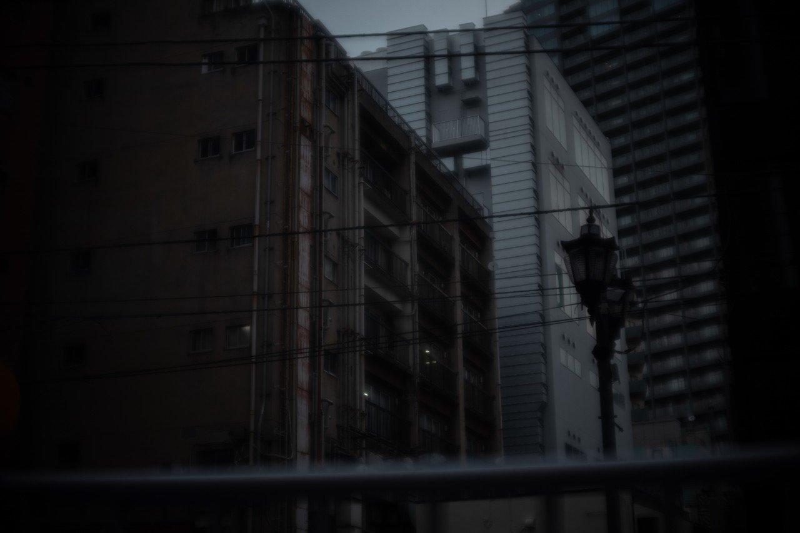
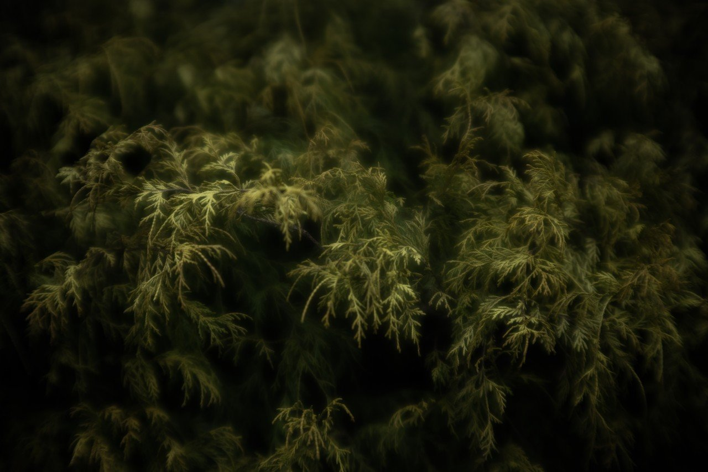
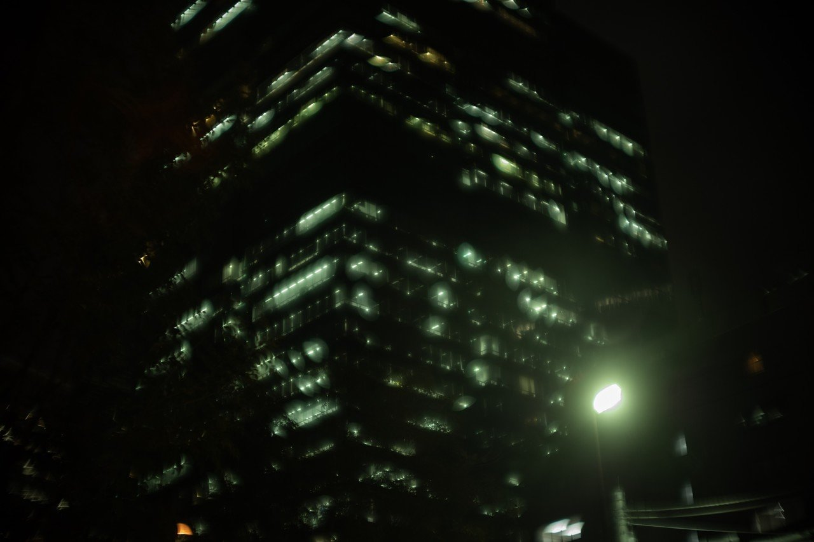
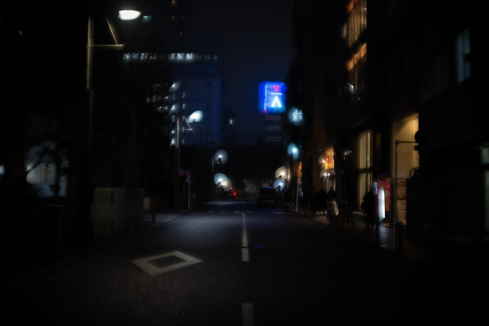
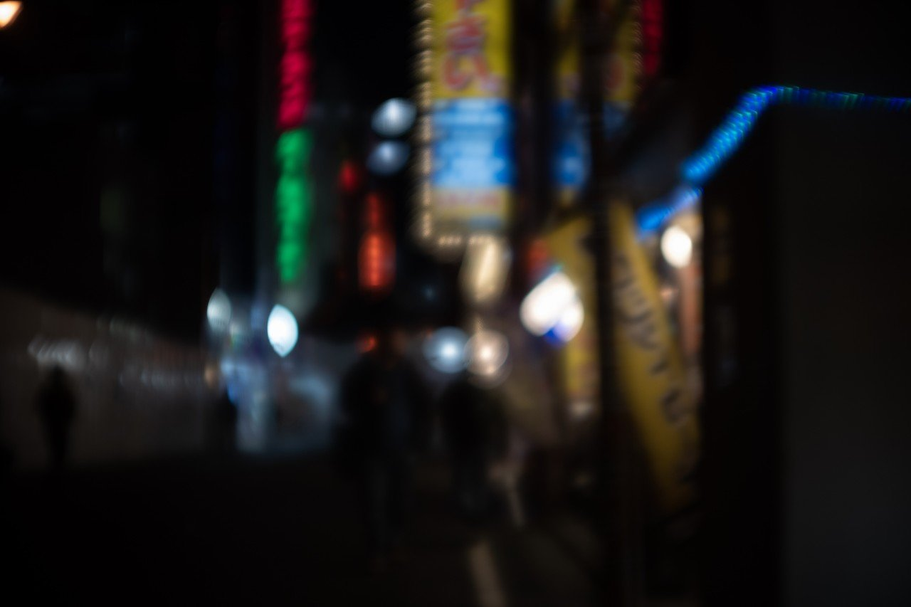
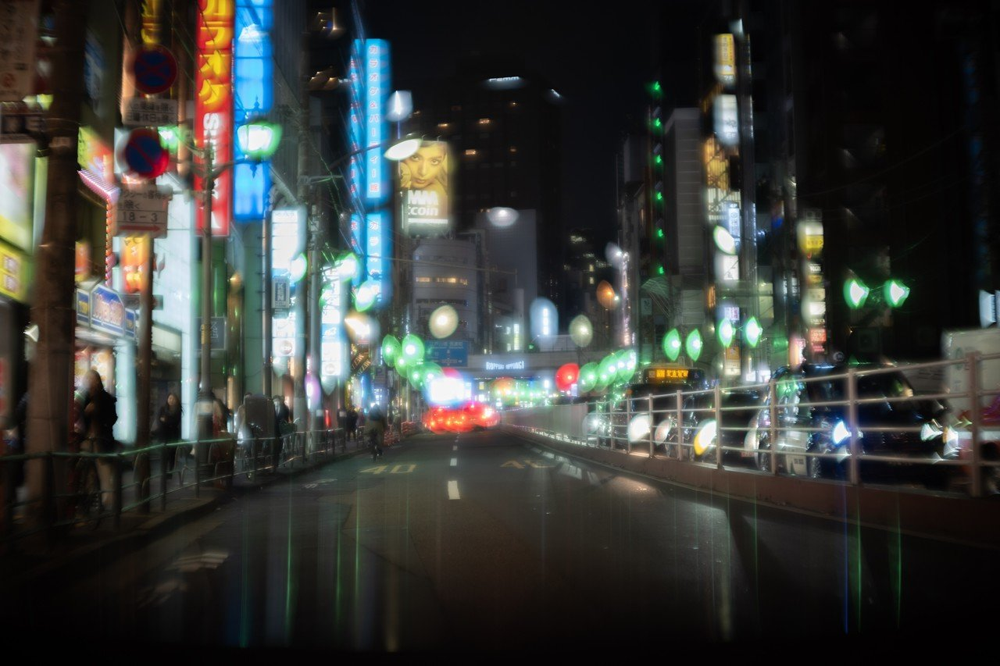
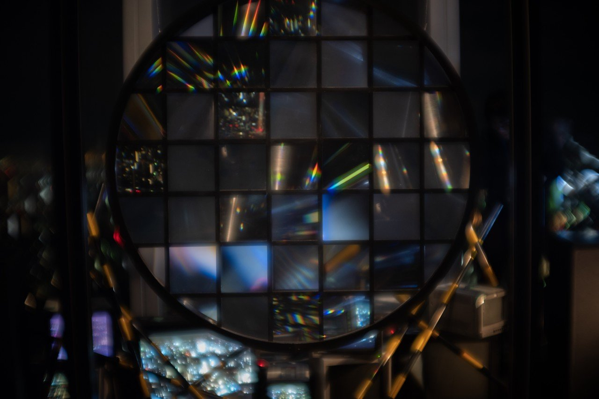

# 風の谷のブレードランナー後編

73

[%22%20d%3D%22M-100-100h300v300h-300z%22%2F%3E%3C%2Fsvg%3E)](/ochyai)

[落合陽一](/ochyai)

2019年2月23日 17:12

購読中

 質感を持った都市のビジョン．退廃的な工業都市の向かう先に電脳と自然が融合した風景がある．1980年代の未来像の着地．1984アップル帝国の夢見た果て，ここは風の谷のブレードランナー．宮崎駿でリドリースコット，高齢化社会のサイボーグ都市．    煙たい夜が明けて，煙たい街を見下ろす． 植物が有機システムとして切り出されながら，波の形をした鏡が宙に浮いている．それが写し込むのは都市構造の遠景． 路地に垂れた電線は重力を標榜して，空気は拡散反射で人の動きを描き出す． 退廃的な都市に生活の温度を感じる．生物が潜む闇．暖かだ． ガラスと金属とアスファルトで作られた清潔な見てくれの裏にある埃あるエレベーターシャフト． 金属とガラスが光源を透かして柔らかに切り取る． アスファルトの大地に落ちる影が描く都市の投射系． 波の形を想いながら都市を眺める．鏡と影と遠景がつくる風景． 人工システムの中にはめられた植物は倦怠感を漂わせつつ，自己増幅を繰り返す． 夜が来た． 人の活動が灯火に変換される．ボケた空を彩る． 濡れたアスファルト，濡れた空気． ボケていても材質を想起させるテクスチャ 昼のような明るさを感じながら夜の底は天地逆転して空に貼り付く． アスファルトが空になることもある． 彼岸花が咲く灯火． お帰りブレードランナー．ブラウン管，コンクリート，アナログとデジタル．成長への期待はいつでも工事中なんだ．それを包含した自然と人工物の退廃が愛おしい．

## 高評価して応援しよう！

高評価

  

* [#写真](https://note.com/hashtag/写真)
* [#落合陽一](https://note.com/hashtag/落合陽一)
* [#落合陽一公式](https://note.com/hashtag/落合陽一公式)

73

3

いつも応援してくださる皆様に落合陽一は支えられています．本当にありがとうございます．

チップで応援

[%22%20d%3D%22M-100-100h300v300h-300z%22%2F%3E%3C%2Fsvg%3E)](/ochyai)

[落合陽一](/ochyai)

フォロー中

メディアアーティストで光や音や物性や計算機メディアの研究をしているような感覚的物書きで博士持ちのスナップ写真家です．多様性社会を目指す波動使いの准教授．noteは作家としての個人的な発信です．ご連絡はリンク先のお問い合わせまで．　<https://yoichiochiai.com>