# 風景と質量と

60

[%22%20d%3D%22M-100-100h300v300h-300z%22%2F%3E%3C%2Fsvg%3E)](/ochyai)

[落合陽一](/ochyai)

2019年2月28日 10:10

購読中

 六本木ヒルズ52階の展望スペースからみた遠景は2次元になってしまう．その映像的な風景と指摘なメディアアートを対比しながら見える風景を考えたい．都市にインスタレーションを設置するのはなにも現場だけではないのだ．風景とのマリアージュもある．    朝日が眩しい．まどろみの中銀の構造物が浮いている．エアプランツは今日も育つ．時間が彫刻の中で刻まれていく．技術は違和感なく自然化する．[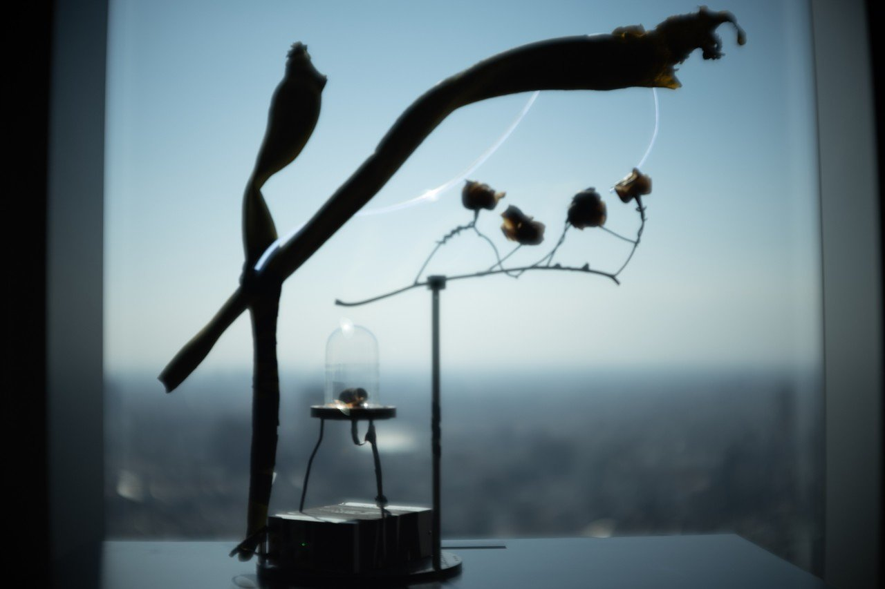](https://assets.st-note.com/production/uploads/images/10226525/picture_pc_fccb1f0aef5ceed3fc1b7ec5955f28e6.jpeg) 外光に負けないLED光源．まどろみの中火花放電する音が聞こえる．風鈴じゃなくてプラズマ鈴だ．[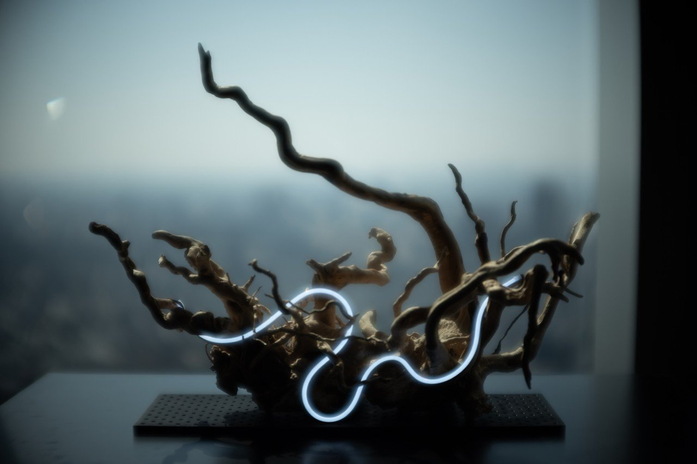](https://assets.st-note.com/production/uploads/images/10226527/picture_pc_5c6b3c6699525e4120436ee66a0b19b9.jpeg) 昼の風景を眺めると眩しさのあまり目が閉じるから薄ぼんやりとした構造が覗く．自然物と都市と人工光源の対比の中に太陽を思う．[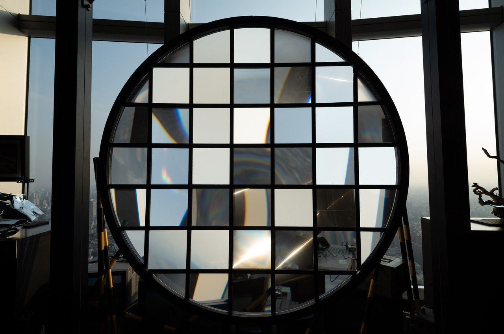](https://assets.st-note.com/production/uploads/images/10226533/picture_pc_b1899589f7e930b34d34749f513538c1.jpeg) 散らばった窓は都市と風景をさまざまな角度で切り出していく．視点が動けば風景も変わり，2次元の遠景に触覚と質感を与える．[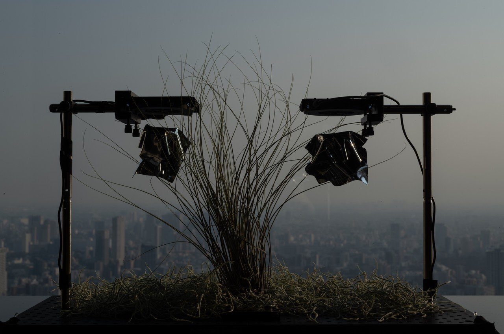](https://assets.st-note.com/production/uploads/images/10226534/picture_pc_bb600533c696ed5422c5a2e7a19daf22.jpeg) 日の傾きを感じながら霞の向こうの都市を思う．[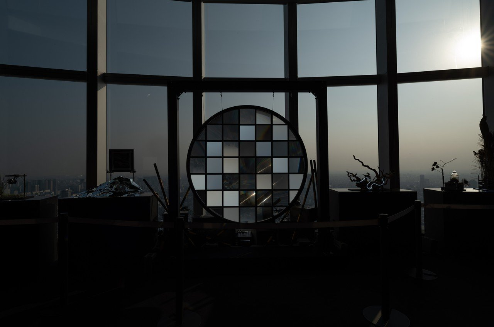](https://assets.st-note.com/production/uploads/images/10226526/picture_pc_8e143a11a9a64551df8b481d57a8fecd.jpeg) 都市に流れるさまざまな時間を一瞬のプラズマから植物の成長，結晶の成長，丸窓を覗く視点の身体性に至るまで複数のスケールで切り取る．[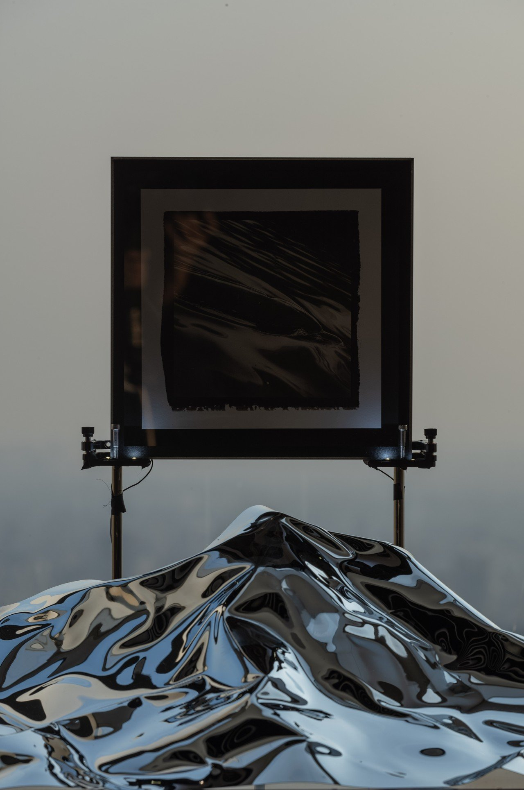](https://assets.st-note.com/production/uploads/images/10226532/picture_pc_671cac9323b11d5b5e02a6caecb99b76.jpeg) 古典的な19世紀のソルトプリントでイルカを切り取る．波の一瞬．それを金属光沢で再現する．金属光沢は都市の時間変化に合わせながら再帰的に風景を作る．さまざまな時間だ．[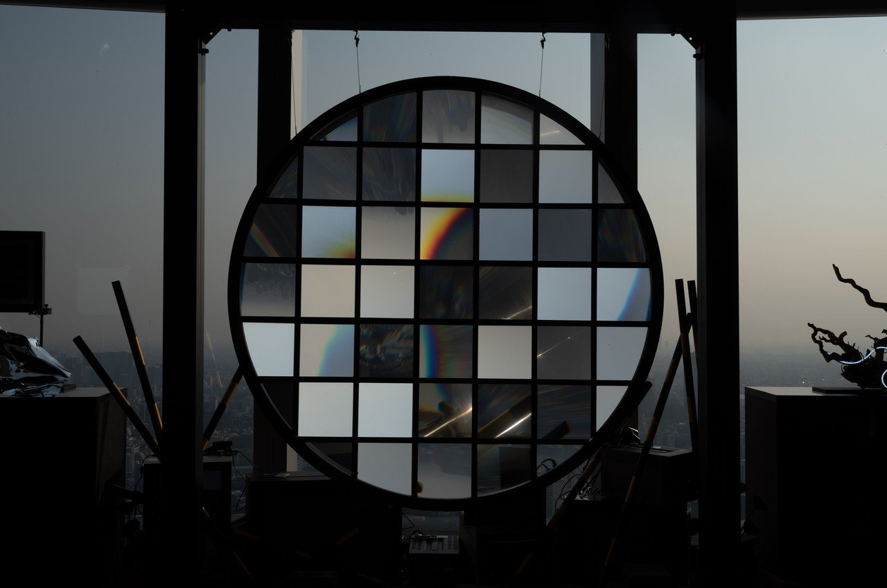](https://assets.st-note.com/production/uploads/images/10226528/picture_pc_3f80fa1aca76c915d2c2373bb39ad725.jpeg) 青空にオレンジが混ざる時間だ． 夕暮れに切り出された光の線が都市を上書きする． 内蔵されたファンでそよぐ孔雀の羽．風を感じる風景とコンクリート．[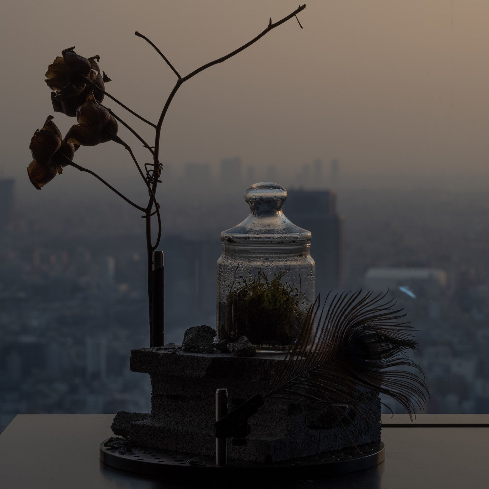](https://assets.st-note.com/production/uploads/images/10226539/picture_pc_553ede3807f5fc46534f6a0a369f6daa.jpeg) コケは光合成が懐かしいのか． 沈む夕日をいくつもの視点で切り出せば，青とオレンジの混ざり合う風景だ． 光源が地の向こうに沈んでいく．夜の闇が近い．[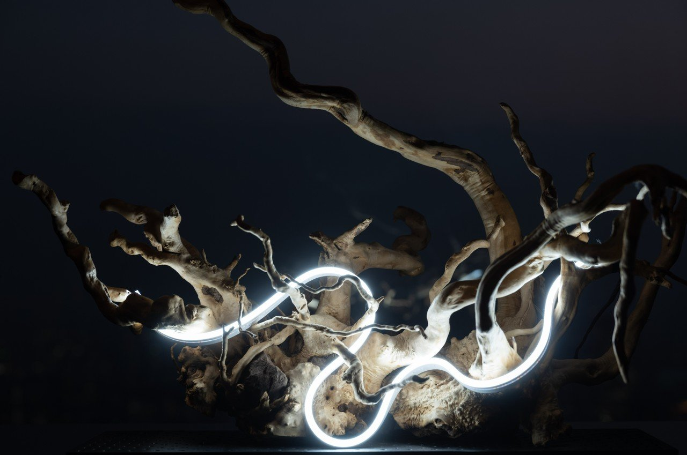](https://assets.st-note.com/production/uploads/images/10226531/picture_pc_87ad5b50ddb430b9dfb7d463f9b2cc90.jpeg) 昼にはない強烈な光だ．[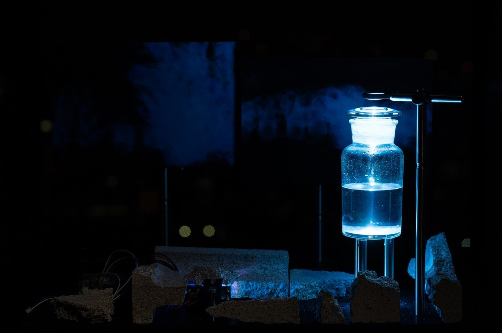](https://assets.st-note.com/production/uploads/images/10226523/picture_pc_073e549255069fe1d55adaed128bd999.jpeg) 夜の闇の中，液中では今日も結晶が育つ．レーザーを拡散して日々，光の形を変えていく． 夜の都市を切り出せば，ブラウン管の明かりとまざりながらアナログとデジタルを越境していく風景が見える．[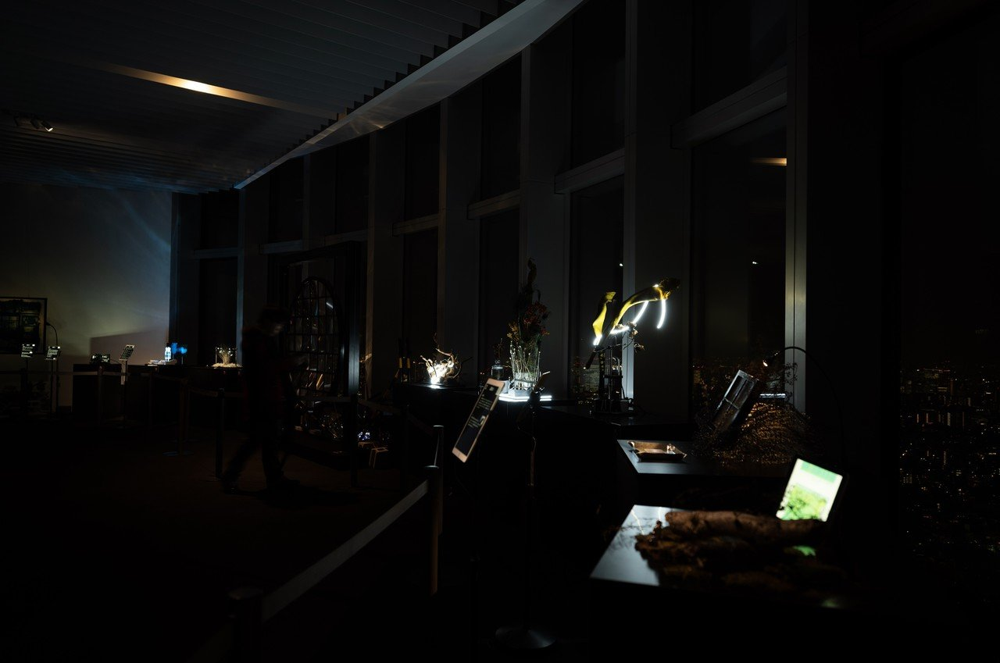](https://assets.st-note.com/production/uploads/images/10226522/picture_pc_6322ee9fafc9c8b5eea833776cfcace8.jpeg) 電気制御のセミが鳴き，宙にモノが自然に浮き，視点が交換され，印刷構造とレンズとデジタルとアナログが混ざり合う，寂びた自然が都市の風景に上書きされていく．

## 高評価して応援しよう！

高評価

  

* [#写真](https://note.com/hashtag/写真)
* [#落合陽一](https://note.com/hashtag/落合陽一)
* [#落合陽一公式](https://note.com/hashtag/落合陽一公式)

60

3

いつも応援してくださる皆様に落合陽一は支えられています．本当にありがとうございます．

チップで応援

[%22%20d%3D%22M-100-100h300v300h-300z%22%2F%3E%3C%2Fsvg%3E)](/ochyai)

[落合陽一](/ochyai)

フォロー中

メディアアーティストで光や音や物性や計算機メディアの研究をしているような感覚的物書きで博士持ちのスナップ写真家です．多様性社会を目指す波動使いの准教授．noteは作家としての個人的な発信です．ご連絡はリンク先のお問い合わせまで．　<https://yoichiochiai.com>