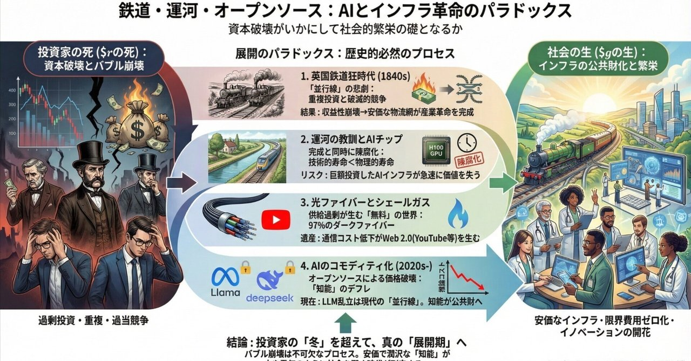
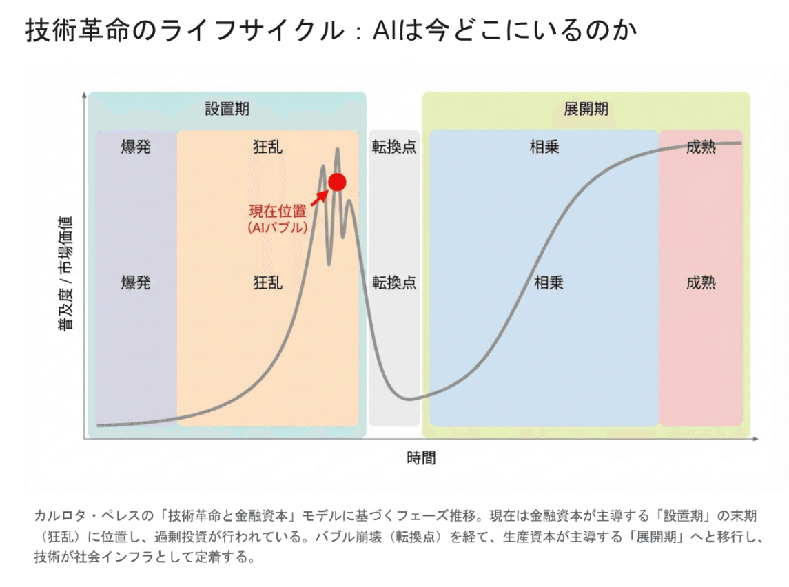
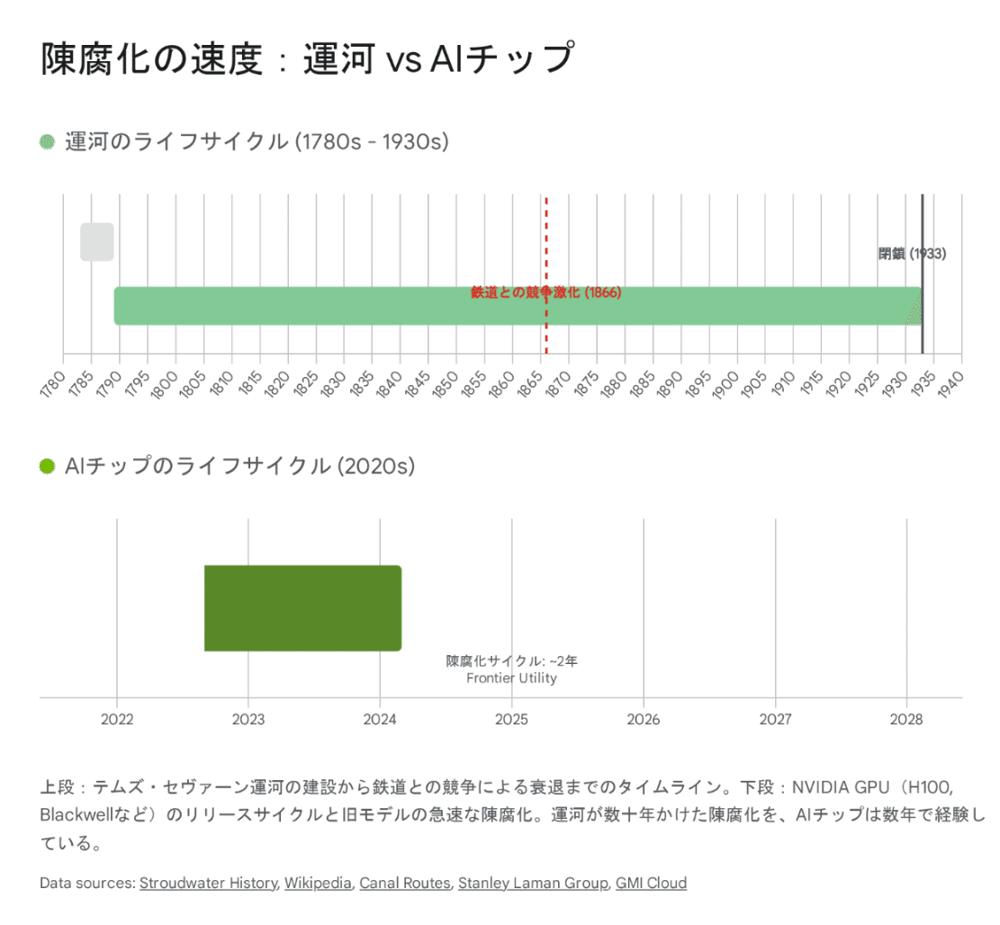

  

# 鉄道・運河・オープンソース：展開のパラドックスとAIの公共財化:資本破壊がいかにして社会的繁栄の礎となるか

48

[%22%20d%3D%22M-100-100h300v300h-300z%22%2F%3E%3C%2Fsvg%3E)](/ochyai)

[落合陽一](/ochyai)

2025年12月21日 15:42

購読中

AIサーベイ

  

### 1. 序論：投資家の死と社会の生、その歴史的必然性

経済史の長きにわたる潮流を俯瞰すると、ある一つの逆説的なパターンが繰り返し浮かび上がる。それは、革新的な技術が登場した際、その技術に魅せられ、巨額の資本を投じた初期の投資家たちの多くが報われないまま市場から退場する一方で、彼らの犠牲の上に築かれたインフラストラクチャーが、その後の社会に計り知れない恩恵をもたらすという現象である。本論考の基底となるドキュメント『AIバブルと歴史的インフラ革命』において提起された「投資家は屍（しかばね）になったが、社会には革命的なインフラが残った」という洞察は、経済学における資本収益率（$r$）と経済成長率（$g$）のダイナミクス、すなわち「$r$ は死んだが $g$ は伸びた」という極めて鋭い歴史的・経済学的真理を突いている 1。  
現在、生成AI（Generative AI）を取り巻く状況は、技術経済学者カルロタ・ペレス（Carlota Perez）が提唱した「技術革命と金融資本」のフレームワークにおける「設置期（Installation Phase）」の最終局面、すなわち「狂乱（Mania）」のフェーズにあると強く示唆される 1。OpenAI、Google、Anthropic、そしてそれらを支えるNVIDIAへの巨額投資は、かつての鉄道狂時代や光ファイバー・バブルと同様に、実需を遥かに超えるインフラ投資を引き起こしている。  
本稿では、提供された資料に基づき、19世紀の英国鉄道狂時代における「並行線（Parallel Lines）」の悲劇、完成と同時に陳腐化した運河の教訓、そして2000年代の光ファイバー・バブルにおける「ダークファイバー」の遺産を詳細に分析する。そして、それらの歴史的事例と現在のAIブーム、とりわけMetaのLlamaシリーズや中国のDeepSeekに代表される「オープンソースによるコモディティ化」との構造的な類似性を論じる。結論として、現在のAIバブルが必然的に迎える「価格破壊」と「収益性の崩壊」こそが、AIを一部の巨大企業の独占物から、社会全体が享受できる「公共財（Public Good）」へと転換させる不可欠なプロセスであることを明らかにする。

### 2. 英国鉄道狂時代（1840年代）：並行する線路と「防衛的投資」の罠

1840年代の英国における「鉄道狂時代（Railway Mania）」は、現代のAIモデル開発競争やGPU争奪戦を理解する上で、最も参照すべき古典的な事例である。蒸気機関という当時の「汎用目的技術（General Purpose Technology）」が引き起こしたこのバブルは、インフラの重複投資がいかにして投資家の富を破壊し、同時に国家の産業基盤を完成させたかを鮮明に示している。  
**2.1. 「スケール」の論理と投資の狂乱**  
1840年代半ば、英国経済は鉄道投資の熱病に浮かされていた。当時の投資家たちは、「鉄道こそが産業の血液であり、ネットワークを支配した者が永遠の独占利益を得る」と信じていた。このナラティブの下、1844年から1847年にかけて、英国議会は数千マイルに及ぶ新規路線の建設を認可した 1。  
特筆すべきは、その投資規模の異常さである。1847年のピーク時には、鉄道建設への投資額は英国のGDPの約6.7%に達した 1。これは現代の経済規模に換算すれば、数兆ドル規模の民間資金が、単一の産業インフラに短期間で投下されたことを意味する。当時の株式市場においても、鉄道関連株は全上場銘柄の時価総額の過半を占めるほどに膨れ上がっていた 1。これは、現在の米国株式市場において、「マグニフィセント・セブン」と呼ばれる巨大テック企業が市場全体を牽引している状況と極めて類似している 4。

**2.2. 失敗のメカニズム：重複投資と「並行線」の悲劇**  
なぜ、これほどの巨額投資が悲劇的な結末を迎えたのか。その核心的な原因は、市場原理に任せた無計画な「重複投資」にある。当時の英国では、政府による中央計画的な路線策定が行われず、民間企業の自由な参入が許されていた。その結果、利益が見込める「ドル箱路線」に対して、複数の鉄道会社が競って参入する事態が発生した。  
最も象徴的なのが、「並行線（Parallel Lines）」の問題である。ロンドンーバーミンガム間や、マンチェスター周辺の産業地帯など、需要の太いルートには、異なる会社が運営する複数の線路が、物理的に並行して敷設された 1。

* **戦略的防衛としての重複:** 多くの場合、既存の鉄道会社は、新たな競合他社の参入を阻止するためだけに、自社路線のすぐ隣に新たな支線を建設するなど、経済合理性を欠いた防衛的投資を行った。例えば、North Staffordshire Railwayは他社の参入を防ぐため、並行する2本の路線を建設したと記録されている 1。これは、「市場シェアを守るためなら、収益性を度外視してでも設備投資を行う」という、現在のAI企業の設備投資競争（軍拡競争）と全く同じ論理である。
* **「似たような生成AI」の乱立:** 現代のAI産業において、Google、OpenAI、Anthropic、Metaなどが、ほぼ同じ機能を持つ大規模言語モデル（LLM）を開発し、それぞれが莫大なコストをかけて学習させている状況は、まさにこの「並行する線路」の現代版と言える 1。物理的な線路が並行して走るのと同様に、論理的に等価なニューラルネットワークがサイバー空間上で重複して構築されているのである。

**2.3. 価格競争と収益性の崩壊：破滅的な競争**  
物理的なインフラが重複して存在する場合、差別化要因は極めて限定され、最終的には「価格」のみが競争の軸となる。並行路線の存在は、必然的に激しい価格競争（Price War）を引き起こし、これは当時の用語で「破滅的な競争（Ruinous Competition）」と呼ばれた 6。  
鉄道事業におけるコスト構造は、固定費（建設費）が極めて大きく、変動費（運行ごとの石炭代や人件費）は比較的小さいという特徴がある。経済学の原理に従えば、激しい競争下では価格は限界費用（変動費）の水準まで低下する。当時の鉄道会社は、隣を走るライバルから客を奪うため、巨額の建設費の回収を度外視し、運行コストギリギリまでの値下げ合戦を繰り広げた 1。  
その結果、鉄道会社の利益率は崩壊した。1845年8月にピークをつけた鉄道株価指数は、その後暴落に転じ、多くの会社が配当を支払えず、あるいは借入金を返済できずに破綻した 1。多くの投資家にとって、鉄道株はただの紙くずとなり、彼らの資産（$r$）は消滅した。  
**2.4. 社会的遺産：産業革命の完成と「社会的貯蓄」**  
しかし、投資家にとっては地獄絵図であったこの結末は、英国社会全体にとっては「天からの贈り物」となった。なぜなら、鉄道会社が破綻しても、敷設された「線路」や「橋梁」、「トンネル」といった物理的資産は消滅しなかったからである。  
破綻した企業の資産は、負債が帳消しにされた状態で（あるいは極めて安価な価格で）整理・統合された。これにより、資本コストの重荷から解放された鉄道ネットワークが誕生した 1。過剰な競争によって引き下げられた運賃は、そのまま維持され、英国全土における石炭、鉄鋼、原材料の輸送コストは劇的に低下した。ある推計によれば、鉄道による貨物輸送運賃は、それまでの馬車や運河に比べて95%もの実質的な低下をもたらしたとされる 1。  
この安価で高速な物流網は、英国の産業革命を「点（工場）」から「面（ネットワーク）」へと拡張し、鉄鋼業や重工業の飛躍的な発展を支えた。ロバート・フォーゲルらによる「社会的貯蓄（Social Savings）」の研究は、鉄道が当時の国民総生産（GNP）の数%に相当するコスト節約効果をもたらしたことを示唆している 1。つまり、鉄道狂時代とは、\*\*「投資家が自らの資産を燃やして、社会共通のインフラを建設した期間」\*\*と定義できるのである。

### 3. 運河の教訓とAIチップの陳腐化リスク

鉄道狂時代に先立つ1790年代の「運河狂時代（Canal Mania）」は、インフラの物理的寿命と技術的寿命の乖離、すなわち「完成した瞬間の陳腐化」という、現在のAIハードウェア投資にとってさらに深刻なリスクを示唆している。  
**3.1. 時間差による陳腐化の恐怖**  
産業革命初期、増大する石炭や物資の輸送需要に応えるため、運河建設ブームが巻き起こった。1793年だけで20以上の運河建設法案が可決されるほどの熱狂であった 1。しかし、運河というインフラは、建設に長い年月を要する。多くの運河が計画・着工された1790年代末に対し、それらが完成して本格的に投資回収を始めようとした1830年代には、すでに「蒸気機関車（鉄道）」という、全く新しいパラダイムが登場していた 1。  
典型的な悲劇の事例として、テムズ・セヴァーン運河（Thames and Severn Canal）が挙げられる。ロンドンとブリストルを結ぶ野心的なプロジェクトとして1789年に完成したが、技術的な不備（漏水）に加え、1840年代の鉄道開通とともに急速に競争力を失った 11。また、ヘレフォード・グロスター運河（Herefordshire and Gloucestershire Canal）も同様に、1845年に全線開通した直後から鉄道との競争に晒され、1880年代には運河そのものが鉄道用地として転用されるという皮肉な結末を迎えた 14。鉄道会社による戦略的な買収や、並行路線の敷設により、運河は「使えない」わけではないが、「遅くて高い」遺物となってしまったのである。運河は完成した瞬間に、その資産価値の大部分を喪失した。  
**3.2. AIインフラへの教訓：H100は「運河」になるか**  
この教訓は、現在のAIハードウェア投資にとって戦慄すべきものである。現在、企業は数千億円を投じてNVIDIAのH100 GPUを大量に購入し、巨大なデータセンターを建設している。しかし、AI技術の進化速度は極めて速い。現在の「Transformerアーキテクチャ」や「GPUによる行列演算」が、5年後も最適解である保証はどこにもない。  
実際、NVIDIA自身が1〜2年おきに性能が数倍向上する新チップ（Blackwellなど）を投入しており、H100の価値は急速に減価償却されている 16。Microsoftのサティア・ナデラCEOが「一世代のチップを4〜5年も減価償却したくない」と発言したように 16、技術的寿命は会計上の耐用年数よりも遥かに短い。もし、数年後に「省エネ脳型チップ（ニューロモルフィック）」や「全く新しいアルゴリズム」が登場した場合、現在建設中のデータセンターは、運河と同様に、完成した瞬間に「ただの電気喰らいの箱」となり、投資回収不能（Sunk Cost）に陥るリスクがある。これは物理的な老朽化ではなく、技術的陳腐化による資産価値の蒸発である。

### 4. 光ファイバーとシェールガス：供給過剰が生む「無料」の世界

19世紀のインフラ革命から時代を下り、現代に近い事例として2000年代の光ファイバー・バブルと2010年代のシェールガス革命を取り上げる。これらは、供給過剰が価格破壊を引き起こし、結果として新たなイノベーションの土壌となった典型例である。  
**4.1. 光ファイバー・バブル：97%のダークファイバーとYouTube**  
1990年代後半、インターネットのトラフィックが「100日で倍増する」という神話の下、WorldComやGlobal Crossingといった通信会社は、地球規模での光ファイバー網建設に邁進した 1。しかし、インフラ建設と並行して「波長分割多重（DWDM）」技術が実用化され、1本の光ファイバーで伝送できるデータ量が数百倍に跳ね上がった。  
物理的なケーブルの敷設競争と、論理的な伝送容量の爆発的拡大が重なった結果、通信帯域の供給能力は需要を遥かに上回った。敷設された光ファイバーの約97%が、一度も光を通すことなく「ダークファイバー（Dark Fiber）」として地中に眠ることとなった 1。  
供給過剰は価格の暴落を招き、通信会社の多くが破綻した。しかし、この「投資家の死」こそが、Web 2.0以降のインターネット文化を花開かせる直接の原因となった。破綻した通信会社からタダ同然で放出された超高速回線があったからこそ、通信コストが限りなくゼロに近づき、YouTubeやNetflixのような「帯域を湯水のように消費する」動画サービスがコスト的に成立したのである 1。  
**4.2. シェールガス革命：利益なき繁栄**  
2010年代の米国シェールガス産業もまた、「利益なき繁栄（Profitless Prosperity）」の罠に陥った 1。フラッキング技術の確立により、独立系石油・ガス会社は借金を重ねて次々と油井を掘削した。個々の企業にとっては増産が合理的行動であったが、全社が一斉に同じ行動をとった「合成の誤謬」により、市場はガスで溢れかえり価格は暴落した。  
多くのシェール企業のフリーキャッシュフローは長期にわたってマイナスであり、投資家はリターンを得られなかった。しかし、世界で最も安い天然ガスと電力は、米国の製造業復活（リショアリング）を支え、経済全体（$g$）には大きなプラスをもたらした 1。これは、生産者が赤字を垂れ流しながら消費者に利益を移転するという構造であり、現在のAI産業における「推論コストの低下」と重なる部分が大きい。

### 5. AIのコモディティ化：オープンソースによる「知能」の限界費用ゼロ化

そして現在、AI産業において歴史は繰り返されようとしている。1840年代の鉄道における「並行線」の役割を果たしているのが、MetaのLlamaシリーズや中国のDeepSeekに代表される「オープンソースモデル」である。これらのモデルは、一部の企業が独占しようとしていた「知能」を、誰もがアクセス可能な公共財へと変えつつある。  
**5.1. DeepSeekショックと価格破壊：知能のデフレ**  
2024年から2025年にかけて、中国のAIスタートアップDeepSeekが公開したモデル「DeepSeek-V3」および「R1」は、AI業界に激震を走らせた。これらのモデルは、OpenAIのGPT-4oなどの最先端モデルと同等の性能を持ちながら、推論コスト（API価格）を劇的に引き下げた 24。  
具体的には、DeepSeek-V3の入力トークン価格は、キャッシュヒット時で100万トークンあたり約0.03ドル（一部条件下）という驚異的な低価格を実現している 27。これは、GPT-4のリリース当初の価格（約30ドル）と比較すると、実に1000分の1のオーダーへの下落である。以下の表は、主要なLLMの入力トークン価格の推移を示したものである。

この劇的な価格低下は、かつての鉄道会社が直面した「並行線による価格競争」そのものである。「知能」はもはや差別化要因ではなく、電気や水のようなコモディティになりつつある。  
**5.2. Metaの「焦土作戦」と公共財化**  
Meta（旧Facebook）の戦略もまた、このコモディティ化を加速させている。Mark Zuckerbergは、巨額のコストをかけて開発したLlamaモデルをオープンソース（正確にはオープンウェイト）として公開している 28。これは、競合他社（GoogleやOpenAI）のビジネスモデル（プロプライエタリなモデルのAPI販売）を破壊するための「焦土作戦」とも解釈できる。  
Metaにとって、AIモデル自体は収益源ではない。彼らの収益源は、AIによって強化された広告プラットフォームやソーシャルネットワークである。したがって、基盤モデルを無料で配ることで、AI開発のエコシステム（PyTorchなど）を自社標準に固定し、競合他社の収益機会を奪うことは合理的な戦略となる 29。この「補完財のコモディティ化」戦略によって、結果として「高性能なAIモデル」は誰もが無料で利用できる公共財へと変質させられている。  
**5.3. $r$ の死と $g$ の生：AI革命の真の結末**  
これらの動向は、AIインフラへの投資回収（$r$）が極めて困難になることを示唆している。Sequoia CapitalのDavid Cahnが提唱した「AI's $600B Question」という試算は、現在のAIインフラ投資（GPUやデータセンター）を正当化するために必要な収益が、アプリケーション層の売上規模から大きく乖離していることを指摘している 30。  
具体的には、NVIDIAの売上予測に基づくと、AIエコシステム全体で年間数千億ドル（約6,000億ドル）の収益が必要となるが、現在の生成AIサービスの収益はその数分の一に過ぎない。多くのAIモデル開発企業は、シェールガス企業のように「利益なき繁栄」に陥るか、ドットコム時代の通信会社のように破綻・統合される可能性が高い。  
しかし、この見通しに悲観する必要があるのは「投資家」だけである。私たち社会（消費者、労働者、次世代の起業家）にとって、このバブルは歓迎すべきものである。歴史的に見れば、インフラ革命期のバブルとは、\*\*「合理的判断では決して建設できない採算度外視の巨大インフラを、強欲な投資家から資金を吸い上げて建設させ、完成後に破綻させることで、社会にタダ同然で開放する」\*\*という、資本主義のシステムに組み込まれた一種の再分配メカニズム（あるいはバグ）である 1。  
かつて、破綻した鉄道会社が残した線路が産業革命を完成させ、破綻した通信会社が残した光ファイバーがYouTubeを生んだように、今、投資家が屍となって築き上げている「AIデータセンター群」と「高性能な学習済みモデル」は、将来、ほぼ無料の「知能インフラ」として社会に残る。医療、教育、科学研究、創薬などの分野で、誰もが安価に高度な知能を利用できる環境が整い、社会全体の成長（$g$）が爆発的に加速する――これこそが、歴史が示唆するAI革命の「真の結末」なのである。

### 6. 結論

本稿では、ドキュメント『AIバブルと歴史的インフラ革命』の内容を検証し、鉄道、運河、光ファイバーといった過去のインフラ革命との比較を通じて、現在のAIブームの行く末を考察した。

1. **展開のパラドックス:** 革命的技術の普及過程では、初期投資家の資本破壊（$r$ の死）が、社会的なインフラの整備（$g$ の生）の必要条件となる。
2. **並行線の悲劇:** 1840年代の鉄道における重複投資は、現在のAIモデル開発競争（LLMの乱立）と構造的に同型であり、必然的に過当競争と収益性の低下を招く。
3. **運河の教訓:** 技術的陳腐化のスピードは速く、現在のGPUインフラもまた、運河のように完成と同時に価値を失うリスクを抱えている。
4. **コモディティ化の加速:** オープンソース（Meta, DeepSeek）の台頭は、鉄道における値下げ競争や光ファイバーにおける帯域価格崩壊と同じ役割を果たし、「知能」を公共財へと押し下げている。

我々は今、歴史的な転換点に立っている。投資家にとっては冬の時代が到来するかもしれないが、その先には、安価で潤沢な「知能」が水や電気のように社会を潤す、真の「展開期（Deployment Phase）」が待っているのである。AIという新たなインフラが「公共財」として機能し始めたとき、真のイノベーションの時代が幕を開けるだろう。  
**引用文献**

1. AIバブルと歴史的インフラ革命
2. Technological Revolutions and Financial Capital - Edward Elgar Publishing, 12月 21, 2025にアクセス、 <https://www.e-elgar.com/shop/usd/technological-revolutions-and-financial-capital-9781843763314.html>
3. 12月 21, 2025にアクセス、 <https://www.focus-economics.com/blog/railway-mania-the-largest-speculative-bubble-you-never-heard-of/#:~:text=Government%20was%20obliging%3B%20in%201845,the%20economy%20at%20the%20time.>
4. The Mag 7 in Charts: How Big Tech Dominates the Market - Investopedia, 12月 21, 2025にアクセス、 <https://www.investopedia.com/the-mag-7-in-charts-how-big-tech-dominates-the-market-11866473>
5. Asset Bubbles and Product Market Competition, 12月 21, 2025にアクセス、 <https://www.bde.es/f/webpi/SES/seminars/2018/Fich/sie1826.pdf>
6. 1887. CONGRESSIONAL RECORD-SENATE. - Congress.gov, 12月 21, 2025にアクセス、 <https://www.congress.gov/49/crecb/1887/01/14/GPO-CRECB-1887-pt1-v18-25-1.pdf>
7. Democratising Speculation: The Great Railway Mania (Chapter 4) - Boom and Bust, 12月 21, 2025にアクセス、 <https://www.cambridge.org/core/books/boom-and-bust/democratising-speculation-the-great-railway-mania/F5A16DC376684C14020C78D86B4A4B48>
8. Innovations in Transportation | World History - Lumen Learning, 12月 21, 2025にアクセス、 <https://courses.lumenlearning.com/suny-worldhistory/chapter/innovations-in-transportation/>
9. Innovations in Transportation - History Guild, 12月 21, 2025にアクセス、 <https://historyguild.org/innovations-in-transportation/>
10. Canals as pre-rail infrastructure buildings | Paradox Interactive Forums, 12月 21, 2025にアクセス、 <https://forum.paradoxplaza.com/forum/threads/canals-as-pre-rail-infrastructure-buildings.1564643/>
11. Thames & Severn Canal - Stroudwater History, 12月 21, 2025にアクセス、 <https://stroudwaterhistory.org.uk/thames-severn-canal/>
12. Thames and Severn Canal - Wikipedia, 12月 21, 2025にアクセス、 <https://en.wikipedia.org/wiki/Thames_and_Severn_Canal>
13. Thames and Severn Canal Route, 12月 21, 2025にアクセス、 <http://www.canalroutes.net/Thames-and-Severn-Canal.html>
14. The Hereford and Gloucester canal - Herefordshire Through Time, 12月 21, 2025にアクセス、 <https://htt.herefordshire.gov.uk/herefordshires-past/the-post-medieval-period/transport/canals/the-hereford-and-gloucester-canal/>
15. Joining the Dots – a strategy for the restoration of the Herefordshire and Gloucestershire Canal, 12月 21, 2025にアクセス、 <https://h-g-canal.org.uk/wp-content/uploads/2025/03/Joining-the-Dots-A-New-Strategy-Document-for-the-H-G-Canal-Trust-11-March-2025.pdf>
16. Why GPU Useful Life Is the Most Misunderstood Variable in AI Economics, 12月 21, 2025にアクセス、 <https://www.stanleylaman.com/signals-and-noise/gpus-how-long-do-they-really-last>
17. 2025 Cost of Renting or Buying NVIDIA H100 GPUs for Data Centers - GMI Cloud, 12月 21, 2025にアクセス、 <https://www.gmicloud.ai/blog/2025-cost-of-renting-or-uying-nvidia-h100-gpus-for-data-centers>
18. Canal - Wikipedia, 12月 21, 2025にアクセス、 <https://en.wikipedia.org/wiki/Canal>
19. Boom, Bubble, Bust: The Fiber Optic Mania - History of the Internet, 12月 21, 2025にアクセス、 <https://internethistory.org/wp-content/uploads/2020/01/OSA_Boom.Bubble.Bust_Fiber.Optic_.Mania_.pdf>
20. SubTel Forum Issue #42 - Pacific Outlook by Submarine Telelecoms Forum - Issuu, 12月 21, 2025にアクセス、 <https://issuu.com/subtelforum/docs/subtel_forum_issue_42>
21. Research Project - Carlota Perez, 12月 21, 2025にアクセス、 <https://carlotaperez.org/research-project/>
22. Exclusive: Ditched Bitumen Desperately Seeks True Commitment - The Energy Mix, 12月 21, 2025にアクセス、 <https://www.theenergymix.com/exclusive-ditched-bitumen-desperately-seeks-true-commitment/>
23. Uber Freight conference spotlights AI, tariffs, “profitless prosperity” - FreightWaves, 12月 21, 2025にアクセス、 <https://www.freightwaves.com/news/uber-freight-conference-spotlights-ai-tariffs-profitless-prosperity>
24. How DeepSeek has changed artificial intelligence and what it means for Europe - Bruegel, 12月 21, 2025にアクセス、 <https://www.bruegel.org/policy-brief/how-deepseek-has-changed-artificial-intelligence-and-what-it-means-europe>
25. Introducing DeepSeek-V3.2-Exp, 12月 21, 2025にアクセス、 <https://api-docs.deepseek.com/news/news250929>
26. DeepSeek's Low Inference Cost Explained: MoE & Strategy | IntuitionLabs, 12月 21, 2025にアクセス、 <https://intuitionlabs.ai/articles/deepseek-inference-cost-explained>
27. LLM API Pricing Comparison (2025): OpenAI, Gemini, Claude | IntuitionLabs, 12月 21, 2025にアクセス、 <https://intuitionlabs.ai/articles/llm-api-pricing-comparison-2025>
28. Evaluating Natural Monopoly Conditions in the AI Foundation Model Market - RAND, 12月 21, 2025にアクセス、 <https://www.rand.org/content/dam/rand/pubs/research_reports/RRA3400/RRA3415-1/RAND_RRA3415-1.pdf>
29. An Antimonopoly Approach to Governing Artificial Intelligence - Yale Law & Policy Review, 12月 21, 2025にアクセス、 <https://yalelawandpolicy.org/antimonopoly-approach-governing-artificial-intelligence>
30. I Had to Understand the AI Bubble Debate. Here's My Attempt. - Medium, 12月 21, 2025にアクセス、 <https://medium.com/swlh/i-had-to-understand-the-ai-bubble-debate-heres-my-attempt-58818fd361d3>
31. AI's $600B Question - Sequoia Capital, 12月 21, 2025にアクセス、 <https://sequoiacap.com/article/ais-600b-question/>

ここから先は有料部分です

ダウンロード

 

copy

## 高評価して応援しよう！

高評価

%22%20d%3D%22M-100-100h300v300h-300z%22%2F%3E%3C%2Fsvg%3E)%22%20d%3D%22M-100-100h300v300h-300z%22%2F%3E%3C%2Fsvg%3E)%22%20d%3D%22M-100-100h300v300h-300z%22%2F%3E%3C%2Fsvg%3E)

3人

  

* [#落合陽一](https://note.com/hashtag/落合陽一)
* [#落合陽一公式](https://note.com/hashtag/落合陽一公式)

この記事は[noteマネー](https://money.note.com/)にピックアップされました

* [NVDA

  NVIDIA Corporation](https://money.note.com/us-companies/NVDA)
* [GOOGL

  Alphabet Inc. A](https://money.note.com/us-companies/GOOGL)
* [META

  Meta Platforms, Inc.](https://money.note.com/us-companies/META)

48

1

いつも応援してくださる皆様に落合陽一は支えられています．本当にありがとうございます．

チップで応援

[%22%20d%3D%22M-100-100h300v300h-300z%22%2F%3E%3C%2Fsvg%3E)](/ochyai)

[落合陽一](/ochyai)

フォロー中

メディアアーティストで光や音や物性や計算機メディアの研究をしているような感覚的物書きで博士持ちのスナップ写真家です．多様性社会を目指す波動使いの准教授．noteは作家としての個人的な発信です．ご連絡はリンク先のお問い合わせまで．　<https://yoichiochiai.com>