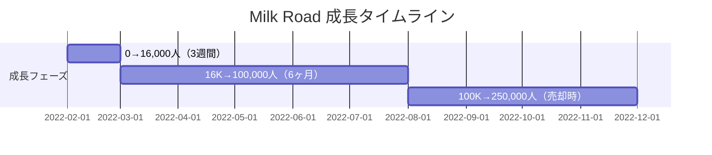
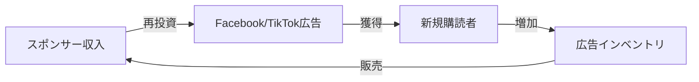

# Milk Road ケーススタディ

## 1. 基本情報

| 項目 | 内容 |
|------|------|
| ニュースレター名 | Milk Road |
| 運営者 | Shaan Puri & Ben Levy |
| URL | https://milkroad.com/ |
| プラットフォーム | beehiiv |
| 開始日 | 2022年2月8日 |
| 配信頻度 | 平日毎日（週5回） |
| 読了時間 | 約5分 |
| 売却日 | 2022年12月16日（10ヶ月後） |
| 売却先 | Bitfo |
| 売却額 | 推定$10M+ |

### 運営者経歴

**Shaan Puri**
- My First Million ポッドキャスト共同ホスト（Sam Parrと）
- 複数の会社を売却した連続起業家
- Twitter フォロワー 100,000+
- ニュースレター立ち上げ時点で既に30,000人の既存購読者

---

## 2. 数値サマリー

| 指標 | 値 |
|------|-----|
| 売却時購読者数 | 250,000+ |
| 成長期間 | 10ヶ月 |
| 6ヶ月時点ARR | $1,000,000 |
| Facebook広告費用 | $180,750 |
| 広告経由獲得数 | 150,000+ |
| 初期CPA | $1.00-$1.30 |
| 後期CPA | $1.70-$2.00 |
| オープン率 | 45% |
| 売却推定額 | $10M+ |

---

## 3. 収益構造

### スポンサーシップモデル

| 指標 | 数値 |
|------|------|
| 購読者あたり月間収益 | 約$0.50 |
| ペイバック期間 | 2-3ヶ月 |
| 6ヶ月時点ARR | $1,000,000 |
| 広告スロット価格 | 約$10,000/回 |

### ユニットエコノミクス

```
購読者獲得コスト: $1.00-$2.00
月間収益/購読者: $0.50
ペイバック期間: 2-3ヶ月
→ 4ヶ月目以降は純利益
```

---

## 4. 成長曲線分析

### マイルストーン達成履歴



### 転換点（Tipping Points）

| # | 時期 | イベント | 効果 |
|---|------|----------|------|
| 1 | 2022年2月8日 | My First Millionで正式発表 | 最初の3週間で16,000購読者 |
| 2 | 2022年春 | $1Mパブリックウォレット | バイラルマーケティングスタント |
| 3 | 2022年8月頃 | 100,000購読者達成 | $1M ARR達成 |
| 4 | 2022年12月 | Bitfoに売却 | 10ヶ月で8桁Exit |

---

## 5. 失敗・ピボット履歴

### 市場環境の逆風

- 2022年は暗号通貨市場が大暴落した年
- $1Mパブリックウォレットは**70%の価値を喪失**
- しかし、この損失を「面白いコンテンツ」に変換
- 逆に注目を集める結果に

### 売却交渉の困難

- クリプト市場の暴落と同時進行
- **2度、交渉が破談しかけた**
- WittmeyerのNon-compete条項問題
- 「ジェットコースターのような交渉」と表現

---

## 6. バイラルコンテンツ分析

### $1Mパブリックウォレット戦略

| 要素 | 詳細 |
|------|------|
| 投資額 | 自己資金$1,000,000 |
| 仕組み | 公開クリプトウォレットでリアルタイム追跡可能 |
| 結果 | 70%暴落 → 逆に話題に |
| 効果 | 「投資をスペクタクルスポーツ化」 |

### 効果的な広告クリエイティブ

1. **ミーム広告**: クリプト文化に馴染むユーモア
2. **ソーシャルプルーフ広告**: 購読者数や推薦の表示

---

## 7. 収益化導線分析

### 収益の再投資サイクル



**結果**: 自己資金で成長、クリプト市場暴落中も黒字維持

---

## 8. マーケティング戦略

### 成長チャネル構成

| チャネル | 貢献度 | 詳細 |
|----------|--------|------|
| **Facebook広告** | 85%+ | Matt McGarry's agencyを利用 |
| **既存オーディエンス** | 高 | Shaanの100K+ Twitterフォロワー |
| **ポッドキャスト** | 高 | My First Millionでの継続的言及 |
| **リファラル** | 中 | シンプルな1-for-1システム |

### リファラルプログラム設計

**シンプルな1-for-1システム**:
- 1人紹介 = PDFレポート「What 12 Crypto Whales are Betting On」をプレゼント
- Ben Levyが数時間で作成
- beehiivで完全自動化
- 物理的な商品なし = **コスト$0**

| 比較項目 | Milk Road | Morning Brew |
|----------|-----------|--------------|
| 報酬数 | 1つ | 10以上 |
| 報酬タイプ | デジタル | 物理商品含む |
| 自動化 | 完全自動 | 発送業務あり |
| コスト | 無料 | 高コスト |

---

## 9. 成功要因分析

### 主要成功要因

| 要因 | 詳細 |
|------|------|
| **1. タイミング** | クリプト市場への関心ピーク（2021-2022年初頭） |
| **2. 既存オーディエンス** | 100,000+ Twitterフォロワー、30,000購読者 |
| **3. 実証済みプレイブック** | The Hustleの成長戦略を熟知 |
| **4. 有料広告の積極活用** | ROIが合えば躊躇なく投資 |
| **5. シンプルなリファラル** | 複雑なシステムを避け、1つの報酬に絞る |
| **6. 一貫した実行** | 毎日配信を継続 |

### 成功の方程式

```
成功 = (証明済みフォーマット)
     + (成長中のニッチ)
     + (既存オーディエンス)
     + (有料広告)
     + (シンプルなリファラル)
     + (一貫した実行)
```

### 差別化要因

| 従来のクリプトメディア | Milk Road |
|----------------------|-----------|
| 専門的・技術的 | 親しみやすい |
| 長文 | 5分で読める |
| 真面目なトーン | ミーム・ユーモア |
| 不定期更新 | 毎日配信 |

---

## 10. 日本市場への示唆

### 日本版立ち上げの可能性

| 観点 | 評価 | 理由 |
|------|------|------|
| ニッチの需要 | ★★★☆☆ | 日本のクリプト市場は規制が厳しい |
| 競合状況 | ★★★★☆ | 日本語のクリプトNLは少ない |
| コンテンツ移転性 | ★★★☆☆ | グローバルニュースは共通、日本特有の規制情報が必要 |
| 収益モデル再現性 | ★★★☆☆ | 日本のクリプト広告主は限定的 |
| ターゲット存在 | ★★☆☆☆ | クリプト投資家は相対的に少ない |

### 日本版実装時の推奨事項

1. **ニッチの再定義**: クリプト単独ではなく「Web3/フィンテック」に拡大
2. **規制対応**: 日本の金融庁規制に準拠した内容
3. **収益モデル**: 広告依存ではなく有料購読を検討
4. **プラットフォーム**: beehiivまたはSubstack

---

## 11. 主要な教訓

1. **既存プレイブックの応用**: 成功したモデルを新しいニッチに適用
2. **シンプルなリファラル**: 1つの報酬、デジタル商品、完全自動化
3. **有料広告を恐れない**: ROIが合えば躊躇なく投資
4. **短いペイバック期間**: 3ヶ月以内に回収できる仕組み
5. **注目を集めるスタント**: 話題性のある施策で無料露出を獲得
6. **既存オーディエンスの活用**: コールドスタート問題を回避
7. **Exit戦略を持つ**: 10ヶ月での売却を実現

---

## Sources

- [They Got Acquired - Milk Road Acquisition](https://theygotacquired.com/content/milk-road-acquired-by-bitfo/)
- [beehiiv Case Study - Milk Road](https://blog.beehiiv.com/p/case-study-milk-road-ben-levy-shaan-puri)
- [beehiiv - Milk Road: From 0 to Acquisition in 10 Months](https://blog.beehiiv.com/p/milk-road-newsletter-acquisition)
- [Startup Spells - Milk Road Marketing Playbook](https://startupspells.com/p/milk-road-marketing-playbook-crypto-newsletter-7-figure-exit-in-10-months)
- [List Growth Engineers - Milk Road Case Study](https://www.listgrowthengineers.com/blog/milk-road-newsletter-growth-case-study)
