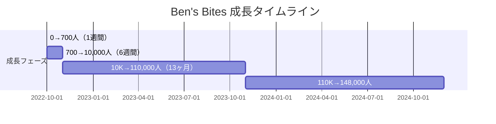
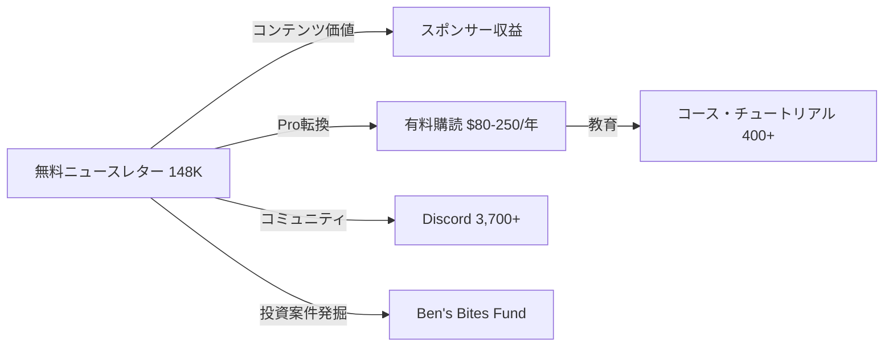

# Ben's Bites ケーススタディ

## 1. 基本情報

| 項目 | 内容 |
|------|------|
| ニュースレター名 | Ben's Bites |
| 運営者 | Ben Tossell |
| URL | https://bensbites.beehiiv.com/ |
| プラットフォーム | beehiiv（以前はSubstack） |
| 開始日 | 2022年10月10日 |
| 配信頻度 | 毎日（Daily） |
| 本拠地 | Flitwick, United Kingdom |

### 運営者経歴

- **MakerPad創業者**: 2019年開始、2ヶ月で$30K/月の利益
- **2021年**: MakerPadをZapierに売却（数百万ドル、85%保有）
- No-Codeムーブメントの先駆者
- コミュニティ構築の豊富な経験

---

## 2. 数値サマリー

| 指標 | 値 |
|------|-----|
| 総購読者数 | 148,000+ |
| 有料購読者数 | 100+（2024年9月時点） |
| 有料転換率 | 約1.5%（推定） |
| 推定ARR | $500K-$1M+ |
| Discord会員 | 3,700+ |
| カバーしたストーリー数 | 12,000+ |
| 生成クリック数 | 4,000,000+ |

### 価格設定

| プラン | 価格 |
|--------|------|
| 月額 | $25 |
| 年額 | $80（以前は$150/年、初期は$100/年） |
| ライフタイム | $250 |
| チームプラン | $1,625（10人まで） |

### 広告単価

| 広告タイプ | 価格 |
|------------|------|
| メイン広告 | $2,000 |
| ツールセクション | $1,200 |
| 分類広告 | $200 |

---

## 3. 収益構造

### 収益源の構成

| 収益源 | 推定金額（月間） |
|--------|------------------|
| スポンサーシップ | $20,000-$50,000 |
| Pro購読 | $30,000+（推定） |
| Ben's Bites Fund | キャリー（長期） |

### Pro会員の特典

- 400以上のコース・チュートリアル
- Slackコミュニティアクセス
- ライブワークショップ
- AIツール割引
- 週2回の「Best of AI」ニュースレター
- 広告なし
- 認定証発行

---

## 4. 成長曲線分析

### マイルストーン達成履歴



### タイムライン詳細

| 時期 | イベント | 購読者数 |
|------|----------|----------|
| 2022年10月10日 | ローンチ | 0 |
| 1週間後 | 初期成長 | 270→700 |
| 6週間後 | **ChatGPT公開6週間前** | 10,000 |
| 2023年2月 | Twitter広告開始 | - |
| 2023年3月 | 1日1,000人以上獲得 | - |
| 2023年11月 | Pro版ローンチ | 110,000+ |
| 2024年10月 | 500号発行、2周年 | 148,000+ |

### 転換点（Tipping Points）

| # | 時期 | イベント | 効果 |
|---|------|----------|------|
| 1 | 2022年10月 | **ChatGPT公開6週間前にローンチ** | AI津波の最前線に位置 |
| 2 | 2022年10月〜2023年3月 | Reply Guy戦略の徹底 | オーガニック成長の基盤 |
| 3 | 2023年11月 | Ben's Bites Pro ローンチ | 収益多角化 |

---

## 5. 失敗・ピボット履歴

### ビジネスモデルの進化

```
Phase 1: 無料ニュースレター + スポンサー（2022年10月〜）
Phase 2: Discord/コミュニティ追加（2023年2月〜）
Phase 3: Pro購読ローンチ（2023年11月〜）
Phase 4: 投資ファンド展開（Ben's Bites Fund）
Phase 5: ライフタイム購読モデルへのシフト
```

### 広告主対応の課題

Ben自身が「広告主対応は嫌いなこと」と明言。ライフタイムサブスクモデルへ移行することで：
- シンプルさを維持
- 広告主管理の負担軽減
- 会員体験の向上

---

## 6. バイラルコンテンツ分析

### Twitter Reply Guy戦略

**Google CEO へのリプライ事例**:
- 25,700ビュー
- 35いいね
- 6ブックマーク
- 推定数百人の新規購読者（Google社員含む）

### 効果的だった施策

| 施策 | 効果 |
|------|------|
| Apple Notes風広告 | コミュニティで反響 |
| 読者の声 + ミーム | エンゲージメント向上 |
| ビルディング・イン・パブリック | ブランド信頼構築 |

### リファラルプログラム

**報酬設計**:
- 2人紹介 → AI Project Tracker（全リンクのフィルタリング・検索可能データベース）へのアクセス
- 低摩擦、高価値の報酬設計
- データベースからニュースレター本文へのリンクバックで再訪促進

---

## 7. 収益化導線分析

### マネタイズモデル



### Ben's Bites Fund

| 項目 | 詳細 |
|------|------|
| チェックサイズ | $200K-$500K |
| ファンドバッカー | Sequoia, O'Shaughnessy Ventures, Ron Conway, Thrive, Ryan Hoover |
| 投資先 | Supabase, Flutterflow, Etched, SF Compute, Pika Labs, Gamma, Julius, CrewAI, Wordware等 |

---

## 8. マーケティング戦略

### Twitter/X戦略（最重要）

**Reply Guy戦術**:
- AIに関するあらゆるツイートのコメント欄に出現
- Ryan Hoover（Product Hunt創業者）と同じ手法
- 2022年10月〜2023年3月末まで毎日継続

### 成長チャネル構成

| チャネル | 時期 | 効果 |
|----------|------|------|
| Twitter Reply Guy | 2022年10月〜2023年3月 | オーガニック基盤構築 |
| Twitter広告 | 2023年2月〜 | 有料成長加速 |
| Discord | 2023年2月〜 | コミュニティ形成 |
| ハッカソン | 随時 | エンゲージメント強化 |

### ハッカソン

- Ben's Bites Hackathon: $27,000の賞金
- 審査員: StabilityAI、Hugging Face、Balderton Capital、Sahil Lavingia等
- 48時間ハッカソンで最大$250,000以上の賞金プール

---

## 9. 成功要因分析

### 主要成功要因

| 要因 | 詳細 |
|------|------|
| **1. 完璧なタイミング** | ChatGPT公開の6週間前にローンチ |
| **2. 過去の経験** | MakerPad売却経験、コミュニティ構築ノウハウ |
| **3. ラーニング・イン・パブリック** | 自分の学びを共有するスタイル |
| **4. 高速実験** | 3日目でフォーマット変更、完璧主義を排除 |
| **5. シンプルさへのこだわり** | 従業員ゼロ、コントラクターのみ |
| **6. 透明性** | スポンサーパフォーマンスの公開 |

### Ben自身の言葉

> "It's probably not the best business model, but I'm not optimizing for that. I'm optimizing for what's best for members and what's best for my lifestyle."

### メガトレンドに乗る

> "Build businesses on mega-trends - When a market is growing quickly (e.g 15%+ YoY growth), industry tailwinds will compound your growth."

---

## 10. 日本市場への示唆

### 日本版立ち上げの可能性

| 観点 | 評価 | 理由 |
|------|------|------|
| ニッチの需要 | ★★★★★ | 日本でもAI需要は急成長中 |
| 競合状況 | ★★★☆☆ | 日本語のAI特化NLは増加中 |
| コンテンツ移転性 | ★★★★★ | グローバルAIニュースは共通 |
| 収益モデル再現性 | ★★★★☆ | スポンサー+有料購読は可能 |
| ターゲット存在 | ★★★★★ | AI関心層は多い |

### 日本版実装時の推奨事項

1. **日本語ローカライズ**: グローバルニュース+日本企業のAI活用事例
2. **コミュニティ構築**: Discord/Slackで日本AI関心層を集約
3. **ハッカソン開催**: 日本のAIスタートアップとの連携
4. **価格設定**: 月額2,000-3,000円、年額15,000-20,000円

---

## 11. 主要な教訓

1. **メガトレンドに乗る**: 15%+成長市場でビジネスを構築
2. **完璧を求めず始める**: 3日目でフォーマット変更OK
3. **Reply Guy戦略**: 毎日AIツイートに返信し続ける地道な作業
4. **コミュニティは資産**: Discord、ハッカソンでエンゲージメント強化
5. **シンプルさを維持**: 従業員を雇わず、ライフスタイル重視
6. **透明性がブランドを築く**: 成功も失敗も公開

---

## Sources

- [Growth in Reverse: How Ben Tossell Grew Ben's Bites](https://growthinreverse.com/bens-bites/)
- [Ben's Bites on Beehiiv](https://bensbites.beehiiv.com/)
- [Capital Letter: Trending AI Newsletter](https://www.capitalletter.com/p/bens-bites)
- [Creator Economy: How I Built a 7-Figure Business with AI](https://creatoreconomy.so/p/how-i-built-a-7-figure-business-with-ai-ben-tossell)
- [Ben's Bites Pro](https://pro.bensbites.co/)
- [Ben Tossell on X](https://x.com/bentossell)
- [CB Insights: Ben's Bites Portfolio](https://www.cbinsights.com/investor/bens-bites)
