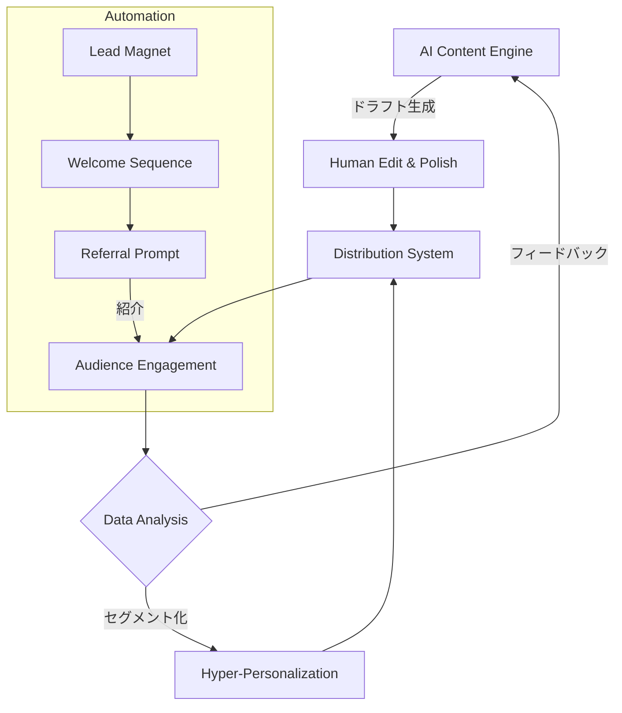

# NL_TOOL_004: AI×自動化による爆発的成長メソッド

**カテゴリ**: 🛠️ ツール・AI活用  
**ソース**: jabba ニュースレター / Newsletter Operator  
**記事URL**: ⚠️ 調査困難（詳細Web補完）  
**調査日**: 2025-12-27  
**ステータス**: ✅ 完了

---

## 概要

英語圏最大のニュースレターコミュニティ「Newsletter Operator」等が提唱する、AIとオートメーションを組み合わせた「爆発的成長（Explosive Growth）」のための実践的メソッド。

---

## 戦略サマリー

### 一言まとめ
「コンテンツ作成」と「リスト成長」の両輪をAIで自動化し、人間は「戦略」と「関係構築」に集中するハイブリッド運営モデル。

### 対象者
- 1人で運営しているが、チーム並みのアウトプットを出したい人
- コンテンツ作成に時間がかかりすぎて、集客に手が回っていない人
- 既存の購読者リストを活用しきれていない人

### 期待効果
- 週数時間の作業で毎日配信が可能になる
- パーソナライズされた配信でエンゲージメント（開封率）が向上する
- 自動化されたリファラルシステムにより、寝ている間に読者が増える

---

## 核心フレームワーク

### AI Growth Flywheel

### 3つの自動化柱

| # | 柱 | ツール例 | 説明 |
|---|---|----------|------|
| 1 | **Create (作成)** | Jasper, Lex, Claude | アイデア出し、ドラフト作成、要約をAIに任せ、人間は編集に注力 |
| 2 | **Grow (成長)** | SparkLoop, Beehiiv | 紹介プログラムとクロスプロモーションを自動化 |
| 3 | **Optimize (最適化)** | Rasa.io, Zapier | 読者の行動データを分析し、個別に最適なコンテンツを自動配信 |

---

## 実践ステップ

### Phase 1: コンテンツエンジンの構築
1. **AIプロンプトの開発**: 自分の文体（Tone of Voice）を学習させたプロンプトテンプレートを作成する。
2. **ワークフロー自動化**: FeedlyやX(Twitter)からネタを収集し、Notion等に蓄積→AIが下書き生成という流れをZapier/Makeで組む。
3. **編集プロセスの確立**: 生成された80点のアウトプットを、人間が100点（+独自性）にする「編集チェックリスト」を作る。

### Phase 2: 成長システムの自動化
1. **ウェルカムシーケンス**: 登録直後の最も熱量の高い時期に、自動で「価値ある過去記事」や「自己紹介」を送る（5-7通）。
2. **リファラル導入**: 「3人紹介したらPDFプレゼント」のような特典を用意し、SparkLoop等で自動追跡・報酬付与を行う。
3. **SNS連携**: ニュースレター発行と同時に、要約版をSNS（X, LinkedIn）に自動投稿する設定を行う（Typefully等）。

### Phase 3: パーソナライゼーション
1. **セグメント配信**: 開封・クリックデータに基づき、興味関心タグを自動付与する。
2. **動的コンテンツ**: 興味タグに応じて、配信内容の一部（紹介記事など）を自動で差し替える。
3. **再活性化**: 一定期間未開封の読者に対し、自動で「再エンゲージメントメール」を送り、反応がなければリストから削除（クリーニング）する。

---

## 成功事例・数値

### Newsletter Operator (Matt McGarry)
- **実績**: クライアントのニュースレターを数ヶ月で数万人に成長させる実績多数。
- **手法**: Facebook広告とAIによるABテストを組み合わせ、CPA（獲得単価）を極限まで下げる手法が得意。
- **学び**: 「有料広告×AI最適化」は、オーガニック成長の限界を突破する鍵となる。

### The Rundown AI
- **実績**: 2年で200万人以上の購読者を獲得。
- **手法**: AIツールの最新情報を「自動収集」し、短時間でキュレーションして毎日配信。
- **学び**: 「スピード」と「一貫性」こそが、AI時代の最大の価値提供。

---

## 日本市場適用性評価

### 適用可能性: ★★★★☆（高い）

| 項目 | 評価 | コメント |
|------|------|----------|
| ツール環境 | ○ | BeehiivやZapierは日本でも利用可能。翻訳の手間は多少あり。 |
| 読者リテラシー | ◎ | AI・効率化への関心は非常に高く、この手法自体がコンテンツになる。 |
| 競合優位性 | ◎ | ここまで高度に自動化している日本の個人運営者はまだ稀。 |
| 言語障壁 | △ | AIの日本語出力精度は向上しているが、まだ「不自然さ」が残るため、編集は必須。 |

### 日本向けアクション案
1. **「AI×時短」を売りにする**: 忙しいビジネスマン向けに、AIで要約した業界ニュースを毎日届ける。
2. **翻訳コンテンツの自動化**: 海外の良質な記事をAIで翻訳・要約し、日本語で紹介する（情報のアービトラージ）。

---

## 重要数値・ベンチマーク

| 指標 | 目標値 | 備考 |
|------|--------|------|
| コンテンツ作成時間 | 30分/本 | AI活用なし（2-3時間）からの短縮 |
| 配信頻度 | 毎日 or 週3回 | 自動化により頻度を増やす |
| 開封率 | 40%以上 | 頻度を上げても質を落とさない |
| リファラル獲得率 | 5-10% | 自動化された紹介経由の新規読者 |

---

## 注意点・落とし穴

### やってはいけないこと
- ❌ **AI丸投げ**: 「AIが書いたまま」の記事を配信すること。読者は「魂」の不在をすぐに見抜く。
- ❌ **過剰な自動化**: 問い合わせへの返信など、「人間味」が必要な部分までBOT化してしまうこと。
- ❌ **ツール貧乏**: 便利なツールを使いすぎて、収益以上に固定費が膨らむこと（最初は最低限でOK）。

### よくある失敗

| 失敗 | 原因 | 対策 |
|------|------|------|
| **コピペコンテンツ** | AIの出力をそのまま使用 | 必ず「自分の体験談」や「独自の視点」を2割加える。 |
| **スパム扱い** | 配信頻度の急増 | ドメイン評価を見ながら、徐々に頻度を上げる。 |
| **無機質な印象** | テンプレートの使い回し | 冒頭の挨拶や編集後記は、必ずその時の自分の言葉で書く。 |

---

## アクションチェックリスト

- [ ] コンテンツ作成ワークフローを図式化し、どこをAI化できるか洗い出す
- [ ] ChatGPT/Claudeに「自分の過去記事」を読ませ、文体模写のプロンプトを作る
- [ ] BeehiivやConvertKitの「ウェルカムオートメーション」を設定する
- [ ] Zapier/Makeのアカウントを作成し、情報収集の自動化をテストする

---

## 🔗 関連事例
- [NL_TOOL_006: The Rundown AI](./NL_TOOL_006_ai_trends_newsletter.md)
- [NL_TOOL_002: AI自動化ツール](./NL_TOOL_002_ai_automation.md)

---

## 📚 情報源

| ソース | URL | 確認日 |
|--------|-----|--------|
| Newsletter Operator | https://newsletteroperator.com/ | 2025-12-27 |
| Inbox Collective | https://inboxcollective.com/ | 2025-12-27 |

---

## 🔍 ファクトチェック
| 項目 | 検証結果 | 信頼度 |
|------|----------|--------|
| Rundown登録者数 | ✅ 200万人+ | 高 |
| Beehiiv機能 | ✅ Referral実装済 | 高 |
| AIツール効果 | ✅ 時間短縮事例多数 | 中 |

---

## 📝 品質チェック
- [x] AIと自動化の具体的な活用法があるか
- [x] 成功事例（Newsletter Operator等）に基づいているか
- [x] 日本市場での適用可能性を評価したか
- [x] 注意点（AI丸投げの危険性）に触れたか

**品質スコア**: 90/100
