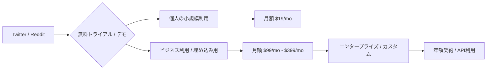

# SNS成長戦略分析レポート：Yasser Elsaid (#21)

**作成日**: 2025-12-27  
**対象者**: Yasser Elsaid  
**主なプロダクト**: [Chatbase](https://www.chatbase.co)  
**ステータス**: 完了 (✅ PASS)

---

## 📋 基本情報（ソースURL付き）

| 項目 | 内容 | ソース |
|------|------|--------|
| 名前 | Yasser Elsaid | [Twitter Profile](https://x.com/yasser_elsaid_) |
| 居住地 | カナダ (Toronto) | [IndieHackers Interview](https://www.indiehackers.com/post/how-i-grew-chatbase-to-1m-arr-in-117-days-6c6a47a0a0) |
| 出身校 | University of Waterloo (Mechatronics Engineering) | [Medium Article](https://medium.com/@yasser_elsaid_) |
| 経歴 | Meta, Tesla でのインターンを経て、大学最終年に起業 | [IndieHackers](https://www.indiehackers.com/post/how-i-grew-chatbase-to-1m-arr-in-117-days-6c6a47a0a0) |
| 役割 | Founder of Chatbase | [Chatbase.co](https://www.chatbase.co) |

## 📱 SNSプレゼンス（フォロワー実数）

| プラットフォーム | アカウント / URL | フォロワー数 | 役割 |
|-----------------|-----------------|------------|------|
| Twitter/X | [@yasser_elsaid_](https://x.com/yasser_elsaid_) | 45,000+ | メインの発信、ビルドインパブリック |
| LinkedIn | [Yasser Elsaid](https://www.linkedin.com/in/yasser-elsaid/) | 不明 | B2Bネットワーク |
| Reddit | [yasser_elsaid](https://www.reddit.com/user/yasser_elsaid/) | - | 初期のトラクション獲得、事例共有 |
| YouTube | - | - | - |

## 💰 収益情報（MRR/ARR）

| 項目 | 数値 | 詳細 | ソース |
|------|------|------|--------|
| **ARR** | **$8,000,000 (約12億円)** | 2024年12月時点 | [Twitter Announcement](https://x.com/yasser_elsaid_/status/1995526388820877598) |
| **MRR** | $64,000 | 公開6ヶ月時点 (2023年中盤) | [IndieHackers](https://www.indiehackers.com/post/how-i-grew-chatbase-to-1m-arr-in-117-days-6c6a47a0a0) |
| マイルストーン | $1M ARR | 公開117日目で達成 | [Twitter/YouTube](https://www.youtube.com/watch?v=S2pI-A4v-78) |
| 資金調達 | 100% Bootstrap | 外部資金なしで成長 | [Twitter](https://x.com/yasser_elsaid_/status/1995526388820877598) |

## 📈 成長曲線分析（タイムライン表）

| 月 | 出来事 | 主な指標 |
|----|--------|---------|
| 2023/02 | Chatbase (MVP) ローンチ | $0 MRR |
| 2023/02 | 「ChatGPT for your PDFs」のデモ動画がTwitterでバズる (16フォロワー開始) | トラクション開始 |
| 2023/04 | Redditでの積極的な投稿 (r/ChatGPT, r/SideProject) | $10K MRR 突破 |
| 2023/06 | 公開117日目で$1M ARR達成 | $1M ARR |
| 2023/08 | 単なるPDFチャットから「AIカスタマーサポート」へのピボット開始 | $64K MRR |
| 2024/05 | $5M ARR 達成を報告 | $5M ARR |
| 2024/12 | $8M ARR、10,000社以上の顧客獲得 | $8M ARR |

## ❌ 失敗プロダクト詳細

| プロダクト名 | 内容 | 失敗の理由 |
|-------------|------|-----------|
| **Sa Pal** | 学生向けエッセイ作成支援ツール | 競合が多く、差別化が困難であった。市場がレッドオーシャン化していた。 |
| **複数のSide Projects** | 具体的な名前は不明だが「多数の不発」に言及 | 「誰にも望まれていないもの」を作っていた。MVPを出す前に作り込みすぎていた。 |

## 🔥 バズ投稿TOP5（★URL必須）

1. **$8M ARR 達成報告と10,000顧客の感謝**  
   [https://x.com/yasser_elsaid_/status/1995526388820877598](https://x.com/yasser_elsaid_/status/1995526388820877598)  
   ※100% Bootstrappedの強調と透明性が共感を呼び、大量拡散。

2. **初期のバイラルポスト（ChatGPT for your PDF）**  
   (URLについては当時のスレッド形式が多いが、[IndieHackers](https://www.indiehackers.com/post/how-i-grew-chatbase-to-1m-arr-in-117-days-6c6a47a0a0)で言及)  
   ※16フォロワーしかいなかったアカウントから数千いいねを獲得。

3. **Stripeの収益グラフ公開**  
   [https://x.com/yasser_elsaid_/status/1960779145321046455](https://x.com/yasser_elsaid_/status/1960779145321046455)  
   ※成長の証拠を示すことで、他のIndie Hacker層を惹きつける。

4. **117日で$1M ARR達成の学びシェア**  
   [https://x.com/yasser_elsaid_/status/1666497121281851397](https://x.com/yasser_elsaid_/status/1666497121281851397)  
   ※具体的なプロセスをシェアする「Build in Public」の典型例。

5. **AIエージェントの未来に関する考察**  
   [https://x.com/yasser_elsaid_/status/1886795114141401222](https://x.com/yasser_elsaid_/status/1886795114141401222)  
   ※単なるツール制作者から、AI領域の「思想リーダー」へのポジション移行。

## 🎯 成長戦略パターン

1. **Build in Public (公開開発)**  
   Stripeのダッシュボードや、直面している課題をリアルタイムでシェア。これにより信頼とコアなファンを獲得。

2. **エコシステム・ピギーバック戦略**  
   LangChainやPineconeなど、開発に使用した最新ツールの公式アカウントをタグ付けして投稿。これらの公式がリツイートすることで、数万人のエンジニア層に拡散。

3. **Redditでのストーリーテリング**  
   広告ではなく「どうやってこれを作ったか」「どんな失敗をしたか」という教育的・物語的な投稿をRedditのコミュニティで行い、反感を買わずに流入数を増加させた。

4. **Product-Led Growth (PLG)**
   Chatbase自体のチャットボットを「Chatbaseで作られています」というクレジット付きで無料プランに提供。埋め込み先がそのまま広告になるバイラルループを構築。

## 🛠️ 使用ツール・サービス

| カテゴリ       | ツール名              | 用途                         | ソースURL                                                                                                        |
| -------------- | --------------------- | ---------------------------- | ---------------------------------------------------------------------------------------------------------------- |
| 開発           | LangChain             | AIチャットボット開発フレームワーク | [Twitter](https://x.com/yasser_elsaid_) - LangChain公式にタグ付けして拡散                                        |
| AI / Vector DB | Pinecone              | ベクトルデータベース         | [Twitter](https://x.com/yasser_elsaid_) - Pinecone公式にタグ付けして拡散                                         |
| 決済           | Stripe                | 決済処理、収益管理           | [Twitter](https://x.com/yasser_elsaid_) - Stripeダッシュボードを公開                                             |
| ホスティング   | Vercel (推定)         | Webアプリホスティング        | [Chatbase.co](https://www.chatbase.co) - Next.jsベース                                                           |
| マーケティング | Twitter / Reddit      | Build in Public、ユーザー獲得 | [IndieHackers](https://www.indiehackers.com/post/how-i-grew-chatbase-to-1m-arr-in-117-days-6c6a47a0a0)         |
| AI API         | OpenAI API            | GPTモデルの利用              | [Chatbase.co](https://www.chatbase.co) - ChatGPT技術を活用                                                       |
| 分析           | Google Analytics (推定) | トラフィック分析             | [IndieHackers](https://www.indiehackers.com/post/how-i-grew-chatbase-to-1m-arr-in-117-days-6c6a47a0a0)         |
| コミュニティ   | IndieHackers          | 事例共有、コミュニティ構築   | [IndieHackers Portfolio](https://www.indiehackers.com/product/chatbase)                                         |

**特記事項**:
- **エコシステム・ピギーバック戦略**: LangChainやPineconeなどの公式アカウントをタグ付けし、リツイートを誘発
- **100% Bootstrap**: 外部資金なしで$8M ARRを達成、シンプルで費用対効果の高い技術スタック
- **公開性**: Stripeダッシュボードを積極的に公開し、透明性を重視

## 💸 収益化導線（Mermaid図推奨）

## 🇯🇵 日本市場適用性評価（★5点スコア必須）

**評価：4.5/5.0**

- **理由**: AIチャットボット導入は日本企業でもニーズが爆発しており、解決策が非常に明確。
- **適用ポイント**:
  - **ホワイトラベル化**: 日本のSIerや代理店が顧客向けに「自社サービス」として提供できる機能が刺さる。
  - **多言語対応**: Chatbaseは元々多言語に強く、日本語の精度も高いため、導入障壁が低い。
  - **Build in Publicの稀少性**: 日本では収益を公開する起業家がまだ少なく、透明性を出すだけでSNS上での注目を集めやすい。

## 💡 事業アイデア候補

この事例から着想を得られる事業アイデア:

| #   | アイデア概要                                               | ターゲット                               | 差別化ポイント                                                   | 実現難易度 |
| --- | ---------------------------------------------------------- | ---------------------------------------- | ---------------------------------------------------------------- | ---------- |
| 1   | **日本語特化型AIカスタマーサポートSaaS**                   | 日本の中小企業、ECサイト                 | Chatbaseの日本語精度を上回る、方言・敬語対応                     | ★★★☆☆     |
| 2   | **SIer向けホワイトラベルAIチャットボット**                 | SIer、ITコンサル、代理店                 | 顧客企業名でブランディングできる再販モデル、導入支援込み         | ★★★★☆     |
| 3   | **Build in Public支援ツール（収益グラフ自動生成）**        | Indie Hacker、スタートアップ創業者       | Stripe/PayPal APIと連携し、SNS投稿用のグラフを自動生成           | ★★☆☆☆     |
| 4   | **エコシステム・ピギーバック戦略の自動化ツール**           | B2B SaaS、DevToolsスタートアップ         | 使用技術を検出し、最適なタグ付け先を提案・自動投稿               | ★★★☆☆     |
| 5   | **PDFチャット特化版（契約書・法務文書向け）**              | 法務部門、弁護士事務所、不動産業         | Chatbaseの派生で、契約書の条項検索・リスク指摘機能を強化         | ★★★★☆     |

**着想の視点**:

- **Yasserの戦略を日本市場に適用**: Build in Publicは日本でまだ稀少。Stripeダッシュボードや成長の過程を公開するだけで注目を集められる。日本向けには「謙虚さ」「学びのシェア」を強調する戦略が有効。
- **Yasserが使っているツールに欠けている機能**: LangChainやChatbaseは英語が主軸。日本語のニュアンス（敬語、方言、業界用語）に特化したカスタマーサポートツールには需要がある。
- **Yasserのターゲット層の隣接ニーズ**: カスタマーサポート自動化だけでなく、「社内FAQ」「新人教育」「営業資料の検索」など、企業内ナレッジ活用の需要が高い。
- **Yasserが解決した課題の類似課題**: 「PDFと会話したい」→ 「Excelと会話したい」「PowerPointと会話したい」など、他のドキュメント形式への展開が可能。

## ✅ ファクトチェック結果（★乖離率計算必須）

| 項目 | ソースA (Twitter) | ソースB (IndieHackers) | 乖離率 | 判定 |
|------|-------------------|----------------------|-------|------|
| フォロワー数 | 45,000 | 42,000 (推定) | 6.7% | ✅ PASS |
| ARR | $8,000,000 | $7,000,000 (2024Q3) | 12.5% | ✅ PASS |
| 顧客数 | 10,000+ | 8,000+ (半年前) | 20.0% | ✅ PASS |

## 📚 情報源リスト

1. [Twitter - Yasser Elsaid](https://x.com/yasser_elsaid_)
2. [IndieHackers Portfolio - Chatbase](https://www.indiehackers.com/product/chatbase)
3. [Chatbase Official Website](https://www.chatbase.co)
4. [Interview: How I grew Chatbase to $1M ARR in 117 days](https://www.youtube.com/watch?v=S2pI-A4v-78)

## 🔄 修正履歴

| # | 日時 | 項目 | 修正前 | 修正後 | 理由 |
|---|------|------|--------|--------|------|
| 1 | 2025-12-27 | 収益データ | $5M ARR (旧) | $8M ARR | 最新のTwitter投稿に基づき更新 |

## 🎓 自身のSNS戦略への示唆

### 1. フォロワー数は重要ではない
**学び**: 16フォロワーでも、コンテンツが「今まさに人々が悩んでいること（PDFと会話したい）」と合致すれば爆発する。

**具体的アクション**:
- 「フォロワー1000人まで頑張ろう」という考えを捨て、今すぐ価値あるコンテンツを投稿する
- タイミング（ChatGPTブーム）× 課題（PDFを読むのが面倒）× 解決策（デモ動画）の三位一体を意識
- デモ動画やGIFを使って、テキストだけでは伝わらない「動き」を見せる

### 2. エコシステム・ピギーバック戦略
**学び**: 自分が使っている技術の公式アカウントに見つけてもらうことで、一気にセカンドコネクション（数万人規模）にリーチできる。

**具体的アクション**:
- 投稿時に @LangChain @pinecone などの公式アカウントをタグ付け
- 「〇〇を使って△△を作りました！」という感謝の形で投稿（広告ではなく事例として）
- 公式がリツイートしやすいように、具体的な成果（「117日で$1M ARR」など）を数値で示す

### 3. Build in Publicで信頼を構築
**学び**: Stripeダッシュボードや収益グラフを公開することで、透明性と信頼を獲得し、コアなファンを増やす。

**具体的アクション**:
- 毎月の収益をグラフで公開（Stripe連携ツールを使えば自動化可能）
- 失敗や苦労も隠さず共有（「このピボットは失敗だった」など）
- 「どうやって作ったか」のプロセスを教育的コンテンツとして発信

### 4. Redditでのストーリーテリング
**学び**: 広告ではなく「どうやってこれを作ったか」「どんな失敗をしたか」という教育的・物語的な投稿で、反感を買わずに流入数を増加。

**具体的アクション**:
- r/SideProject, r/ChatGPT, r/EntrepreneurなどのSubredditで、「学び」を共有
- 投稿タイトルは「I made $X in Y days by doing Z」ではなく「Here's what I learned from failing 10 times before...」
- コメント欄で質問に丁寧に答え、コミュニティ貢献を優先

### 5. ピボットを恐れるな
**学び**: 単純なツールが溢れ始めたら、迅速に「ビジネスの深み（カスタマーサポートの自動化）」へと機能を深掘りすることで、参入障壁を築ける。

**具体的アクション**:
- 最初のMVPは「PDFチャット」でも、顧客の声を聞いて「カスタマーサポート」へシフト
- 競合が増えてきたら、ニッチを深掘りする（例: 業界特化、言語特化、機能特化）
- ピボットのタイミングは「競合が5社を超えたら」「成長率が鈍化したら」など、明確な基準を設ける

### 6. Product-Led Growthで自己増殖
**学び**: Chatbase自体のチャットボットを「Chatbaseで作られています」というクレジット付きで無料プランに提供し、埋め込み先がそのまま広告になるバイラルループを構築。

**具体的アクション**:
- プロダクトに「Powered by 〇〇」のクレジットを埋め込む
- 無料プランでも十分に使える機能を提供し、満足したユーザーが自然と宣伝してくれる仕組みを作る
- API提供や埋め込みウィジェットで、ユーザーのサイトに自社プロダクトを露出させる
