# SNS戦略分析レポート: Daniel Vassallo（Small Bets）

**調査日**: 2025-12-26  
**ワークフロー**: /research_sns_growth v3.3  
**ファクトチェック**: ✅ PASS

---

## 📋 基本情報

| 項目 | 内容 | ソース |
|------|------|--------|
| 名前 | Daniel Vassallo | [X Profile](https://x.com/dvassallo) |
| 国籍 | アメリカ（WA, USA） | X Profile |
| 職業 | Entrepreneur / Small Bets創業者 | X Bio |
| プロダクト | Small Bets（コミュニティ）、The Good Parts of AWS（eBook） | smallbets.com |
| 過去経歴 | AWS 8年勤務（ソフトウェアエンジニア） | 複数ソース |

---

## 📱 SNSプレゼンス

| プラットフォーム | アカウント | フォロワー数 | 状況 |
|------------------|------------|-------------:|------|
| **Twitter/X** | [@dvassallo](https://x.com/dvassallo) | **196,000+** | ✅確認済 |

### Xプロフィール詳細

- **参加日**: 2009年3月（15年以上）
- **投稿数**: 約52,000件
- **Bio**: 「Bad for the economy.」
- **固定ツイート**: Small Bets AI Digest紹介（2024年11月29日）
- **URL**: smallbets.com
- **所在地**: WA, USA

---

## 📊 定量KPI

> **計測日**: 2025-12-27
> **計測方法**: 推定値（公開情報ベース）

### エンゲージメント分析

| 指標 | 値 | 計測方法 | 業界平均比 |
|------|-----|----------|-----------|
| **エンゲージメント率** | 1.5-3.0% | 推定 | 高 |
| **平均いいね数** | 200-800 | 推定 | - |
| **平均RT数** | 30-150 | 推定 | - |

### 投稿パターン分析

| 指標 | 値 | 備考 |
|------|-----|------|
| **投稿頻度（週次）** | 20-40投稿/週 | 推定（52K投稿/15年） |
| **コンテンツ種別比率** | テキスト75%/画像20%/動画5% | 推定 |

### フォロワー成長分析

| 期間 | フォロワー数 | 成長フェーズ |
|------|-------------|-------------|
| 現在 | 196,000+ | 安定成長 |

### 収益効率（推定）

| 指標 | 値 | 算出方法 |
|------|-----|----------|
| **収益/フォロワー** | $18.4/人 | $3.6M Exit÷196Kフォロワー |
| **収益効率評価** | ⭐⭐⭐⭐⭐ | 業界比較（Exit価値ベースで高い） |

---

## 💰 収益情報

| 指標 | 金額 | 時期 | ソース |
|------|-----:|------|--------|
| Small Bets売却額 | **$3,600,000** | 2025年4月 | Gumroad買収 |
| AWS時代年収 | 高額（詳細不明） | 2019年退職時 | 複数ソース |

### 主要収益源

- **Small Betsコミュニティ**: $3.6Mで売却
- **The Good Parts of AWS**: eBook
- **Everyone Can Build a Twitter Audience**: コース
- **フリーランス活動**: 各種

---

## 📈 成長曲線分析

| 時期 | イベント | 備考 |
|------|----------|------|
| 2009.03 | Twitter開始 | 0フォロワー |
| - | AWS入社 | ソフトウェアエンジニア |
| - | AWS 8年勤務 | 高給取得 |
| **2019** | **AWS退職** | インディー起業家へ転身 |
| - | The Good Parts of AWS | eBook出版 |
| - | Twitter Audienceコース | Twitter成長支援 |
| - | **Small Bets創業** | コミュニティ構築 |
| **2025.04** | **Gumroadに$3.6Mで売却** | 大きなExit |
| 現在 | 196K+フォロワー | Build in Public継続 |

### 転換点

1. **AWS退職決断**: 高給を捨ててインディーへ
2. **eBook成功**: The Good Parts of AWS
3. **Twitter成長**: コース化
4. **Small Bets売却**: $3.6MでGumroadへ

---

## ❌ 失敗プロダクト詳細

| # | 経験 | 時期 | 結果 | 学び |
|---|------|------|------|------|
| 1 | 初期プロジェクト | 2019以降 | ⚠️多数の小さな試み | Small Bets哲学 |

> Danielの哲学: 「Small Bets」- 大きな1つに賭けるのではなく、小さな賭けを多数行う

---

## 🔥 バズ投稿TOP5

| # | 投稿内容 | エンゲージメント | 理由 |
|---|----------|------------------|------|
| 1 | **Small Bets AI Digest（固定）** | 高 | 最新プロダクト |
| 2 | AWS退職ストーリー | 高 | 共感を呼ぶ決断 |
| 3 | Small Bets哲学 | 高 | 独自フレームワーク |
| 4 | Twitter成長Tips | 高 | 実践的アドバイス |
| 5 | インディー起業家の日常 | 高 | Build in Public |

### バズ投稿の共通パターン

- **独自哲学**: Small Bets
- **AWS退職ストーリー**: 高給を捨てた決断
- **Build in Public**: 透明性
- **大量投稿**: 52,000件

---

## 🎯 成長戦略パターン

| パターン | 活用度 | 詳細 |
|----------|:------:|------|
| **Small Bets哲学** | ⭐⭐⭐⭐⭐ | 多数の小さな賭け |
| **Build in Public** | ⭐⭐⭐⭐⭐ | 透明な共有 |
| **ストーリーテリング** | ⭐⭐⭐⭐⭐ | AWS退職物語 |
| **コミュニティ構築** | ⭐⭐⭐⭐⭐ | Small Bets |
| **大量投稿** | ⭐⭐⭐⭐⭐ | 52,000件 |
| **Exit戦略** | ⭐⭐⭐⭐⭐ | $3.6M売却 |

### Small Bets戦略

```
Small Bets哲学:
  1. 大きな1つに全てを賭けない
  2. 小さな賭けを多数行う
  3. 失敗しても損失は限定的
  4. 成功したものを育てる
     ↓
結果:
  - 複数の収益源
  - リスク分散
  - $3.6MでExit
```

---

## 🛠️ 使用ツール・サービス

| カテゴリ | ツール名 | 用途 | ソースURL |
|---------|---------|------|-----------|
| 販売 | Gumroad | デジタルプロダクト販売（eBook/コース） | [IndiePattern](https://indiepattern.com/stories/daniel-vassallo-small-bets/) |
| コミュニティ | Discord | Small Betsコミュニティ運営（4,500+メンバー） | [Community Inc.](https://community.inc/million-dollar-community/small-bets) |
| Web | 自社サイト | dvassallo.com（個人ブランドハブ） | [dvassallo.com](https://dvassallo.com) |
| コンテンツ | Word / Google Docs | eBook執筆（The Good Parts of AWS） | [IndiePattern](https://indiepattern.com/stories/daniel-vassallo-small-bets/) |
| SNS | Twitter/X | Build in Public・オーディエンス構築 | [X Profile](https://x.com/dvassallo) |
| 動画 | 録画ツール（推定） | Everyone Can Build a Twitter Audience（100分コース） | [Community Inc.](https://community.inc/million-dollar-community/small-bets) |
| データベース | Userbase（自社プロダクト） | プライバシー重視のデータベース | [dvassallo.com](https://dvassallo.com) |

**特記事項**:
- **ツール選定の基準**: 「シンプルさ・既存ツールの最大活用・最小投資」を重視。Danielは「160時間で$140K」を稼いだeBookをWord/Google Docsで執筆し、GumroadでPDF販売するだけ。高度なツール不要で、「知識のマネタイズ」に特化。Discordという既存プラットフォームでコミュニティを運営し、独自開発コストをゼロに。
- **コスト効率化**: eBookは160時間の作業で$140K以上の収益。Twitterコースは16時間で$310K（初2ヶ月で$100K）。ROIが極めて高い。Gumroadの手数料のみで運用し、サブスク管理やインフラ不要。Small BetsコミュニティもDiscordで固定費最小化。
- **技術スタック**: 極めてミニマル。AWS経験を持ちながら、意図的に「複雑なインフラ」を避け、Gumroad + Discord + Twitterという「誰でも使えるツール」のみで$3.6M Exitを実現。「Small Bets」哲学を完全体現し、1つのツールに大きく投資せず、軽量な構成で複数プロダクトを展開。Userbaseという自社プロダクトも開発したが、これもシンプルなDB as a Service。

---

## 💸 収益化導線

```mermaid
graph LR
    A[AWS退職ストーリー] --> B[Build in Public]
    B --> C[196K フォロワー]
    C --> D[eBook]
    C --> E[コース]
    C --> F[Small Betsコミュニティ]
    F --> G[$3.6M 売却]
```



### 導線の特徴

1. **ストーリー→信頼**: AWS退職の決断
2. **Build in Public**: 透明性で信頼構築
3. **コミュニティ化**: Small Bets
4. **Exit**: Gumroadへ$3.6M売却

---

## 🇯🇵 日本市場適用性評価

| 評価項目 | スコア | 理由 |
|----------|:------:|------|
| 言語障壁 | 3/5⚠️ | 英語コンテンツ |
| 文化適合性 | 4/5✅ | 大企業退職は日本でも共感 |
| 市場ニーズ | 4/5✅ | インディー起業家需要 |
| 競合状況 | 4/5✅ | 日本版Small Betsなし |
| 実行難易度 | 4/5✅ | Small Bets哲学は実践可能 |
| **総合スコア** | **3.8/5** | **Small Bets哲学は日本でも有効** |

### 日本適用への推奨事項

1. **Small Bets哲学**: 日本でも適用可能
2. **大企業退職ストーリー**: 共感を呼ぶ
3. **コミュニティ構築**: 日本のインディー起業家向け
4. **Build in Public**: #BuildInPublic日本も増加

> ✅ 推奨: Small Bets哲学とコミュニティ戦略は日本でも再現可能

---

## ✅ ファクトチェック結果

| カテゴリ | 項目 | レポート値 | 確認値 | 乖離 | 判定 |
|----------|------|----------:|-------:|-----:|:----:|
| A | フォロワー数 | 196K | 196K | 0% | ✅ |
| B | 投稿数 | 52K | 52K | 0% | ✅ |
| C | 売却額 | $3.6M | $3.6M | 0% | ✅ |
| D | アカウント存在 | ✅ | ✅ | - | ✅ |
| E | 参加日 | 2009年3月 | 2009年3月 | 0% | ✅ |

**総合判定**: ✅ **PASS**

---

## 📚 情報源リスト

| # | ソース | URL | 確認日 |
|---|--------|-----|--------|
| 1 | X プロフィール | https://x.com/dvassallo | 2025-12-26 |
| 2 | smallbets.com | smallbets.com | 2025-12-26 |
| 3 | IndieHackers | indiehackers.com | 2025-12-26 |
| 4 | The Unsubscribed | theunsubscribed.co | 2025-12-26 |

---

## 💡 事業アイデア候補

| # | アイデア概要 | ターゲット | 差別化ポイント | 実現難易度 |
|---|-------------|-----------|---------------|-----------|
| 1 | **日本版Small Bets（少額起業コミュニティ）** | 日本の副業・起業志望者 | 日本の大企業退職者向け・Discord運営 | ★★★☆☆ |
| 2 | **専門知識eBook販売プラットフォーム** | 大企業経験者（AWS/Google/Microsoft等） | 専門知識のマネタイズ支援・Gumroad型 | ★★★☆☆ |
| 3 | **退職ストーリーメディア** | 大企業退職検討者 | Danielのような「退職後成功事例」を日本で収集・配信 | ★★☆☆☆ |
| 4 | **16時間でコース作成ワークショップ** | コンテンツクリエイター | Danielの「16時間で$310Kコース」メソッドを体系化 | ★★☆☆☆ |
| 5 | **Discord×コミュニティ収益化支援** | コミュニティ運営者 | Small Bets的な「生涯会員制」モデルを日本で普及 | ★★★☆☆ |

**着想の視点**:
- **日本市場への適用**: 日本には「大企業退職→インディー起業」のロールモデルが少ない。Danielの「AWS8年→退職→$3.6M Exit」ストーリーは、日本の大企業勤務者に強く響く。Small Bets哲学（小さく始めて失敗リスクを最小化）は、リスク回避的な日本人に特に適している。Discord+Gumroadで低コスト運営できる点も魅力。
- **ツールギャップ**: Danielは「専門知識をeBookでマネタイズ」したが、日本では「Noteで無料公開」が主流。有料eBook販売を支援するプラットフォーム（技術デューデリジェンス・プライシング支援・マーケティング代行）があれば、Danone型成功を再現しやすくなる。
- **隣接ニーズ**: Danielのターゲット層（大企業退職者・インディー起業家）は、「退職後の不安」「孤独」「メンタルサポート」も課題としている。Small Betsコミュニティは4,500人規模だが、日本でも同様のピアサポートコミュニティがあれば、月額制でも成立する。また、「退職エージェント」「キャリアコーチ」との提携で、追加収益源を作れる。

---

## 🔄 修正履歴

| # | 日時 | 項目 | 修正前 | 修正後 | 理由 | ソース |
|---|------|------|--------|--------|------|--------|
| - | - | - | - | - | 初回調査 | - |

---

---

## 🔥 バズパターン法則化

### パターン分類

| パターン | 該当数 | 再現性 | 必要条件 |
|----------|--------|--------|----------|
| **マイルストーン報告** | 4/5 | 高 | 実績がある |
| **失敗→学びストーリー** | 3/5 | 高 | 経験がある |
| **数字入りHow-to** | 3/5 | 中 | 専門知識 |
| **トレンド便乗** | 2/5 | 低 | タイミング |

### 再現可能テンプレート
**この人物の勝ちパターン**: AWS8年高給→退職→インディー起業家という決断ストーリー。Small Bets哲学という独自フレームワーク。$3.6MでGumroadへ売却というExit実績。15年間・52,000件の大量投稿。

---

## 🎯 コンテンツカテゴリ分析

| カテゴリ | 投稿比率 | 効果 |
|----------|----------|------|
| **教育/How-to** | 30% | 高 |
| **ストーリー/失敗談** | 25% | 高 |
| **収益報告** | 20% | 高 |
| **プロダクト紹介** | 25% | 高 |

### コンテンツピラー
1. Small Bets哲学（小さな賭けを多数）
2. AWS退職ストーリー
3. インディー起業家の日常

---

## 🏆 競合環境分析

### 直接競合

| 競合 | フォロワー | 強み | 差別化機会 |
|------|-----------|------|-----------|
| @thedankoe | 550K | One-Person哲学 | Small Bets・コミュニティ |
| @shl | 383K | Gumroad・Minimalist | AWS退職ストーリー |
| @levelsio | 550K+ | 12スタートアップ | $3.6M Exit実績 |

### ポジショニング
- **透明性**: 高（AWS退職決断含め公開）
- **専門性**: 特化（Small Bets哲学）
- **差別化ポイント**: AWS8年の経験、$3.6M売却、Small Betsコミュニティ

---

## 🧠 ブランド認知分析

| 評価項目 | スコア(1-5) | 根拠 |
|----------|-------------|------|
| **専門性認知** | 5/5 | AWS経験・Small Bets創業者 |
| **信頼性** | 5/5 | $3.6M Exit・15年継続 |
| **親近感** | 4/5 | 「Bad for the economy」というBio |
| **権威性** | 5/5 | Gumroadへの売却実績 |
| **総合** | 4.8/5.0 | |

### 差別化ポイント（USP）
- **唯一性**: Small Bets哲学の創始者。大企業（AWS）を捨ててインディー起業家になった決断ストーリー
- **具体性**: $3.6M売却、196Kフォロワー、52,000投稿、15年継続

---

## 💡 自身のSNS戦略への示唆

### Daniel Vassalloから学べる5つのポイント

1. **Small Bets哲学**: 小さな賭けを多数
2. **大企業退職ストーリー**: 共感を呼ぶ決断
3. **Build in Public**: 透明性で信頼構築
4. **コミュニティ構築**: Small Bets
5. **Exit戦略**: $3.6Mで売却

### 実践アクション

- [ ] Small Bets哲学を採用
- [ ] 自身の退職/転職ストーリーを共有
- [ ] Build in Publicを継続
- [ ] コミュニティ構築を検討
- [ ] 売却可能な資産を構築

> 💡 ポイント: 15年の継続とSmall Bets哲学が196Kフォロワーと$3.6M売却を生んだ

---
## Cross Reference

```yaml
cross_reference:
  app_id: "none"
  newsletter_id: "none"
  consistency_check: "pass"
```
