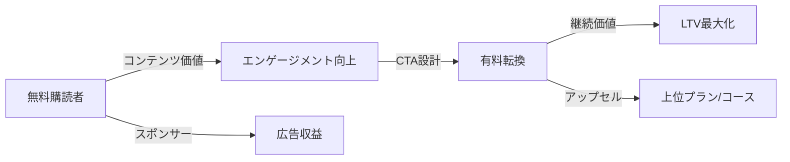
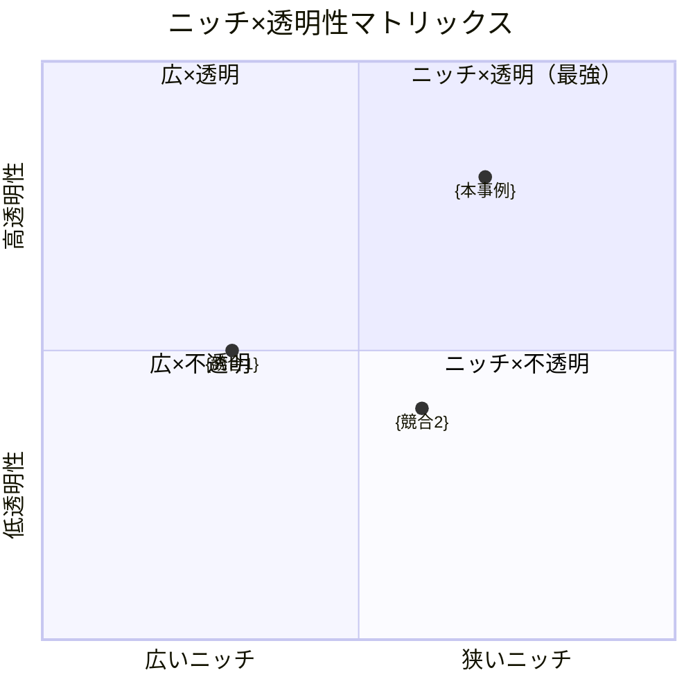

---
# ニュースレター事例調査テンプレート v2.1
# YAML Front Matter（RAG/ベクトル検索最適化）
# v2.1更新: バズスコアリング、レバレッジ度、読者セグメント分析を追加

id: "NL_CASE_XXX"
version: "2.1"
created: "YYYY-MM-DD"
updated: "YYYY-MM-DD"

# 基本情報
newsletter_name: "ニュースレター名"
founder_name: "運営者名"
founder_twitter: "@handle"
platform: "substack"  # substack | beehiiv | convertkit | ghost | 独自
language: "en"  # en | ja | multi
niche: "tech"  # ai | business | creator | tech | finance | design | product | other

# 収益ティア
mrr_usd: 0
mrr_tier: "<5k"  # 100k+ | 50k-100k | 25k-50k | 10k-25k | 5k-10k | <5k
arr_usd: 0

# 購読者データ
subscribers_total: 0
subscribers_paid: 0
paid_conversion_rate: 0.0
open_rate: 0.0
click_rate: 0.0
churn_rate: 0.0

# セマンティックタグ（5分類）
growth_strategies:
  - "referral_program"
  # referral_program | seo_content | twitter_growth | product_hunt | paid_ads | community
content_style:
  - "educational"
  # educational | curated | storytelling | data_driven | entertainment
success_pattern:
  - "niche_domination"
  # niche_domination | community_driven | personality_brand | curation_king | data_moat
monetization:
  - "paid_subscription"
  # paid_subscription | sponsorship | course_sales | affiliate | consulting | job_board
marketing_channel:
  - "twitter"
  # twitter | linkedin | tiktok | youtube | organic_search | referral

# 日本市場スコア（5観点）
japan_market_score:
  overall: 0.0
  niche_demand: 0
  competition: 0
  content_transferability: 0
  revenue_model_reproducibility: 0
  target_audience_exists: 0

# クロスリファレンス
related:
  app_cases: []  # ["APP_001", "APP_022"]
  sns_cases: []  # ["SNS_wilson", "SNS_dan_koe"]
  strategies: []  # ["NL_STRATEGY_014", "NL_STRATEGY_022"]

# ファクトチェック
fact_check:
  status: "pending"  # pass | warn | ng | pending
  last_checked: "YYYY-MM-DD"
  sources_count: 0

# v2.1追加: バズスコアリング
viral_metrics:
  avg_share_rate: 0.0  # 平均シェア率（%）
  referral_contribution: 0.0  # リファラル経由の新規購読者割合（%）
  top_buzz_open_rate: 0.0  # 最高開封率（%）
  viral_coefficient: 0.0  # バイラル係数（1購読者あたりの紹介数）

# v2.1追加: レバレッジ度評価
leverage_score:
  overall: 0  # 総合レバレッジ度（1-5）
  content_reusability: 0  # コンテンツ再利用性
  automation_level: 0  # 自動化レベル
  passive_income_ratio: 0  # 不労所得比率
  scalability: 0  # スケーラビリティ

# v2.1追加: 読者セグメント分析
reader_segments:
  casual: 0  # カジュアル層（開封<30%）の割合
  engaged: 0  # エンゲージド層（開封30-70%）の割合
  loyal: 0  # ロイヤル層（開封>70%）の割合
  segment_to_paid_rate: 0  # 各層から有料への転換率

# v2.1追加: コンテンツピラー
content_pillars:
  - name: ""
    frequency: ""  # 配信頻度
    engagement: ""  # エンゲージメント評価
---

# {ニュースレター名} ケーススタディ

**バージョン**: 2.1
**テンプレートID**: NL_CASE_STUDY_v2.1

---

## 1. 基本情報

| 項目 | 内容 |
|------|------|
| **ニュースレター名** | {ニュースレター名} |
| **運営者名** | {運営者名} |
| **プラットフォーム** | Substack / beehiiv / ConvertKit / Ghost / 独自 |
| **URL** | {ニュースレターURL} |
| **ニッチ/テーマ** | {テーマ・ジャンル} |
| **成功パターン** | 🎯ニッチ特化 / 📰キュレーション / 👤人格ブランド / 🏘️コミュニティ / 📊データ |
| **調査日** | {YYYY-MM-DD} |

---

## 2. 運営者プロフィール

### 基本情報

| 項目 | 内容 |
|------|------|
| **名前** | {フルネーム} |
| **国籍/居住地** | {国・都市} |
| **経歴** | {職歴・バックグラウンド} |
| **専門分野** | {得意領域} |
| **X(Twitter)** | [@handle](URL) |
| **その他SNS** | {LinkedIn, YouTube等} |

### ストーリー

{ニュースレター開始の経緯、動機、ターニングポイント}

---

## 3. ニュースレター詳細

### 概要

| 項目 | 内容 |
|------|------|
| **開始日** | {YYYY年MM月} |
| **配信頻度** | 週1 / 週2 / 日刊 / 月2回 等 |
| **記事の長さ** | {平均文字数 or 読了時間} |
| **言語** | 英語 / 日本語 / 多言語 |
| **対象読者** | {ターゲット層の説明} |

### コンテンツ構成

| セクション | 説明 |
|-----------|------|
| {セクション1} | {内容} |
| {セクション2} | {内容} |
| {セクション3} | {内容} |

### 特徴・差別化ポイント

- {特徴1}
- {特徴2}
- {特徴3}

---

## 4. 購読者データ

| 指標 | 数値 | 情報源 | 確認日 |
|------|------|--------|--------|
| **総購読者数** | {数値} | {ソース} | {日付} |
| **有料購読者数** | {数値} | {ソース} | {日付} |
| **有料転換率** |  | {ソース} | {日付} |
| **クリック率** |  | {ソース} | {日付} |

---

## 5. 成長曲線分析【NEW in v2.0】

### マイルストーン達成履歴

```mermaid
gantt
    title 購読者数成長タイムライン
    dateFormat  YYYY-MM
    section 成長フェーズ
    0→100人       :{開始日}, {到達日}
    100→1,000人   :{開始日}, {到達日}
    1,000→10,000人 :{開始日}, {到達日}
    10,000→50,000人 :{開始日}, {到達日}
```

### 成長推移表

| 時期 | 購読者数 | マイルストーン | 成長速度 |
|------|----------|----------------|----------|
| {開始時} | {数値} | ニュースレター開始 | - |
| {時期} | {数値} | {イベント} | +{数}/月 |
| {時期} | {数値} | {イベント} | +{数}/月 |
| {現在} | {数値} | 現在 | +{数}/月 |

### 転換点（Tipping Points）

| # | 時期 | イベント | 効果 | 詳細 |
|---|------|----------|------|------|
| 1 | {YYYY年MM月} | {イベント名} | +{数値}購読者 | {詳細説明} |
| 2 | {YYYY年MM月} | {イベント名} | +{数値}購読者 | {詳細説明} |
| 3 | {YYYY年MM月} | {イベント名} | +{数値}購読者 | {詳細説明} |

---

## 6. 失敗・ピボット履歴【NEW in v2.0】

### 失敗ニュースレター/施策一覧

| # | 名称/施策 | 期間 | 失敗理由 | 学び |
|---|----------|------|----------|------|
| 1 | {施策名} | {YYYY-YYYY} | {理由} | {学び} |
| 2 | {施策名} | {YYYY-YYYY} | {理由} | {学び} |
| 3 | {施策名} | {YYYY-YYYY} | {理由} | {学び} |

### 暗黒期（成長停滞期）

- **期間**: {YYYY年MM月}〜{YYYY年MM月}（{X}ヶ月）
- **状況**: 購読者数{XXXX}人で停滞
- **原因**: {停滞の主な原因}
- **突破のきっかけ**: {具体的な施策・イベント}
- **学び**: {この経験から得た教訓}

### 失敗からの教訓サマリー

1. **{教訓1}**: {詳細説明}
2. **{教訓2}**: {詳細説明}
3. **{教訓3}**: {詳細説明}

---

## 7. バイラルコンテンツ分析【NEW in v2.0】

### バズニュースレター号TOP5

| # | 号タイトル | 配信日 | 開封率 | 紹介数 | バズ要因 |
|---|-----------|--------|--------|--------|----------|
| 1 | {タイトル} | {YYYY/MM/DD} |  | {数} | {要因} |
| 3 | {タイトル} | {YYYY/MM/DD} |  | {数} | {要因} |
| 5 | {タイトル} | {YYYY/MM/DD} |  | {効果} |
| ストーリー形式 |  | {効果} |
| インタビュー |  | {効果} |

### バズパターン再現テンプレート【NEW in v2.1】

#### パターン1: {パターン名}

```
【件名】{件名テンプレート}
【フック】{最初の1-2文}
【展開】{本文の構成}
【CTA】{行動喚起}
```

#### パターン2: {パターン名}

```
【件名】{件名テンプレート}
【フック】{最初の1-2文}
【展開】{本文の構成}
【CTA】{行動喚起}
```

---

## 7.5. コンテンツピラー分析【NEW in v2.1】

### 3本柱構成

| ピラー | 説明 | 頻度 | エンゲージメント |
|--------|------|------|-----------------|
| **{ピラー1}** | {内容説明} | {週X回} | ⭐⭐⭐⭐⭐ |
| **{ピラー2}** | {内容説明} | {週X回} | ⭐⭐⭐⭐ |
| **{ピラー3}** | {内容説明} | {月X回} | ⭐⭐⭐ |

### ピラー間の相乗効果

```mermaid
flowchart TB
    A[ピラー1: {名称}] -->|信頼構築| B[ピラー2: {名称}]
    B -->|行動喚起| C[ピラー3: {名称}]
    C -->|リピート| A
```

---

## 7.6. 読者セグメント分析【NEW in v2.1】

### セグメント構成

| セグメント | 定義 | 割合 | 行動特性 |
|-----------|------|------|----------|
| **カジュアル層** | 開封率<30%、受動的 | {%} | {特性} |
| **エンゲージド層** | 開封率30-70%、能動的 | {%} | {特性} |
| **ロイヤル層** | 開封率>70%、熱狂的 |  | {特性} |

### セグメント別転換率

```mermaid
flowchart LR
    A[新規登録 100%] -->|30日後| B[カジュアル ]
    A -->|30日後| D[ロイヤル ]
```

### セグメント活性化施策

| セグメント | 課題 | 活性化施策 |
|-----------|------|-----------|
| カジュアル→エンゲージド | {課題} | {施策} |
| エンゲージド→ロイヤル | {課題} | {施策} |
| ロイヤル→有料 | {課題} | {施策} |

---

## 8. 収益化導線分析【NEW in v2.0】

### マネタイズモデル



### 収益概要

| 項目 | 内容 |
|------|------|
| **月間収益（MRR）** | ${金額} |
| **年間収益（ARR）** | ${金額} |
| **収益開始時期** | {YYYY年MM月} |
| **確認ソース** | {情報源} |

### 価格戦略

| プラン | 価格 | 特典 | 転換率 |
|--------|------|------|--------|
| **無料** | $0 | {無料コンテンツ内容} | - |
| **月額有料** | ${金額}/月 | {有料特典} | {%} |
| **年額有料** | ${金額}/年 | {年額特典}（月額比{X}%割引） |  |

### 収益構成（推定）

| 収益源 | 割合 | 金額（月） |
|--------|------|-----------|
| 有料購読 |  | ${金額} |
| アフィリエイト |  | ${金額} |
| その他 |  | {LP最適化、リードマグネット} |
| 無料→有料検討 |  | {価格アンカリング、トライアル} |
| 有料→継続 | {%} | {オンボーディング、コミュニティ} |

### LTV/CAC分析

| 指標 | 値 | 計算根拠 |
|------|-----|----------|
| 平均月額収益 | ${金額} | 価格×有料購読者数÷全購読者 |
| 平均継続月数 | {X}ヶ月 | 1÷月次解約率 |
| LTV（生涯価値） | ${金額} | 月額収益×継続月数 |
| CAC（獲得コスト） | ${金額} | マーケ費用÷新規獲得数 |
| LTV/CAC比率 | {X.X} | 3.0以上が健全目安 |

---

## 9. マーケティング戦略

### リフェラル施策

| 施策 | 報酬内容 | 効果 |
|------|----------|------|
| {施策1} | {報酬} | {効果} |
| {施策2} | {報酬} | {効果} |

### SNS活用

| プラットフォーム | フォロワー数 | 活用方法 | 貢献度 |
|-----------------|-------------|----------|--------|
| X(Twitter) | {数値} | {活用方法} |  |
| その他 | {数値} | {活用方法} | {%} |

### その他成長施策

- {施策1}: {効果}
- {施策2}: {効果}
- {施策3}: {効果}

---

## 10. 使用ツール

| カテゴリ | ツール名 | 用途 |
|---------|---------|------|
| **配信プラットフォーム** | {Substack, beehiiv等} | メイン配信 |
| **メール配信** | {ESP名} | 配信管理 |
| **分析** | {分析ツール} | KPI追跡 |
| **リファラル** | {SparkLoop等} | 紹介プログラム |
| **執筆** | {執筆支援ツール} | コンテンツ作成 |
| **決済** | {Stripe等} | 課金処理 |
| **自動化** | {Zapier等} | ワークフロー |

---

## 10.5. レバレッジ度評価【NEW in v2.1】

### レバレッジ度スコア

| 評価項目 | スコア(1-5) | 説明 |
|---------|-------------|------|
| **コンテンツ再利用性** | {1-5} | {SNS/YouTube/書籍への転用可能性} |
| **自動化レベル** | {1-5} | {執筆/配信/収益の自動化度} |
| **不労所得比率** | {1-5} | {労働時間に比例しない収益の割合} |
| **スケーラビリティ** | {1-5} | {購読者増加時のコスト増加抑制} |
| **総合レバレッジ度** | **{平均}** | {総評} |

### レバレッジ戦略

| 戦略 | 実装状況 | 効果 |
|------|----------|------|
| **コンテンツリパーパス** | {○/△/×} | {説明} |
| **テンプレート化** | {○/△/×} | {説明} |
| **外注/チーム化** | {○/△/×} | {説明} |
| **自動化ツール活用** | {○/△/×} | {説明} |

---

## 10.6. 競合ポジショニング【NEW in v2.1】

### ニッチ内ポジショニング図



### 競合比較表

| 項目 | {本事例} | {競合1} | {競合2} |
|------|----------|---------|---------|
| **購読者数** | {数値} | {数値} | {数値} |
| **開封率** |  | {%} |
| **配信頻度** | {頻度} | {頻度} | {頻度} |
| **価格帯** | {価格} | {価格} | {価格} |
| **差別化ポイント** | {ポイント} | {ポイント} | {ポイント} |

---

## 11. 成功要因分析

### 成功の鍵（4軸分析）

| 軸 | 要因 | 説明 |
|----|------|------|
| **コンテンツ** | {要因} | {説明} |
| **マーケティング** | {要因} | {説明} |
| **タイミング** | {要因} | {説明} |
| **個人の強み** | {要因} | {説明} |

### ターニングポイント

{成長の転換点となったイベントや施策の詳細}

---

## 12. 日本市場適用性評価

### 定量スコアリング

| 評価項目 | スコア(1-5) | 重み | 加重スコア | コメント |
|---------|-------------|------|-----------|----------|
| ニッチの日本需要 | {1-5} | 25% | {算出} | {説明} |
| 競合状況 | {1-5} | 20% | {算出} | {日本での類似NL} |
| コンテンツ移植性 | {1-5} | 20% | {算出} | {ローカライズ難易度} |
| 収益モデル再現性 | {1-5} | 20% | {算出} | {日本での価格設定} |
| ターゲット層存在 | {1-5} | 15% | {算出} | {日本での読者層} |
| **総合スコア** | - | 100% | **{合計}** | {総評} |

### 日本版アイデア提案

**ニュースレター名案**: {日本向け名称案}

**コンセプト**: {日本市場向けにアレンジしたコンセプト}

**差別化ポイント**: {日本市場での差別化戦略}

**想定ターゲット**: {日本での具体的なペルソナ}

**収益モデル案**: {日本向け価格設定・マネタイズ戦略}

---

## 13. 関連ケーススタディ【NEW in v2.0】

### 同一人物の分析

- **App分析**: [{APP_ID}](../../../01_App/case_studies/{ファイル名}.md)
- **SNS分析**: [{SNS_ID}](../../../03_SNS/case_studies/{フォルダ名}/sns_analysis.md)

### 類似戦略の事例

- **{戦略名}**: [{NL_STRATEGY_ID}](../strategies/{ファイル名}.md)
- **{戦略名}**: [{NL_STRATEGY_ID}](../strategies/{ファイル名}.md)

### 類似ニッチの事例

- [{ニュースレター名}](./{ファイル名}.md)
- [{ニュースレター名}](./{ファイル名}.md)

---

## 14. ファクトチェック履歴

### 判定結果

| 判定 | 日時 | 備考 |
|------|------|------|
| {✅PASS / ⚠️WARN / ❌NG} | {YYYY-MM-DD HH:MM} | {備考} |

### チェック項目詳細

| 項目 | 結果 | ソース数 | 乖離率 | 備考 |
|------|------|----------|--------|------|
| 購読者数 | {PASS/NG} | {数} |  | {備考} |
| 価格設定 | {PASS/NG} | {数} | - | {備考} |
| URL存在 | {PASS/NG} | - | - | {備考} |
| Xアカウント | {PASS/NG} | - | - | {備考} |

### 再調査履歴（該当する場合）

| 回 | 実施日 | ソース | 結果 |
|----|--------|--------|------|
| 1 | {日付} | {ソース} | {結果} |
| 2 | {日付} | {ソース} | {結果} |

---

## 15. 情報源

| ソース | URL | 確認日 | 信頼度 |
|--------|-----|--------|--------|
| jabbaニュースレター | {URL} | {日付} | ⭐⭐⭐ |
| 公式サイト/About | {URL} | {日付} | ⭐⭐⭐ |
| X(Twitter) | {URL} | {日付} | ⭐⭐ |
| インタビュー記事 | {URL} | {日付} | ⭐⭐⭐ |
| {その他ソース} | {URL} | {日付} | {⭐} |

---

## 16. 学びとアクションポイント

### 再現可能な施策（優先度付き）

| 優先度 | 施策 | 実装難易度 | 期待効果 |
|--------|------|-----------|----------|
| P1 | {施策1} | {低/中/高} | {効果} |
| P2 | {施策2} | {低/中/高} | {効果} |
| P3 | {施策3} | {低/中/高} | {効果} |

### 注意点・リスク

- {リスク1}
- {リスク2}

---

**調査者**: Antigravity
**最終更新**: {YYYY-MM-DD}
**テンプレートバージョン**: 2.1

---

## 更新履歴

| バージョン | 日付 | 更新内容 |
|-----------|------|----------|
| v2.1 | 2025-12-28 | バズスコアリング、レバレッジ度評価、読者セグメント分析、コンテンツピラー分析、競合ポジショニング図を追加 |
| v2.0 | 2025-12-27 | 成長曲線分析、失敗分析、バイラル分析、収益化導線分析、クロスリファレンスを追加 |
| v1.0 | 2025-12-26 | 初期テンプレート作成 |
