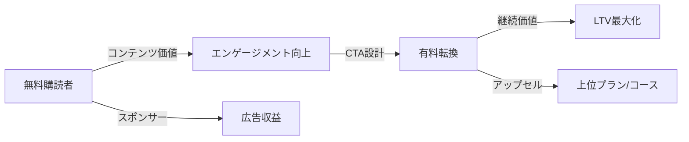

---
# ============================================================
# ニュースレター事例調査テンプレート v2.1
# YAML Front Matter（RAG/ベクトル検索最適化）
# SNS v5.0の優れた要素を取り込んだ拡張版
# ============================================================

id: "NL_CASE_XXX"
version: "2.1"
created: "YYYY-MM-DD"
updated: "YYYY-MM-DD"

# 基本情報
newsletter_name: "ニュースレター名"
founder_name: "運営者名"
founder_twitter: "@handle"
platform: "substack"  # substack | beehiiv | convertkit | ghost | 独自
language: "en"  # en | ja | multi
niche: "tech"  # ai | business | creator | tech | finance | design | product | other
website: "https://..."

# 収益ティア
mrr_usd: 0
mrr_tier: "<5k"  # 100k+ | 50k-100k | 25k-50k | 10k-25k | 5k-10k | <5k
arr_usd: 0

# 購読者データ
subscribers_total: 0
subscribers_paid: 0
paid_conversion_rate: 0.0
open_rate: 0.0
click_rate: 0.0
churn_rate: 0.0

# 定量KPI（v2.1追加）
metrics:
  engagement_rate: null           # エンゲージメント率（%）
  growth_rate_monthly: null       # 月次成長率（%）
  revenue_per_subscriber: null    # 購読者あたり収益（USD）
  leverage_ratio: null            # レバレッジ度（ARR÷推定労働時間）
  buzz_score_avg: null            # バズスコア平均（0-100）

# 成長ステージ（v2.1追加）
growth_stage:
  current: ""                     # trust | authority | influence
  trust_score: null               # 信頼構築度（1-5）
  authority_score: null           # 権威確立度（1-5）
  influence_score: null           # 影響力拡大度（1-5）

# 失敗パターン（v2.1追加）
failure_analysis:
  total_failures: null            # 総失敗数
  primary_pattern: ""             # market | scale | timing | competition | content
  recovery_speed: ""              # fast | medium | slow

# セマンティックタグ（5分類）
growth_strategies:
  - "referral_program"
  # referral_program | seo_content | twitter_growth | product_hunt | paid_ads | community | lead_magnet | sparkloop
content_style:
  - "educational"
  # educational | curated | storytelling | data_driven | entertainment | comic_format | deep_dive
success_pattern:
  - "niche_domination"
  # niche_domination | community_driven | personality_brand | curation_king | data_moat | platform_synergy
monetization:
  - "paid_subscription"
  # paid_subscription | sponsorship | course_sales | affiliate | consulting | job_board | saas | agency
marketing_channel:
  - "twitter"
  # twitter | linkedin | tiktok | youtube | organic_search | referral | podcast | product_hunt
buzz_pattern:
  - "milestone_report"
  # milestone_report | failure_story | how_to | trend_riding | data_visualization | exclusive_insight

# 日本市場スコア（5観点）
japan_market_score:
  overall: 0.0
  niche_demand: 0
  competition: 0
  content_transferability: 0
  revenue_model_reproducibility: 0
  target_audience_exists: 0

# クロスリファレンス（v2.1必須化）
cross_reference:
  app_id: ""                      # 例: "APP_003"（該当なしは"N/A"）
  sns_id: ""                      # 例: "SNS_wilson"（該当なしは"N/A"）
  person_registry_id: ""          # 例: "PERSON_001_pieter_levels"
  funnel_integration: ""          # full | partial | none
  cross_leverage_score: null      # クロス活用度（1-5）

related:
  app_cases: []                   # ["APP_001", "APP_022"]
  sns_cases: []                   # ["SNS_wilson", "SNS_dan_koe"]
  strategies: []                  # ["NL_STRATEGY_014", "NL_STRATEGY_022"]

# ファクトチェック
fact_check:
  status: "pending"               # pass | warn | ng | pending
  last_checked: "YYYY-MM-DD"
  sources_count: 0
---

# {ニュースレター名} ケーススタディ

**バージョン**: 2.1
**テンプレートID**: NL_CASE_STUDY_v2.1

---

## 1. 基本情報

| 項目 | 内容 |
|------|------|
| **ニュースレター名** | {ニュースレター名} |
| **運営者名** | {運営者名} |
| **プラットフォーム** | Substack / beehiiv / ConvertKit / Ghost / 独自 |
| **URL** | {ニュースレターURL} |
| **ニッチ/テーマ** | {テーマ・ジャンル} |
| **開始日** | {YYYY年MM月} |
| **配信頻度** | 週1 / 週2 / 日刊 / 月2回 等 |
| **成功パターン** | ニッチ特化 / キュレーション / 人格ブランド / コミュニティ / データ |

---

## 2. 数値サマリー

| 指標 | 値 |
|------|-----|
| 総購読者数 | **{数値}** |
| 有料購読者数 | {数値} |
| 有料転換率 |  |
| クリック率 | {%} |
| 推定MRR | ${金額} |
| 推定ARR | ${金額} |

---

## 3. 収益構造

| 収益源 | 詳細 |
|--------|------|
| {収益源1} | {詳細} |
| {収益源2} | {詳細} |
| {収益源3} | {詳細} |

---

## 4. 成長の転換点

- {YYYY年MM月}: {イベント1}
- {YYYY年MM月}: {イベント2}
- {YYYY年MM月}: {イベント3}

---

## 5. 成功要因分析

| 要因 | 詳細 |
|------|------|
| **{要因1}** | {詳細} |
| **{要因2}** | {詳細} |
| **{要因3}** | {詳細} |

---

## 6. 失敗・ピボット履歴

### 失敗ニュースレター/施策一覧

| # | 名称/施策 | 期間 | 失敗理由 | 学び |
|---|----------|------|----------|------|
| 1 | {施策名} | {YYYY-YYYY} | {理由} | {学び} |
| 2 | {施策名} | {YYYY-YYYY} | {理由} | {学び} |
| 3 | {施策名} | {YYYY-YYYY} | {理由} | {学び} |

### 暗黒期（成長停滞期）

- **期間**: {YYYY年MM月}〜{YYYY年MM月}（{X}ヶ月）
- **状況**: 購読者数{XXXX}人で停滞
- **原因**: {停滞の主な原因}
- **突破のきっかけ**: {具体的な施策・イベント}
- **学び**: {この経験から得た教訓}

### 失敗パターン4分類【v2.1追加】

| パターン | 該当数 | 代表例 | 学び |
|----------|--------|--------|------|
| **市場検証失敗** | X件 | {例} | 読者ニーズの誤認、PMF未達成 |
| **スケーラビリティ失敗** | X件 | {例} | 成長の壁、配信限界 |
| **タイミング失敗** | X件 | {例} | 早すぎ/遅すぎ、トレンド見誤り |
| **コンテンツ失敗** | X件 | {例} | 差別化不足、質の低下 |

### 失敗→成功の因果関係

| 失敗 | 学び | 適用先（成功） | 効果 |
|------|------|---------------|------|
| {失敗1} | {学び} | {成功施策} | {効果} |
| {失敗2} | {学び} | {成功施策} | {効果} |

---

## 7. バイラルコンテンツ分析

### バズニュースレター号TOP5

| # | 号タイトル | 配信日 | 開封率 | 紹介数 | バズ要因 |
|---|-----------|--------|--------|--------|----------|
| 1 | {タイトル} | {YYYY/MM/DD} |  | {数} | {要因} |
| 3 | {タイトル} | {YYYY/MM/DD} |  | {数} | {要因} |
| 5 | {タイトル} | {YYYY/MM/DD} | {%} | {数} | {要因} |

### バズパターン共通要素

1. **{パターン1}**: {説明}
2. **{パターン2}**: {説明}
3. **{パターン3}**: {説明}

### バズスコアリング【v2.1追加】

> **目的**: バズコンテンツの成功要因を定量化し、再現性を高める

**スコアリング基準（0-100点）**:

| 要素 | 配点 | 評価基準 | TOP号スコア |
|------|------|----------|-------------|
| **感情的フック** | 0-30点 | 驚き/共感/好奇心の喚起度 | /30 |
| **数字の具体性** | 0-30点 | 具体的数字・期間の有無 | /30 |
| **実用性** | 0-20点 | すぐ使えるテンプレート・チェックリストの有無 | /20 |
| **タイムリー性** | 0-20点 | トレンド便乗、適切な配信タイミング | /20 |
| **総合バズスコア** | **0-100点** | | **/100** |

**TOP5号のバズスコア**:

| # | 号概要 | 感情 | 数字 | 実用 | タイミング | **総合** |
|---|--------|------|------|------|-----------|---------|
| 1 | {概要} | /30 | /30 | /20 | /20 | **/100** |
| 2 | {概要} | /30 | /30 | /20 | /20 | **/100** |
| 3 | {概要} | /30 | /30 | /20 | /20 | **/100** |

**平均バズスコア**: /100

### 再現可能テンプレート【v2.1追加】

**この運営者の勝ちパターン**:
```
【パターン名: {パターン名}】
1. [フック要素]: {冒頭で注意を引く要素}
2. [展開要素]: {本文での価値提供}
3. [CTA]: {行動喚起}

テンプレート例:
"[冒頭フック]
[ストーリー/データ展開]
[学び3つ]
[CTA]"
```

---

## 8. コンテンツピラー分析【v2.1追加】

### コンテンツピラー3層構造

```
┌─────────────────────────────────────────────────────┐
│  Layer 1: Core Philosophy（基盤哲学）                │
│  └─ ブランドアイデンティティを形成する根本思想       │
├─────────────────────────────────────────────────────┤
│  Layer 2: Primary Themes（主要テーマ）              │
│  └─ 定期的に発信する主軸コンテンツ                  │
├─────────────────────────────────────────────────────┤
│  Layer 3: Supporting Content（補助コンテンツ）      │
│  └─ 時事、ゲスト寄稿、Q&A                           │
└─────────────────────────────────────────────────────┘
```

**この運営者の3層ピラー**:

| 層 | ピラー名 | 説明 | 配信比率 |
|----|---------|------|----------|
| **L1: 基盤哲学** | {哲学名} | 例: "Build in Public精神" |  |
| **L2: 主要テーマ2** | {テーマ} | 例: 技術Tips |  |
| **L3: 補助** | {補助内容} | 時事、ゲスト、Q&A |  | 高/中/低 |
| **クリック率** |  | 高/中/低 |
| **リファラル率** | {%} | 高/中/低 |

### レバレッジ度分析

> **目的**: 時間あたりの収益効率を測定し、再現可能性を評価

| 指標 | 値 | 算出方法 |
|------|-----|----------|
| **年間収益（ARR）** | ${金額} | |
| **推定週次労働時間** | {X}時間 | NL執筆+マーケ+コミュニティ |
| **年間労働時間** | {X}時間 | 週次×52 |
| **レバレッジ度** | {X}倍 | ARR÷（年間労働時間×$50基準） |

**レバレッジ度の解釈**:
- **30倍以上**: 極めて高効率（トップ層）
- **15-30倍**: 高効率（成功層）
- **5-15倍**: 中効率（成長層）
- **5倍未満**: 効率化余地あり

**この運営者のレバレッジ評価**: {評価と理由}

---

## 11. 成長ステージモデル【v2.1追加】

### 3段階成長モデル

```
┌─────────────────────────────────────────────────────────────┐
│  Stage 3: 影響力拡大期（100K+購読者）                        │
│  └─ 業界標準化、後発者への模倣、エコシステム形成            │
├─────────────────────────────────────────────────────────────┤
│  Stage 2: 権威確立期（10K-100K購読者）                       │
│  └─ 書籍出版、メディア出演、コース販売、業界での認知        │
├─────────────────────────────────────────────────────────────┤
│  Stage 1: 信頼構築期（0-10K購読者）                          │
│  └─ 透明性、一貫した配信、コア読者の獲得                    │
└─────────────────────────────────────────────────────────────┘
```

### 現在のステージ判定

| ステージ | スコア(1-5) | 根拠 | 達成マイルストーン |
|----------|-------------|------|-------------------|
| **信頼構築** | /5 | {根拠} | {達成済み事項} |
| **権威確立** | /5 | {根拠} | {達成済み事項} |
| **影響力拡大** | /5 | {根拠} | {達成済み事項} |

**現在のステージ**: Stage {X}（{期名}）

### 次ステージへの移行条件

| 条件 | 現状 | 必要アクション | 優先度 |
|------|------|---------------|--------|
| {条件1} | {現状} | {アクション} | S/A/B |
| {条件2} | {現状} | {アクション} | S/A/B |

---

## 12. 収益化導線分析

### マネタイズモデル



### 価格戦略

| プラン | 価格 | 特典 | 転換率 |
|--------|------|------|--------|
| **無料** | $0 | {無料コンテンツ内容} | - |
| **月額有料** | ${金額}/月 | {有料特典} | {%} |
| **年額有料** | ${金額}/年 | {年額特典}（月額比{X}%割引） | {%} |

### LTV/CAC分析

| 指標 | 値 | 計算根拠 |
|------|-----|----------|
| 平均月額収益 | ${金額} | |
| 平均継続月数 | {X}ヶ月 | 1÷月次解約率 |
| LTV（生涯価値） | ${金額} | 月額収益×継続月数 |
| CAC（獲得コスト） | ${金額} | マーケ費用÷新規獲得数 |
| LTV/CAC比率 | {X.X} | 3.0以上が健全目安 |

---

## 13. 日本市場適用性評価

### 定量スコアリング

| 評価項目 | スコア(1-5) | 重み | 加重スコア | コメント |
|---------|-------------|------|-----------|----------|
| ニッチの日本需要 | {1-5} | 25% | {算出} | {説明} |
| 競合状況 | {1-5} | 20% | {算出} | {日本での類似NL} |
| コンテンツ移植性 | {1-5} | 20% | {算出} | {ローカライズ難易度} |
| 収益モデル再現性 | {1-5} | 20% | {算出} | {日本での価格設定} |
| ターゲット層存在 | {1-5} | 15% | {算出} | {日本での読者層} |
| **総合スコア** | - | 100% | **{合計}** | {総評} |

**総合判定**: ◎非常に高い / ○高い / △中程度 / ×低い

### 日本版透明性戦略【v2.1追加】

> **目的**: 日本文化に適応した情報開示戦略を設計

**段階的開示モデル**:

| Level | 公開内容 | タイミング | 日本的表現例 |
|-------|----------|-----------|-------------|
| **L1** | 取り組み内容 | 開始時 | 「〇〇に挑戦中です」 |
| **L2** | 課題・壁 | 1-3ヶ月後 | 「こんな壁にぶつかりました」 |
| **L3** | 成果概要 | 成功後 | 「おかげさまで〇〇達成」 |
| **L4** | 具体的数字 | 信頼構築後 | 「月商〇桁を達成しました」 |

**この運営者の透明性パターンの日本適用**:
- {適用案1}
- {適用案2}

---

## 14. クロスリファレンス【v2.1必須】

> **目的**: App/Newsletter/SNSの3軸統合分析を可能にする

### 関連ドキュメント

| カテゴリ | ID | タイトル | 関連性 |
|----------|-----|---------|--------|
| **App** | {APP_XXX または N/A} | {タイトル} | same_person / related_product |
| **SNS** | {SNS_XXX または N/A} | {タイトル} | same_person / related_product |
| **Newsletter（他）** | {NL_XXX} | {タイトル} | competitor / collaborator |
| **戦略** | {NL_STRATEGY_XXX} | {タイトル} | implementation |

### 3軸ファネル統合

```
SNS（認知）
  ↓ フォロワー {数}K
Newsletter（育成）
  ↓ 購読者 {数}K
App/Product/Course（収益化）
  ↓ 収益 ${金額}K
```

### クロスレバレッジ評価

| 項目 | スコア(1-5) | 根拠 |
|------|-------------|------|
| **SNS→Newsletter誘導効率** | /5 | フォロワー→購読者の転換率 |
| **Newsletter→Product転換率** | /5 | 購読者→顧客の転換率 |
| **Product→SNS再循環** | /5 | 顧客のSNSでの発信・推薦 |
| **総合クロスレバレッジスコア** | **/5.0** | |

---

## 15. 主要な教訓

1. **{教訓1}**: {詳細説明}
2. **{教訓2}**: {詳細説明}
3. **{教訓3}**: {詳細説明}
4. **{教訓4}**: {詳細説明}
5. **{教訓5}**: {詳細説明}

---

## Sources

- [{ソース1タイトル}]({URL})
- [{ソース2タイトル}]({URL})
- [{ソース3タイトル}]({URL})
- [{ソース4タイトル}]({URL})

---

## 使い方（v2.1）

### 必須セクション（15セクション）

1. 基本情報（Section 1）
2. 数値サマリー（Section 2）
3. 収益構造（Section 3）
4. 成長の転換点（Section 4）
5. 成功要因分析（Section 5）
6. **失敗・ピボット履歴（Section 6）** ← 失敗パターン4分類追加
7. **バイラルコンテンツ分析（Section 7）** ← バズスコアリング追加
8. **コンテンツピラー分析（Section 8）** ← v2.1新規
9. コミュニティ・エンゲージメント戦略（Section 9）
10. **定量KPI分析（Section 10）** ← レバレッジ度追加
11. **成長ステージモデル（Section 11）** ← v2.1新規
12. 収益化導線分析（Section 12）
13. **日本市場適用性評価（Section 13）** ← 透明性戦略追加
14. **クロスリファレンス（Section 14）** ← v2.1必須
15. 主要な教訓（Section 15）

### 品質基準（v2.1）

- **行数**: 300行以上（v2.1基準）
- **必須セクション**: 15セクション以上
- **クロスリファレンス**: 必須（App/SNS統合）
- **バズスコア**: 必須（0-100点）
- **定量KPI**: エンゲージメント率、成長率、レバレッジ度
- **ソース**: 各項目にソースを明記

### v2.0からの主要変更点

| 項目 | v2.0 | v2.1 |
|------|------|------|
| セクション数 | 16 | **15**（統合により効率化） |
| 最小行数 | 300行 | **300行**（維持） |
| クロスリファレンス | 任意 | **必須** |
| バズスコア | なし | **必須** |
| 新規要素 | - | コンテンツピラー、成長ステージ、レバレッジ度、失敗パターン分類 |

### 調査ワークフロー（v2.1）

```
Step 1: 基本情報収集（5分）
  └─ プロフィール、購読者数、開封率

Step 2: 定量分析（15分）★拡充
  └─ 開封率、クリック率、成長率
  └─ レバレッジ度算出、バズスコア計算

Step 3: 失敗分析（10分）★v2.1強化
  └─ 失敗プロダクト一覧、失敗パターン分類
  └─ 暗黒期の詳細

Step 4: バイラル分析（15分）★v2.1強化
  └─ バズ号TOP5、バズスコアリング
  └─ 再現可能テンプレート抽出

Step 5: コンテンツ戦略分析（10分）★v2.1新規
  └─ コンテンツピラー3層構造
  └─ 成長ステージ判定

Step 6: 収益化分析（10分）
  └─ 価格戦略、LTV/CAC
  └─ 収益構成

Step 7: 日本市場評価（10分）★拡充
  └─ 定量スコア算出
  └─ 透明性戦略の日本適応

Step 8: クロスリファレンス（5分）★v2.1新規
  └─ App/SNS連携、3軸ファネル
  └─ クロスレバレッジ評価

Step 9: 品質保証（5分）
  └─ ファクトチェック、300行以上確認
```

**調査者**: Antigravity
**最終更新**: YYYY-MM-DD
**テンプレートバージョン**: 2.1
