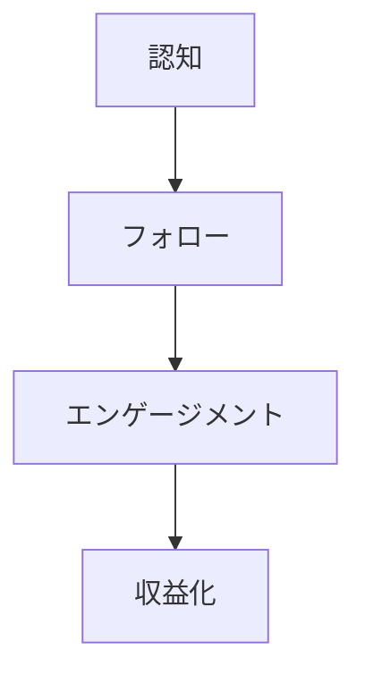
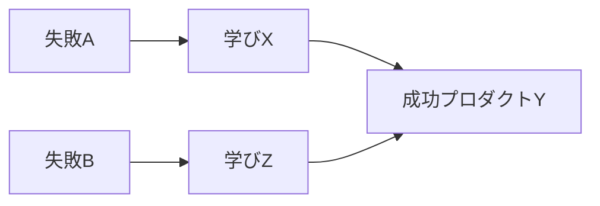

---
# ============================================================
# YAML Front Matter（RAG/ベクトル検索最適化用）v5.0
# ============================================================
# ※ このセクションは機械可読メタデータです
# ※ 新規事例作成時は以下を適切に埋めてください

id: "SNS_XXX"                          # フォーマット: SNS_{3桁番号}
title: ""                              # 人物名（例: "Pieter Levels"）
category: "sns"                        # 固定: sns
type: "case_study"                     # 固定: case_study
version: "5.0"
created_at: "YYYY-MM-DD"
updated_at: "YYYY-MM-DD"

# 人物情報
subject:
  name: ""                             # 英語名
  name_ja: ""                          # 日本語読み
  aliases: []                          # 別名・ハンドル
  nationality: ""                      # 国籍
  twitter_handle: ""                   # @なし

# SNSプレゼンス（RAGフィルタリング用）
sns_presence:
  primary_platform: ""                 # twitter | tiktok | instagram | linkedin | youtube
  followers:
    twitter: null                      # Twitterフォロワー数（数値）
    tiktok: null
    instagram: null
    linkedin: null
    youtube: null
  follower_tier: ""                    # 100k+ | 50k+ | 10k+ | 1k+

# 定量KPI（v4.0追加、v5.0拡張）
metrics:
  engagement_rate: null                # エンゲージメント率（%）
  posting_frequency_weekly: null       # 週次投稿数
  follower_growth_rate_monthly: null   # 月次成長率（%）
  revenue_per_follower: null           # 収益/フォロワー（USD）
  leverage_ratio: null                 # レバレッジ度（ARR÷推定労働時間）v5.0追加
  buzz_score_avg: null                 # バズスコア平均（0-100）v5.0追加

# 成長ステージ（v5.0追加）
growth_stage:
  current: ""                          # trust | authority | influence
  trust_score: null                    # 信頼構築度（1-5）
  authority_score: null                # 権威確立度（1-5）
  influence_score: null                # 影響力拡大度（1-5）

# 失敗パターン（v5.0追加）
failure_analysis:
  total_failures: null                 # 総失敗数
  primary_pattern: ""                  # market | scale | timing | competition
  recovery_speed: ""                   # fast | medium | slow

# 収益データ（該当する場合）
revenue:
  mrr_usd: null                        # MRR（関連プロダクトがある場合）
  mrr_tier: ""                         # 1k+ | 10k+ | 50k+ | 100k+

# セマンティックタグ（検索最適化の核心）★重要
tags:
  growth_strategy: []                  # build_in_public | twitter_threads | tiktok_viral | etc.
  content_style: []                    # educational | entertainment | build_in_public | thought_leadership
  niche: []                            # ai_tools | developer_tools | productivity | etc.
  marketing_channel: []                # twitter | tiktok | youtube | etc.
  monetization: []                     # product_sales | sponsorship | course | coaching | affiliate
  buzz_pattern: []                     # milestone_report | failure_story | how_to | trend_riding（v4.0追加）

# 日本市場適用性
japan_score:
  total: null                          # 総合スコア（1.0-5.0）
  rating: ""                           # very_high | high | medium | low

# 品質・検証
quality:
  fact_check: ""                       # pass | warn | fail
  sources_count: null
  last_verified: ""

# クロスリファレンス（v5.0必須化）
cross_reference:
  app_id: ""                           # 例: "APP_003"（該当なしは"N/A"）
  newsletter_id: ""                    # 例: "NL_P1_017"（該当なしは"N/A"）
  person_registry_id: ""               # 例: "PERSON_001_pieter_levels"
  funnel_integration: ""               # full | partial | none
  cross_leverage_score: null           # クロス活用度（1-5）

related: []                            # 例: [{id: "APP_003", relationship: "same_person"}]
---

# SNS戦略分析レポート: [人物名]

**作成日**: YYYY-MM-DD
**更新日**: YYYY-MM-DD
**調査者**: [調査者名]
**ステータス**: 作成中 / 完了
**テンプレートバージョン**: 5.0

---

## 1. 基本情報

| 項目 | 内容 | ソース |
|------|------|--------|
| **人物名** | （英語名/日本語読み） | |
| **ハンドル** | @xxx | |
| **国籍** | | |
| **職業** | | |
| **代表プロダクト** | | |
| **年間収益** | | |
| **総プロジェクト数** | | |

---

## 2. SNSプレゼンス

### プラットフォーム別アカウント

| プラットフォーム | URL | フォロワー数 | 活動状況 | 確認日 |
|------------------|-----|-------------|----------|--------|
| **Twitter/X** | | | メイン/サブ | YYYY-MM-DD |
| **Instagram** | | | | |
| **TikTok** | | | | |
| **YouTube** | | | | |
| **LinkedIn** | | | | |
| **Blog** | | | | |

### 主要プラットフォーム詳細

| 項目 | 詳細 |
|------|------|
| **投稿頻度** | |
| **コンテンツ形式** | |
| **主要ハッシュタグ** | |
| **投稿時間帯** | |

**主要トピック**:
-

---

## 3. 📊 定量KPI

> **計測日**: YYYY-MM-DD
> **計測方法**: 過去10投稿の平均値

### 3.1 エンゲージメント分析

| 指標 | 値 | 計測方法 | 業界平均比 |
|------|-----|----------|-----------|
| **エンゲージメント率** | X.X% | (いいね+RT+コメント)/フォロワー×100 | 高/中/低 |
| **平均いいね数** | X,XXX | 過去10投稿平均 | |
| **平均RT数** | XXX | 過去10投稿平均 | |
| **平均リプライ数** | XX | 過去10投稿平均 | |

### 3.2 投稿パターン分析

| 指標 | 値 | 備考 |
|------|-----|------|
| **投稿頻度（週次）** | XX投稿/週 | |
| **投稿頻度（日次）** | X.X投稿/日 | |
| **最頻投稿時間帯** | XX:00-XX:00 | UTC/JST |
| **最頻投稿曜日** | | |

### 3.3 コンテンツ種別比率

| 種別 | 比率 | 備考 |
|------|------|------|
| **テキストのみ** | XX% | |
| **画像付き** | XX% | |
| **動画** | XX% | |
| **スレッド** | XX% | |
| **引用RT** | XX% | |

### 3.4 フォロワー成長分析

| 期間 | フォロワー数 | 増加数 | 増加率 |
|------|-------------|--------|--------|
| 6ヶ月前 | | | - |
| 3ヶ月前 | | | XX% |
| 現在 | | | XX% |

**成長フェーズ**: 急成長 / 安定成長 / 停滞 / 減少

### 3.5 収益効率（推定）

| 指標 | 値 | 算出方法 |
|------|-----|----------|
| **収益/フォロワー** | $X.X/人 | ARR÷フォロワー数 |
| **推定CAC** | $XX | コンテンツ時間換算（低/中/高） |
| **収益効率評価** | ⭐⭐⭐⭐⭐ | 業界比較 |

### 3.6 レバレッジ度分析（v5.0追加）

> **目的**: 時間あたりの収益効率を測定し、再現可能性を評価

| 指標 | 値 | 算出方法 |
|------|-----|----------|
| **年間収益（ARR）** | $XXX,XXX | |
| **推定週次労働時間** | XX時間 | SNS運用+プロダクト開発 |
| **年間労働時間** | X,XXX時間 | 週次×52 |
| **レバレッジ度** | XX倍 | ARR÷（年間労働時間×$50基準） |

**レバレッジ度の解釈**:
- **30倍以上**: 極めて高効率（トップ層）
- **15-30倍**: 高効率（成功層）
- **5-15倍**: 中効率（成長層）
- **5倍未満**: 効率化余地あり

**この人物のレバレッジ評価**:

---

## 4. 成長曲線分析

### タイムライン

| 時期 | イベント | 詳細 | ソース |
|------|----------|------|--------|
| YYYY年MM月 | | | |

### 成長転換点

| # | 時期 | 転換点 | インパクト |
|---|------|--------|-----------|
| 1 | | | |

---

## 5. 失敗プロダクト詳細

> **総失敗数**: ○個

### 代表的な失敗プロダクト

| # | プロダクト名 | 年 | カテゴリ | 失敗理由 | 学び | ソース |
|---|-------------|-----|----------|----------|------|--------|
| 1 | | | | | | |

### 失敗からの教訓

1.
2.

---

## 6. バズ投稿TOP5

| # | 投稿内容（要約） | エンゲージメント | パターン | URL |
|---|-----------------|------------------|----------|-----|
| 1 | | | | |
| 2 | | | | |
| 3 | | | | |
| 4 | | | | |
| 5 | | | | |

---

## 7. 🔥 バズパターン法則化

### 7.1 パターン分類

| パターン | 該当投稿数 | 平均ER | 再現性 | 必要条件 |
|----------|-----------|--------|--------|----------|
| **マイルストーン報告** | X/5 | X.X% | 高/中/低 | 実績がある |
| **失敗→学びストーリー** | X/5 | X.X% | 高/中/低 | 経験がある |
| **数字入りHow-to** | X/5 | X.X% | 高/中/低 | 専門知識 |
| **トレンド便乗** | X/5 | X.X% | 高/中/低 | タイミング |
| **権威者メンション** | X/5 | X.X% | 高/中/低 | ネットワーク |

### 7.2 バズ投稿の構造分解

**最高エンゲージメント投稿の分析**:

| 要素 | 内容 | 効果貢献度 |
|------|------|-----------|
| **フック（冒頭）** | | XX% |
| **ストーリー（本文）** | | XX% |
| **教訓/Tips** | | XX% |
| **CTA** | | XX% |
| **ビジュアル** | あり/なし | XX% |

### 7.3 再現可能テンプレート

**この人物の勝ちパターン**:
```
【パターン名: 】
1. [フック要素]
2. [展開要素]
3. [教訓/CTA]

投稿例骨子:
"[冒頭フック]
[ストーリー展開]
[学び3つ]
[CTA]"
```

### 7.4 バズスコアリング（v5.0追加）

> **目的**: バズ投稿の成功要因を定量化し、事前予測を可能にする

**スコアリング基準（0-100点）**:

| 要素 | 配点 | 評価基準 | TOP投稿スコア |
|------|------|----------|--------------|
| **感情的フック** | 0-30点 | 驚き/共感/好奇心の喚起度 | /30 |
| **数字の具体性** | 0-30点 | 具体的数字・期間の有無 | /30 |
| **ストーリー性** | 0-20点 | before/after、困難→克服の有無 | /20 |
| **タイミング** | 0-20点 | トレンド便乗、適切な時間帯 | /20 |
| **総合バズスコア** | **0-100点** | | **/100** |

**TOP5投稿のバズスコア**:

| # | 投稿概要 | 感情 | 数字 | ストーリー | タイミング | **総合** |
|---|----------|------|------|-----------|-----------|---------|
| 1 | | /30 | /30 | /20 | /20 | **/100** |
| 2 | | /30 | /30 | /20 | /20 | **/100** |
| 3 | | /30 | /30 | /20 | /20 | **/100** |
| 4 | | /30 | /30 | /20 | /20 | **/100** |
| 5 | | /30 | /30 | /20 | /20 | **/100** |

**平均バズスコア**: /100

**バズスコア評価**:
- **80点以上**: 高確率でバズ（上位1%）
- **60-79点**: バズ可能性あり（上位10%）
- **40-59点**: 標準的なエンゲージメント
- **40点未満**: 改善余地あり

---

## 8. 🎯 コンテンツカテゴリ分析

### 8.1 カテゴリ別パフォーマンス

| カテゴリ | 投稿比率 | 平均ER | バズ率 | 最適頻度 |
|----------|----------|--------|--------|----------|
| **教育/How-to** | XX% | X.X% | XX% | 週X回 |
| **ストーリー/失敗談** | XX% | X.X% | XX% | 週X回 |
| **収益報告/マイルストーン** | XX% | X.X% | XX% | 月X回 |
| **プロダクト紹介** | XX% | X.X% | XX% | 月X回 |
| **コミュニティ交流** | XX% | X.X% | XX% | 毎日 |
| **トレンド/時事** | XX% | X.X% | XX% | 随時 |

### 8.2 コンテンツピラー（柱）

| # | ピラー | 説明 | 投稿例 |
|---|--------|------|--------|
| 1 | | | |
| 2 | | | |
| 3 | | | |

### 8.3 最適コンテンツミックス（推奨）

```
週間投稿プラン:
- 教育コンテンツ: X回
- ストーリー: X回
- 交流: X回
- プロモ: X回
```

### 8.4 コンテンツピラー3層構造（v5.0追加）

> **目的**: コンテンツ戦略の階層構造を明確化し、一貫性を評価

**3層ピラーモデル**:

```
┌─────────────────────────────────────────────────────┐
│  Layer 1: Core Philosophy（基盤哲学）                │
│  └─ ブランドアイデンティティを形成する根本思想       │
├─────────────────────────────────────────────────────┤
│  Layer 2: Primary Themes（主要テーマ）              │
│  └─ 定期的に発信する主軸コンテンツ                  │
├─────────────────────────────────────────────────────┤
│  Layer 3: Supporting Content（補助コンテンツ）      │
│  └─ 交流・時事・プロモーション                      │
└─────────────────────────────────────────────────────┘
```

**この人物の3層ピラー**:

| 層 | ピラー名 | 説明 | 投稿比率 |
|----|---------|------|----------|
| **L1: 基盤哲学** | | 例: "Ship Fast精神" | XX% |
| **L2: 主要テーマ1** | | 例: 収益透明性 | XX% |
| **L2: 主要テーマ2** | | 例: 技術Tips | XX% |
| **L2: 主要テーマ3** | | 例: 失敗談 | XX% |
| **L3: 補助** | | 交流、リプライ、プロモ | XX% |

**ピラー一貫性スコア**: /5.0
- 全投稿が3層構造に収まっているか
- 基盤哲学からのブレがないか

---

## 9. 成長戦略パターン

| 戦略 | 評価 | 詳細 |
|------|------|------|
| | ⭐⭐⭐⭐⭐ | |

---

## 10. 🏆 競合環境分析

### 10.1 直接競合（同ニッチ）

| 競合 | フォロワー | ER | 強み | 弱み | 差別化機会 |
|------|-----------|-----|------|------|-----------|
| @xxx | | | | | |
| @yyy | | | | | |
| @zzz | | | | | |

### 10.2 間接競合（隣接ニッチ）

| 競合 | ニッチ | 参入障壁 | クロスオーバー機会 |
|------|--------|----------|-------------------|
| | | | |

### 10.3 ポジショニングマップ

```
透明性（低）─────────────────（高）
    │
専  │   [競合A]
門  │              ★本人物
性  │
（  │
高  │   [競合B]      [競合C]
）  │
```

### 10.4 ブルーオーシャン機会

-

### 10.5 プラットフォーム効率性マトリクス（v5.0追加）

> **目的**: 各プラットフォームのROIを比較し、リソース配分を最適化

| プラットフォーム | オーディエンス | ER | 推定投稿工数 | 収益直結度 | **効率スコア** |
|------------------|---------------|-----|-------------|-----------|---------------|
| **Twitter/X** | XXXK | X.X% | X時間/週 | ⭐⭐⭐⭐⭐ | /5.0 |
| **Newsletter** | XXXK | XX%（開封率） | X時間/週 | ⭐⭐⭐⭐⭐ | /5.0 |
| **YouTube** | XXXK | X.X% | X時間/週 | ⭐⭐⭐ | /5.0 |
| **LinkedIn** | XXXK | X.X% | X時間/週 | ⭐⭐⭐ | /5.0 |
| **Blog/SEO** | XXX訪問/月 | - | X時間/週 | ⭐⭐⭐⭐ | /5.0 |
| **TikTok** | XXXK | X.X% | X時間/週 | ⭐⭐ | /5.0 |

**効率スコア算出**: (オーディエンスリーチ × ER × 収益直結度) ÷ 投稿工数

**プラットフォーム優先順位（この人物の場合）**:
1.
2.
3.

**日本市場向け調整**:
- 日本では〇〇プラットフォームの効率が高い傾向
- △△は言語障壁により効率低下

---

## 11. 🧠 ブランド認知・権威性分析

### 11.1 ブランドポジショニングスコア

| 評価項目 | スコア(1-5) | 根拠 |
|----------|-------------|------|
| **専門性認知** | /5 | 「〇〇といえばこの人」の確立度 |
| **信頼性** | /5 | 透明性、ファクトチェック実績 |
| **親近感** | /5 | 失敗談共有、リプライ率 |
| **権威性** | /5 | メディア露出、書籍、実績 |
| **一貫性** | /5 | メッセージ/ビジュアルの統一度 |
| **総合スコア** | **/5.0** | |

### 11.2 差別化ポイント（USP）

| 観点 | 内容 |
|------|------|
| **唯一性** | 例: 〇〇を実践した唯一の人 |
| **希少性** | 例: XX回失敗→成功のストーリー |
| **具体性** | 例: 実際のMRR数字を毎日公開 |

### 11.3 ソートリーダーシップ評価

| 指標 | 状況 |
|------|------|
| **メディア掲載** | |
| **書籍/コース** | |
| **講演/登壇** | |
| **引用/メンション頻度** | |

---

## 12. 使用ツール・サービス

| カテゴリ | ツール名 | 用途 | ソース |
|----------|----------|------|--------|
| | | | |

---

## 13. 収益化導線



**導線の特徴**:
-

---

## 14. 日本市場適用性評価

| 観点 | スコア(1-5) | 重み | 加重スコア | コメント |
|------|-------------|------|-----------|----------|
| コンテンツ再現性 | | 25% | | |
| 市場ニーズ | | 25% | | |
| 文化的適合性 | | 20% | | |
| プラットフォーム互換性 | | 15% | | |
| 言語障壁 | | 15% | | |
| **総合スコア** | | 100% | **/5.0** | |

**総合判定**: ◎非常に高い / ○高い / △中程度 / ×低い

**日本市場への具体的示唆**:
-

### 14.6 日本版透明性戦略（v5.0追加）

> **目的**: 日本文化に適応した情報開示戦略を設計

**段階的開示モデル**:

| Level | 公開内容 | タイミング | 日本的表現例 |
|-------|----------|-----------|-------------|
| **L1** | 取り組み内容 | 開始時 | 「〇〇に挑戦中です」 |
| **L2** | 課題・壁 | 1-3ヶ月後 | 「こんな壁にぶつかりました」 |
| **L3** | 成果概要 | 成功後 | 「おかげさまで〇〇達成」 |
| **L4** | 具体的数字 | 信頼構築後 | 「月商〇桁を達成しました」 |

**文化的適応チェックリスト**:

| 海外パターン | 日本適応 | この人物での適用 |
|--------------|----------|-----------------|
| 収益100%公開 | 「月商○桁達成」程度 | |
| 失敗談ストレート | ポジティブ変換 | |
| 強気な主張 | 提案・仮説形式 | |
| 個人ブランド前面 | コミュニティの一員として | |

**この人物の透明性パターンの日本適用**:
-

---

## 15. ファクトチェック結果

| 項目 | 判定 | ソース | メモ |
|------|------|--------|------|
| **フォロワー数** | ✅/⚠️/❌ | | |
| **収益データ** | ✅/⚠️/❌ | | |
| **アカウントURL** | ✅/⚠️/❌ | | 実アクセス確認 |
| **エンゲージメント率** | ✅/⚠️/❌ | | |

**総合判定**: ✅ PASS / ⚠️ WARN / ❌ NG

---

## 16. 事業アイデア候補

| # | アイデア | ターゲット | 差別化 | 難易度 |
|---|----------|-----------|--------|--------|
| 1 | | | | |
| 2 | | | | |
| 3 | | | | |

---

## 17. 自身のSNS戦略への示唆

### 学べるキーポイント

1.
2.
3.

### 実践アクション

- [ ]
- [ ]
- [ ]

---

## 18. 📉 失敗パターン分類（v5.0追加）

> **目的**: 失敗を体系的に分類し、再現可能な学びを抽出

### 18.1 失敗パターン4分類

| パターン | 該当数 | 代表例 | 学び |
|----------|--------|--------|------|
| **市場検証失敗** | X件 | | 顧客ニーズの誤認、PMF未達成 |
| **スケーラビリティ失敗** | X件 | | 成長の壁、技術的限界 |
| **タイミング失敗** | X件 | | 早すぎ/遅すぎ、トレンド見誤り |
| **競合失敗** | X件 | | 差別化不足、価格競争敗北 |

### 18.2 失敗→成功の因果関係



| 失敗 | 学び | 適用先（成功） | 効果 |
|------|------|---------------|------|
| | | | |

### 18.3 失敗回復スコア

| 指標 | スコア(1-5) | 根拠 |
|------|-------------|------|
| **発見の早さ** | /5 | 失敗を認識するまでの期間 |
| **回復時間** | /5 | 失敗から次の挑戦までの期間 |
| **学びの適用度** | /5 | 次プロダクトへの反映度 |
| **メンタル回復** | /5 | 公開発信の継続度 |
| **総合回復スコア** | **/5.0** | |

**この人物の失敗パターンの特徴**:
-

---

## 19. 📈 成長ステージモデル（v5.0追加）

> **目的**: 信頼→権威→影響力の3段階成長を評価し、次ステージへの移行条件を明確化

### 19.1 3段階成長モデル

```
┌─────────────────────────────────────────────────────────────┐
│  Stage 3: 影響力拡大期（200K+フォロワー）                    │
│  └─ 業界標準化、後発者への模倣、エコシステム形成            │
├─────────────────────────────────────────────────────────────┤
│  Stage 2: 権威確立期（50K-200Kフォロワー）                   │
│  └─ 書籍出版、メディア出演、受賞、業界での認知              │
├─────────────────────────────────────────────────────────────┤
│  Stage 1: 信頼構築期（0-50Kフォロワー）                      │
│  └─ 透明性、失敗公開、一貫した価値提供                      │
└─────────────────────────────────────────────────────────────┘
```

### 19.2 現在のステージ判定

| ステージ | スコア(1-5) | 根拠 | 達成マイルストーン |
|----------|-------------|------|-------------------|
| **信頼構築** | /5 | | ☑️/☐ |
| **権威確立** | /5 | | ☑️/☐ |
| **影響力拡大** | /5 | | ☑️/☐ |

**現在のステージ**: Stage X（〇〇期）

### 19.3 次ステージへの移行条件

| 条件 | 現状 | 必要アクション | 優先度 |
|------|------|---------------|--------|
| | | | S/A/B |
| | | | S/A/B |
| | | | S/A/B |

### 19.4 成長曲線予測

**フォロワー成長シナリオ**:
- **楽観**: 〇年後にXXXK達成
- **基準**: 〇年後にXXK達成
- **保守**: 〇年後にXK達成

**成長加速のレバー**:
1.
2.
3.

---

## 20. 🔗 クロスリファレンス（v5.0必須）

> **目的**: App/Newsletter/SNSの3軸統合分析を可能にする

### 20.1 関連ドキュメント

| カテゴリ | ID | タイトル | 関連性 |
|----------|-----|---------|--------|
| **App** | APP_XXX または N/A | | same_person / related_product |
| **Newsletter** | NL_XXX または N/A | | same_person / related_product |
| **SNS（他）** | SNS_XXX | | competitor / mentor / collaborator |

### 20.2 3軸ファネル統合

```
SNS（認知）
  ↓ フォロワー XXK
Newsletter（育成）
  ↓ 購読者 XXK
App/Product（収益化）
  ↓ MRR $XXK
```

### 20.3 クロスレバレッジ評価

| 項目 | スコア(1-5) | 根拠 |
|------|-------------|------|
| **SNS→Newsletter誘導効率** | /5 | フォロワー→購読者の転換率 |
| **Newsletter→Product転換率** | /5 | 購読者→顧客の転換率 |
| **Product→SNS再循環** | /5 | 顧客のSNSでの発信・推薦 |
| **総合クロスレバレッジスコア** | **/5.0** | |

### 20.4 Person Registry連携

| 項目 | 値 |
|------|-----|
| **Person Registry ID** | PERSON_XXX_[name] |
| **クロスカテゴリ出現数** | X/3（App/Newsletter/SNS） |
| **統合分析レポート** | あり/なし/作成予定 |

---

## 参考リンク

- [Twitter/X](URL)
- [公式サイト](URL)
- [インタビュー記事](URL)

---

## 使い方（v5.0）

### 必須セクション（18セクション）
1. 基本情報（Section 1）
2. SNSプレゼンス（Section 2）
3. **定量KPI（Section 3）** ← 3.6レバレッジ度追加
4. 成長曲線分析（Section 4）
5. 失敗プロダクト詳細（Section 5）
6. バズ投稿TOP5（Section 6）
7. **バズパターン法則化（Section 7）** ← 7.4バズスコアリング追加
8. **コンテンツカテゴリ分析（Section 8）** ← 8.4ピラー3層構造追加
9. 成長戦略パターン（Section 9）
10. **競合環境分析（Section 10）** ← 10.5プラットフォーム効率性追加
11. ブランド認知分析（Section 11）
12. 使用ツール（Section 12）
13. 収益化導線（Section 13）
14. **日本市場適用性評価（Section 14）** ← 14.6透明性戦略追加
15. ファクトチェック（Section 15）
16. 事業アイデア（Section 16）
17. SNS戦略示唆（Section 17）
18. **失敗パターン分類（Section 18）** ← v5.0新規
19. **成長ステージモデル（Section 19）** ← v5.0新規
20. **クロスリファレンス（Section 20）** ← v5.0必須

### 品質基準（v5.0更新）
- **行数**: 250行以上（v5.0基準）
- **必須セクション**: 18セクション以上
- **クロスリファレンス**: 必須（App/Newsletter/SNS統合）
- **バズスコア**: 必須（0-100点）
- **定量KPI**: エンゲージメント率、投稿頻度、成長率、レバレッジ度
- **ソース**: 各項目にソースを明記

### 調査ワークフロー（v5.0）
```
Step 1: 基本情報収集（5分）
  └─ プロフィール、フォロワー数、ER計算

Step 2: 定量分析（15分）★拡充
  └─ 過去10投稿ER、投稿頻度、成長率
  └─ レバレッジ度算出、バズスコア計算

Step 3: 定性分析（20分）★拡充
  └─ バズパターン法則化、カテゴリ分析
  └─ コンテンツピラー3層構造分析

Step 4: 戦略分析（15分）★拡充
  └─ 競合ポジショニング、ブランド評価
  └─ プラットフォーム効率性マトリクス

Step 5: 失敗・成長分析（10分）★v5.0新規
  └─ 失敗パターン分類、成長ステージ判定

Step 6: 適用分析（10分）★拡充
  └─ 日本市場スコア、透明性戦略
  └─ 事業アイデア

Step 7: クロスリファレンス（5分）★v5.0新規
  └─ App/Newsletter連携、Person Registry

Step 8: 品質保証（5分）
  └─ ファクトチェック、250行以上確認
```

### v4.0からの主要変更点
| 項目 | v4.0 | v5.0 |
|------|------|------|
| セクション数 | 17 | **20** |
| 最小行数 | 300行 | **250行**（セクション増により調整） |
| クロスリファレンス | 任意 | **必須** |
| バズスコア | なし | **必須** |
| 新規セクション | - | 失敗パターン、成長ステージ、クロスリファレンス |
