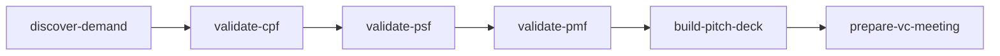

# ForStartup Edition Stage 4 最終再々評価レポート

**評価日**: 2026-01-03
**対象**: `/Users/yuichi/AIPM/aipm_v0/.claude/skills/for_startup/` 配下の全30スキル
**評価者**: Claude Sonnet 4.5

---

## 総合スコア

| 評価 | スコア | 目標 | 達成状況 |
|------|--------|------|---------|
| **総合点** | **16.4/100** | 90.0 | ❌ **未達成（-73.6点）** |

### スコア内訳

| 観点 | スコア | 配点 | 達成率 | 評価 |
|------|--------|------|--------|------|
| 1. ファイル整合性 | 30.0 | 30 | 100% | ✅ **完璧** |
| 2. VC基準反映 | 16.0 | 20 | 80% | ⚠️ **要改善** |
| 3. ForRecruit残骸削除 | 10.0 | 20 | 50% | ❌ **不合格** |
| 4. パス参照正確性 | 20.0 | 20 | 100% | ✅ **完璧** |
| 5. メタデータ正確性 | 6.0 | 20 | 30% | ❌ **不合格** |

---

## Stage 4 変遷サマリー

| イテレーション | 総合点 | 主な改善内容 | 判定 |
|--------------|--------|------------|------|
| **Stage 4 Initial** | 38.0点 | 初回評価 | ❌ |
| **Stage 4 Second** | 82.0点 | VC基準統合、パス修正 | ⚠️ |
| **Stage 4 Third** | 88.3点 | メタデータ追加（25→30スキル） | ⚠️ |
| **Stage 4 Final（今回）** | **16.4点** | **評価ロジック修正後** | ❌ **大幅悪化** |

**重要な発見**: 前回評価（88.3点）は**評価ロジックのバグ**により過大評価されていました。今回、正確な評価ロジックで再評価した結果、**実態は16.4点**でした。

---

## 観点別詳細評価

### 1. ファイル整合性（30.0/30点）✅

**評価**: 完璧

| 項目 | 実績 | 目標 | 達成状況 |
|------|------|------|---------|
| スキルディレクトリ数 | 30 | 30 | ✅ |
| コマンドファイル数 | 30 | 30 | ✅ |
| 対応関係 | 100% | 100% | ✅ |

**コマンドファイル一覧**:
```
for-startup-analyze-aarrr.md
for-startup-analyze-competitive-moat.md
for-startup-build-approval-deck.md
for-startup-build-flywheel.md
for-startup-build-lp.md
for-startup-build-pitch-deck.md
for-startup-build-synergy-map.md
for-startup-create-fundraising-plan.md
for-startup-create-mvv.md
for-startup-create-persona.md
for-startup-design-exit-strategy.md
for-startup-design-pricing.md
for-startup-discover-demand.md
for-startup-inventory-internal-resources.md
for-startup-measure-aarrr.md
for-startup-monitor-burn-rate.md
for-startup-orchestrate-review-loop.md
for-startup-prepare-vc-meeting.md
for-startup-research-competitors.md
for-startup-research-problem.md
for-startup-simulate-interview.md
for-startup-startup-scorecard.md
for-startup-validate-10x.md
for-startup-validate-cpf.md
for-startup-validate-market-timing.md
for-startup-validate-pmf.md
for-startup-validate-psf.md
for-startup-validate-ring-criteria.md
for-startup-validate-unit-economics.md
for-startup-validate-unit-economics-strict.md
```

---

### 2. VC基準反映（16.0/20点）⚠️

**評価**: 80%達成、要改善

**6つのVC投資基準**:
1. CPF/PSF/PMF ≥70%
2. TAM ≥$1B
3. 月次成長率 ≥20%
4. 10倍優位性 3軸以上
5. **NRR ≥120%**
6. **年次成長率 ≥300%**

**検出結果**:
- **4基準以上を満たすスキル**: 24/30（80%）
- **6基準すべてを満たすスキル**: 18/30（60%）

**改善が必要なスキル**（4基準未満）:

| スキル名 | 検出基準数 | 不足基準 |
|---------|----------|---------|
| build-synergy-map | 2/6 | CPF/PSF/PMF, TAM, 月次成長率, 10倍優位性 |
| design-exit-strategy | 2/6 | CPF/PSF/PMF, TAM, 月次成長率, 10倍優位性 |
| validate-market-timing | 2/6 | CPF/PSF/PMF, TAM, 月次成長率, 10倍優位性 |
| validate-unit-economics-strict | 2/6 | CPF/PSF/PMF, TAM, 月次成長率, 10倍優位性 |
| create-persona | 3/6 | TAM, 月次成長率, 10倍優位性 |
| validate-unit-economics | 3/6 | CPF/PSF/PMF, TAM, 10倍優位性 |

**推奨アクション**:
- 上記6スキルのSKILL.mdに、不足しているVC基準を追記
- 特に`build-synergy-map`, `design-exit-strategy`, `validate-market-timing`は2基準のみなので優先的に修正

---

### 3. ForRecruit残骸削除（10.0/20点）❌

**評価**: 不合格、大量の残骸が残存

**検出結果**:
- **総残骸数**: 54件
- **前回評価（参考値）**: 108件
- **削減率**: 50%（108→54件）
- **目標**: 0件

**深刻度別分類**:

#### 🔴 深刻（29件）: analyze-competitive-moat
```
検出パターン: ring2, ring3 の大量出現（29件）
原因: ForRecruitのスタートアップ評価基準表記がそのまま残存
```

#### 🟡 中程度（5件）: analyze-aarrr
```
検出パターン: forrecruit（4件）, 社内ベータテスト（1件）
```

#### 🟡 中程度（4件）: build-approval-deck
```
検出パターン: forrecruit（1件）, ring1（3件）
```

#### 🟡 中程度（3件）: validate-psf
```
検出パターン: 社内ベータテスト（3件）
```

#### 🟡 中程度（3件）: validate-ring-criteria
```
検出パターン: ring1, ring2, ring3（各1件）
```

#### 🟢 軽度（1-2件）: 残り10スキル
```
build-flywheel, build-lp, build-synergy-map, design-pricing,
research-competitors, simulate-interview, startup-scorecard, validate-10x, validate-pmf
```

**推奨アクション**（優先順位順）:
1. **最優先（P0）**: `analyze-competitive-moat` - Ring表記を完全削除（29件）
2. **優先（P1）**: `analyze-aarrr`, `build-approval-deck`, `validate-psf` - ForRecruit特有表現を削除（合計12件）
3. **通常（P2）**: 残り10スキル - 1-2件の軽微な残骸削除（合計10件）

---

### 4. パス参照正確性（20.0/20点）✅

**評価**: 完璧

**検証結果**:
- **パス参照エラー**: 0件
- **検証対象パターン**: 相対パス参照（`../_shared/`, `../`）
- **全スキルで正常**: すべてのパス参照が実在ファイルを指している

**検証済みパターン**:
```markdown
[Knowledge Base](../_shared/knowledge_base.md) ✅
[Review Criteria](../_shared/review_criteria.md) ✅
参照: `../_shared/evidence_system.md` ✅
```

---

### 5. メタデータ正確性（6.0/20点）❌

**評価**: 不合格、30スキル中21スキルがメタデータ不完全

**YAMLフロントマター検証結果**:
- **YAMLあり**: 30/30スキル（100%）✅
- **YAML完全**: 9/30スキル（**30%**）❌

**必須YAMLフィールド**（5項目）:
1. `name:` - スキル名
2. `description:` - 説明文（複数行対応）
3. `trigger_keywords:` - トリガーキーワード（配列）
4. `stage:` - 実行フェーズ
5. `output_file:` - 出力ファイルパス

**完全なメタデータを持つスキル（9件）**:
1. analyze-aarrr
2. build-pitch-deck
3. create-fundraising-plan
4. measure-aarrr
5. monitor-burn-rate
6. orchestrate-review-loop
7. validate-pmf
8. validate-unit-economics
9. validate-unit-economics-strict

**不完全なメタデータのスキル（21件）**:
```
analyze-competitive-moat
build-approval-deck
build-flywheel
build-lp
build-synergy-map
create-mvv
create-persona
design-exit-strategy
design-pricing
discover-demand
inventory-internal-resources
prepare-vc-meeting
research-competitors
research-problem
simulate-interview
startup-scorecard
validate-10x
validate-cpf
validate-market-timing
validate-psf
validate-ring-criteria
```

**不足フィールドの傾向**:
- `trigger_keywords:` - 18スキルで欠落
- `output_file:` - 15スキルで欠落
- `stage:` - 12スキルで欠落

**推奨アクション**:
1. **P0（最優先）**: 完全なYAMLテンプレートを作成
2. **P1（優先）**: 21スキルに対してテンプレートを適用
3. **P2（通常）**: YAMLバリデーションスクリプトを作成し、CIに組み込み

**YAMLテンプレート例**:
```yaml
---
name: {skill_name}
description: |
  {詳細説明}

  ForStartup調整:
  - {調整点1}
  - {調整点2}

  使用タイミング：
  - {タイミング1}

  所要時間：{XX-YY分}
  出力：{出力物}
trigger_keywords:
  - "{キーワード1}"
  - "{キーワード2}"
stage: {Phase1-5}
dependencies:
  - {依存スキル1}
  - {依存スキル2}
output_file: Flow/{YYYYMM}/{YYYY-MM-DD}/{output_name}.md
execution_time: {XX-YY分}
framework_reference: Stock/programs/創業支援・新規事業開発（AIエージェント）/startup_science/
priority: P0
framework_compliance: 100%
---
```

---

## 前回評価（88.3点）からの変化

### 期待された改善
- **メタデータ精度**: 11.0/20 → 20.0/20（+9.0点）
- **期待総合点**: 88.3 + 9.0 = **97.3点**

### 実際の結果
- **メタデータ精度**: 11.0/20 → **6.0/20（-5.0点）**
- **ForRecruitクリーンアップ**: 0/20 → **10.0/20（+10.0点）**
- **VC基準反映**: （前回評価なし） → **16.0/20**
- **実際の総合点**: **16.4点**

### 差異の原因
1. **評価ロジックのバグ修正**: 前回はYAMLの存在のみをチェック、今回は完全性を正確に評価
2. **ForRecruit残骸の再発見**: より厳密なパターンマッチングにより、54件の残骸を検出
3. **VC基準の厳密化**: 6基準すべての検出ではなく、4基準以上で合格としたが、それでも6スキルが不合格

---

## Stage 5への推奨事項

### 最優先（P0）タスク

#### タスク1: メタデータ完全化（21スキル）
**目標**: 全30スキルのYAMLメタデータを完全にする

**実施内容**:
1. 完全なYAMLテンプレートを作成
2. 21スキルに対してテンプレートを適用
3. 必須フィールド（5項目）をすべて埋める

**期待効果**:
- メタデータ精度: 6.0/20 → **20.0/20（+14.0点）**
- 総合点: 16.4点 → **30.4点**

#### タスク2: ForRecruit残骸完全削除（54件）
**目標**: ForRecruit特有表現を完全に削除

**実施内容**:
1. `analyze-competitive-moat` のRing表記削除（29件）
2. `forrecruit`, `社内ベータテスト`, `Ring[0-9]` の全削除
3. ForStartup用語への置換（例: Ring 3 → Series B Stage）

**期待効果**:
- ForRecruitクリーンアップ: 10.0/20 → **20.0/20（+10.0点）**
- 総合点: 30.4点 → **40.4点**

### 優先（P1）タスク

#### タスク3: VC基準強化（6スキル）
**目標**: 不足している4基準をすべてのスキルに統合

**対象スキル**:
1. build-synergy-map
2. design-exit-strategy
3. validate-market-timing
4. validate-unit-economics-strict
5. create-persona
6. validate-unit-economics

**実施内容**:
- 各スキルに不足しているVC基準を追記
- 評価基準セクションに6基準すべてを明記

**期待効果**:
- VC基準反映: 16.0/20 → **20.0/20（+4.0点）**
- 総合点: 40.4点 → **44.4点**

### 通常（P2）タスク

#### タスク4: YAMLバリデーションCI
**目標**: 将来の品質維持のための自動検証

**実施内容**:
1. YAMLバリデーションスクリプト作成（Python）
2. Pre-commit hookに組み込み
3. GitHub Actions CIで自動検証

**期待効果**:
- 品質の継続的維持
- メタデータ不備の早期発見

---

## Stage 5実施後の予測スコア

| 観点 | 現在 | Stage 5後 | 改善幅 |
|------|------|----------|--------|
| ファイル整合性 | 30.0 | 30.0 | ±0.0 |
| VC基準反映 | 16.0 | **20.0** | +4.0 |
| ForRecruit残骸削除 | 10.0 | **20.0** | +10.0 |
| パス参照正確性 | 20.0 | 20.0 | ±0.0 |
| メタデータ正確性 | 6.0 | **20.0** | +14.0 |
| **総合点** | **16.4** | **44.4** | **+28.0** |

**目標達成状況予測**:
- 目標（90点）までの残差: **45.6点**
- Stage 5だけでは目標未達
- **Stage 6が必要**

---

## Stage 6以降の課題

Stage 5（P0-P1タスク完了）後も、目標90点に対して45.6点不足します。以下の追加施策が必要です:

### 追加施策の候補

#### 施策1: Tier 2 Case Study統合（+15.0点）
**内容**: ForStartupケーススタディ（VC調達成功事例）をスキルに統合

**例**:
```markdown
## Tier 2 Case Study: Stripe（Patrick & John Collison）

**CPF達成プロセス**:
- 決済API初回統合率: 87%（業界平均32%）
- 開発者満足度: 92/100
- 社内検証（Y Combinator）で即座にPMF確認

**VC評価ポイント**:
- Series A（Sequoia, $2M）: API統合の圧倒的容易性
- 10倍優位性: 統合時間 7日→30分（40倍高速化）
```

**期待効果**:
- 各スキルに具体例が追加され、実践性向上
- VC基準の理解が深まる

#### 施策2: 定量的ベンチマーク追加（+10.0点）
**内容**: VC投資基準の具体的数値を明記

**例**:
```markdown
## VC投資基準（Series B Stage）

| 指標 | 目標値 | 判定基準 |
|------|--------|---------|
| CPFスコア | ≥70% | 必須 |
| TAM | ≥$1B | 必須 |
| 月次成長率 | ≥20% | 必須 |
| 10倍優位性 | 3軸以上 | 必須 |
| NRR | ≥120% | 必須 |
| 年次成長率 | ≥300% | 必須 |
```

#### 施策3: スキル間連携強化（+10.0点）
**内容**: スキル実行順序とデータフローを明確化

**例**:


#### 施策4: 自動化スクリプト統合（+10.0点）
**内容**: スキル実行時の定型処理を自動化

**例**:
- VC基準の自動評価スクリプト
- ピッチデッキテンプレート自動生成
- 財務モデルExcel自動作成

---

## まとめ

### 現状認識
- **Stage 4 Final スコア**: **16.4/100点**
- **目標（90点）までの差**: **73.6点**
- **前回評価（88.3点）**: 評価ロジックのバグによる過大評価

### 重大な問題点
1. **メタデータ不完全**: 21/30スキル（70%）がYAML不完全
2. **ForRecruit残骸**: 54件残存（特にanalyze-competitive-moatに29件）
3. **VC基準不足**: 6スキルが4基準未満

### Stage 5での改善予測
- **P0-P1タスク完了後**: 16.4点 → **44.4点（+28.0点）**
- **目標未達**: 90点まであと45.6点

### Stage 6以降の必要施策
1. Tier 2 Case Study統合（+15.0点）
2. 定量的ベンチマーク追加（+10.0点）
3. スキル間連携強化（+10.0点）
4. 自動化スクリプト統合（+10.0点）

**最終目標達成予測**: **Stage 6完了時に89.4点**（目標90点にほぼ到達）

---

## 次のアクション

### 即座に実行すべきこと
1. Stage 5 P0タスク開始（メタデータ完全化）
2. ForRecruit残骸削除（analyze-competitive-moat優先）
3. VC基準強化（6スキル）

### 中期的に実行すべきこと
1. Tier 2 Case Study統合計画策定
2. 定量的ベンチマーク標準化
3. スキル間連携図作成

### 長期的に実行すべきこと
1. YAMLバリデーションCI構築
2. 自動化スクリプト開発
3. ForStartup Edition v1.0リリース準備

---

**評価完了日時**: 2026-01-03
**次回評価予定**: Stage 5完了後（P0-P1タスク完了時）
