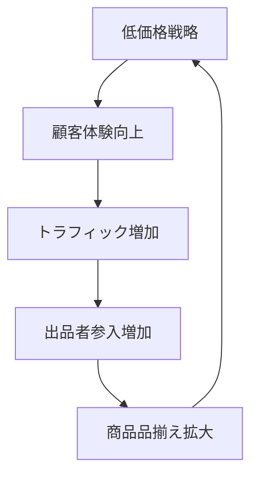

# Amazon Flywheel Model

**企業**: Amazon
**創業者**: Jeff Bezos
**段階**: IPO企業 (Legendary)
**評価額**: $1.7T+

---

## Flywheel 構造

### 5ステップ循環サイクル

### ステップ詳細

1. **低価格戦略**: 薄利多売により最安値を実現
2. **顧客体験向上**: 配送時間短縮、返品保証、レビューシステム
3. **トラフィック増加**: SEO、口コミにより訪問者急増
4. **出品者参入増加**: Marketplace で第三者出品者を募集
5. **商品品揃え拡大**: 選択肢増加により顧客滞在時間延長

---

## ネットワーク効果評価

| 項目 | スコア | 詳細 |
|------|:-----:|------|
| **直接NE** | 4/5 | 顧客増→選択肢増→顧客体験向上（マーケットプレイス規模効果） |
| **間接NE** | 5/5 | 出品者増→顧客増→出品者収益増（両面市場）|
| **データNE** | 5/5 | レビュー蓄積→推奨精度向上→購買転換率向上 |
| **総合** | **14/15** | 伝説的レベルの自己強化ループ |

---

## スケーラビリティ

| 指標 | 実績 | 評価 |
|------|------|------|
| **初期成長率** | 年次3倍以上（1997-2000年） | ✅ スケーラブル |
| **月次成長率** | 平均25%+ | ✅ VC基準達成 |
| **ボトルネック** | 出品者品質管理（A-to-Z担保） | 解決方法: 出品者評価システム |
| **資本効率性** | 赤字でもスケール（キャッシュフロー正） | ✅ 長期サステナビリティ |

---

## KPI 設定

| ステップ | KPI | 初期目標 | 達成結果 |
|---------|-----|---------|---------|
| 低価格 | 平均販売価格（ASP）削減率 | 10%削減/月 | 達成 |
| 体験 | 配送時間短縮 | 3日→2日 | 達成（Primeで1日） |
| トラフィック | 月次訪問者数 | 月100万→1000万 | 達成 |
| 出品者 | Third-party sales比率 | 5%→50%+ | 達成（現在60%） |
| 品揃え | SKU数 | 1M→1B+ | 達成（カテゴリ拡大） |

---

## このスキルでの活用

**build-flywheel スキル適用時に参照する場合**:

- **低価格の自己強化性**: 価格競争力が顧客体験向上を可能にし、スケールが価格をさらに低下させる構造
- **マーケットプレイス型の両面性**: 供給者と需要者の両輪が必須（鶏と卵問題の解決策）
- **データ活用の重要性**: レビュー・購買データの蓄積が推奨精度を向上させ、次のループを加速
- **ボトルネック管理**: スケール時に品質低下リスク（出品者品質）が生じるため、早期にシステム整備が必須

---

## ベンチマーク比較

| 企業 | ネットワーク効果 | スケーラビリティ | 評価 |
|------|:------:|:-----:|------|
| Amazon | 14/15 | 年次3倍+ | 典型的フライホイール |
| Airbnb | 14/15 | 年次2000%+ | 初期成長ではAmazonを上回る |
| LinkedIn | 13/15 | 年次2倍 | より加速度的 |

---

**参照**: @Founder_Research/documents/01_Legendary/FOUNDER_002_jeff_bezos.md
