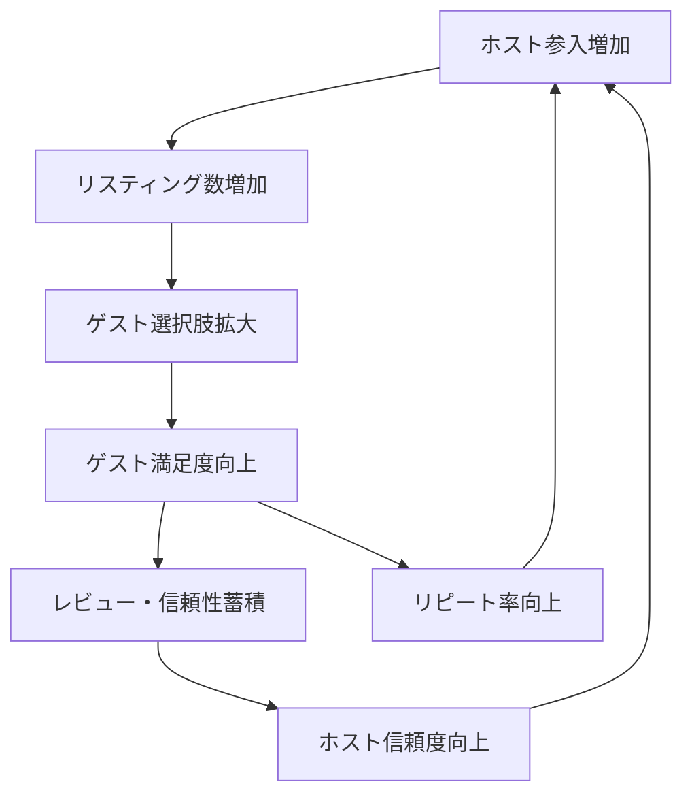

# Airbnb Marketplace Flywheel

**企業**: Airbnb
**創業者**: Brian Chesky, Joe Gebbia, Nathan Blecharczyk
**段階**: IPO企業 (Legendary)
**IPO評価額**: $100B+ (2020年12月)

---

## Flywheel 構造

### 7ステップ両面マーケットプレイス循環

### ステップ詳細

1. **ホスト参入増加**: マーケットの成長を見てホストが参入
2. **リスティング数増加**: ホスト数増→掲載物件数倍増
3. **ゲスト選択肢拡大**: 豊富な選択肢でゲスト訪問増加
4. **ゲスト満足度向上**: ユニークな体験の提供
5. **レビュー・信頼性蓄積**: ポジティブレビュー蓄積
6. **ホスト信頼度向上**: 評判システムでホストの質が上昇
7. **ホスト参入増加**: サイクル再開

---

## ネットワーク効果評価

| 項目 | スコア | 詳細 |
|------|:-----:|------|
| **直接NE** | 5/5 | ホスト増→リスティング増→ゲスト体験向上（規模効果） |
| **間接NE** | 5/5 | ゲスト増→ホスト収益増→ホスト参入（両面市場の最高形） |
| **データNE** | 4/5 | レビュー蓄積→信頼性向上→変換率向上（不動産は信頼が鍵） |
| **総合** | **14/15** | Amazon と同等の自己強化ループ |

---

## 成長率実績

| 指標 | 初期段階（2008-2010） | スケール段階（2010-2015） |
|------|:------:|:-----:|
| **月次成長率** | 25-35% | 15-20% |
| **年次成長率** | 2000%+ | 100%+ |
| **リスティング数** | 1K → 100K | 100K → 1M |
| **ゲスト数** | 100 → 100K | 100K → 10M |

---

## スケーラビリティのボトルネック

### 最大の課題: ホスト品質管理

**発見**: 初期段階でゲスト満足度が低い（写真品質の悪さ）
**原因**: ホストが自分で撮影する低品質な写真
**解決策**: 「Do things that don't scale」
- 創業者自ら各都市でホストを訪問
- プロが写真撮影（無料サービス）
- 結果: **予約数 2-3倍増**

**学習**: スケール前にボトルネックを特定・解決することで次フェーズの成長が加速

---

## KPI 追跡

| ステップ | KPI | 単位 | 目標値 | 意義 |
|---------|-----|------|--------|------|
| ホスト参入 | アクティブホスト数 | 千人 | 月100人増 | サプライ側成長 |
| リスティング | アクティブリスティング数 | 件 | 月500件増 | 選択肢拡大 |
| ゲスト | 月次予約件数 | 件 | 月20%成長 | 需要側成長 |
| 満足度 | NPS スコア | 点 | 50+ | 推薦率 |
| 信頼性 | 4.8星以上レビュー率 | % | 90%+ | 品質担保 |
| リピート | リピート予約率 | % | 30%+ | LTV向上 |

---

## このスキルでの活用

**build-flywheel スキル設計時に参照すべき要点**:

- **両面市場の鶏と卵問題**: ホストとゲストの同時参入が必須（サプライ側優先の判断）
- **ボトルネック早期発見**: スケール前の検証が次フェーズの加速を決定
- **信頼性システムの重要性**: 不動産・シェアリング経済では信頼スコアがFlywheel の中核
- **定量的な意思決定**: 写真品質改善の数値インパクト（2-3倍）を測定し次施策に反映

---

## 他企業との比較

| 企業 | 両面市場 | ボトルネック対応 | 成長加速度 | NE強度 |
|------|:-----:|:-----:|:-----:|:-----:|
| Airbnb | ✅ 強い | ✅ Do things that don't scale | ⭐⭐⭐ | 14/15 |
| Uber | ✅ 強い | ⚠️ 品質管理課題残存 | ⭐⭐⭐ | 13/15 |
| Amazon | ✅ 強い | ✅ A-to-Z担保 | ⭐⭐⭐ | 14/15 |

---

**参照**: @Founder_Research/documents/01_Legendary/FOUNDER_006_brian_chesky.md
