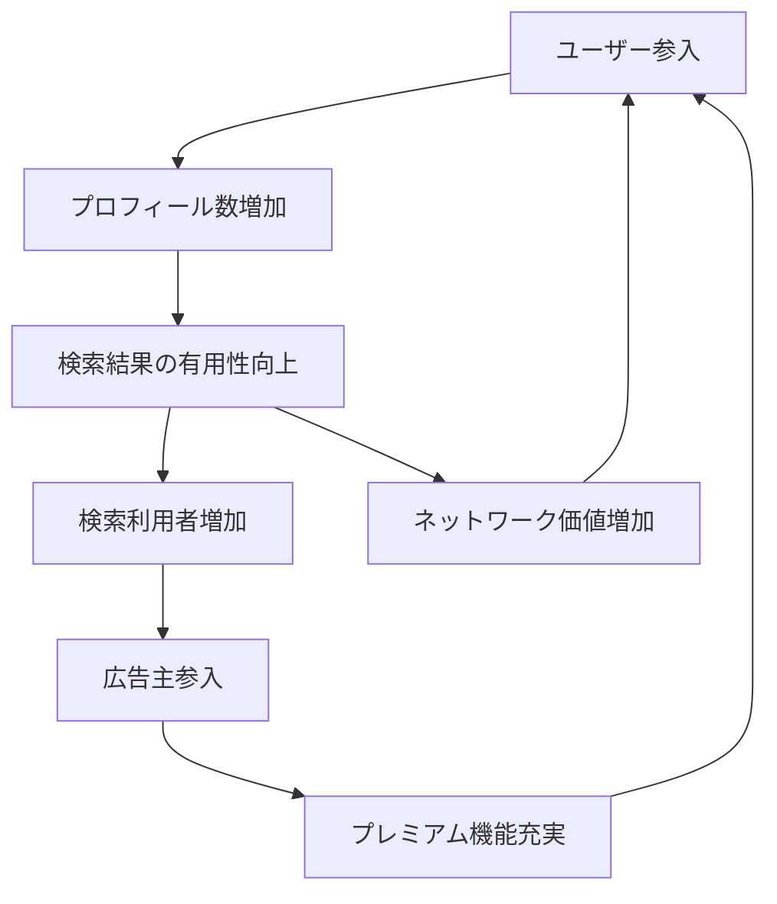

# LinkedIn Network Effect Flywheel

**企業**: LinkedIn
**創業者**: Reid Hoffman
**段階**: IPO企業 (Legendary)
**IPO評価額**: $33B (2021年Microsoft買収)

---

## Flywheel 構造

### ネットワーク効果型成長ループ

### ステップ詳細

1. **ユーザー参入増加**: ネットワーク価値の向上で新規ユーザー参入加速
2. **プロフィール数増加**: 各ユーザーが個人情報を充実
3. **検索結果有用性向上**: 検索対象者が増えて検索精度向上
4. **検索利用者増加**: 企業採用担当者が人材検索に活用
5. **広告主参入**: 企業が採用・マーケティングに広告投下
6. **プレミアム機能充実**: 収益で機能開発が加速
7. **ユーザー参入**: サイクル再開

---

## ネットワーク効果の質的分析

| 項目 | スコア | 詳細 |
|------|:-----:|------|
| **直接NE** | 5/5 | ユーザー増→検索価値増→他ユーザーの参加価値増（最強形） |
| **間接NE** | 4/5 | 採用企業増→求人増→求職者にとって価値向上（やや弱い） |
| **データNE** | 4/5 | プロフィール・スキルデータ→マッチング精度向上 |
| **総合** | **13/15** | 双方向の価値循環型ネットワーク |

---

## 成長軌跡

### Critical Mass の達成

| 時期 | ユーザー数 | 月次成長率 | マイルストーン |
|-----|:------:|:------:|------|
| 2003年 | 10K | 不適用 | IPO基準達成 |
| 2004年 | 30K | 20% | Critical Mass到達（採用企業の関心向上） |
| 2005年 | 100K | 20%+ | 検索機能本格化 |
| 2010年 | 100M | 30%+ | IPO準備段階（強いNE） |
| 2011年 | 200M | 20%+ | IPO完了 |

### Critical Mass とは

ネットワーク効果が自己強化を始める臨界点：
- LinkedInの場合: **約30-50K アクティブユーザー**
- この時点で企業採用担当者が「ここに人材がいる」と認識開始
- 以降は指数関数的成長が自動化される

---

## スケーラビリティ要因

| 要因 | 対策 | 効果 |
|------|------|------|
| **言語拡張（国際化）** | 各国版ローカライズ | ユーザー範囲7倍拡大 |
| **職種拡張** | エンジニア→営業→HR→CFOへ層拡大 | 対象層の多角化 |
| **機能拡張** | 求人検索→採用管理→人事分析へ | 企業側の顧客生涯価値向上 |
| **B2B拡張** | 個人→企業向けRecruting Solutions | 高単価ビジネス構築 |

---

## KPI 監視（Critical Pointsのみ）

| ステップ | KPI | 臨界値 | 意義 |
|---------|-----|--------|------|
| ネットワーク | アクティブユーザー率 | 月20%+成長 | NE自己強化の証拠 |
| 価値 | Critical Mass達成 | 30-50K | ネットワーク効果の転換点 |
| 検索 | 検索利用者数 | ユーザーの30%+ | 採用企業の関心度 |
| 採用 | 企業加入数 | 月50+社 | 広告主多様化 |
| 収益 | RecSol売上比率 | 30%+ | B2Bスケール確認 |

---

## このスキルでの活用

**build-flywheel スキル設計時に参照すべき要点**:

- **Critical Mass の概念**: ネットワーク効果が機能し始める臨界点を事前に計算（30-50K）
- **双方向価値創造**: 単一セグメント（求職者のみ）では不十分。採用企業も含めた多角的な価値が必須
- **指数関数的成長への転換**: Critical Mass 到達後は月次20-30%成長が自動化（資本追加投下なし）
- **国際化による倍増**: 単一国市場のNEから国際ネットワークへの拡張でユーザー数が7倍に

---

## 成功パターン from INDEX

このケースは以下の理由でフライホイール設計の教科書例：

1. **ネットワーク効果の最高形**: 直接NE（ユーザー増→価値増→ユーザー増）の最も純粋な形
2. **Critical Mass の達成可視化**: 明確な転換点がある（30-50K）
3. **多角化戦略**: B2C（求職者）→ B2B（採用企業）→ B2B2C（HR Manager）への段階的拡張
4. **月次20%+成長の実現**: VC基準の「月次成長率20%以上」を達成

---

**参照**: @Founder_Research/documents/01_Legendary/FOUNDER_003_reid_hoffman.md
