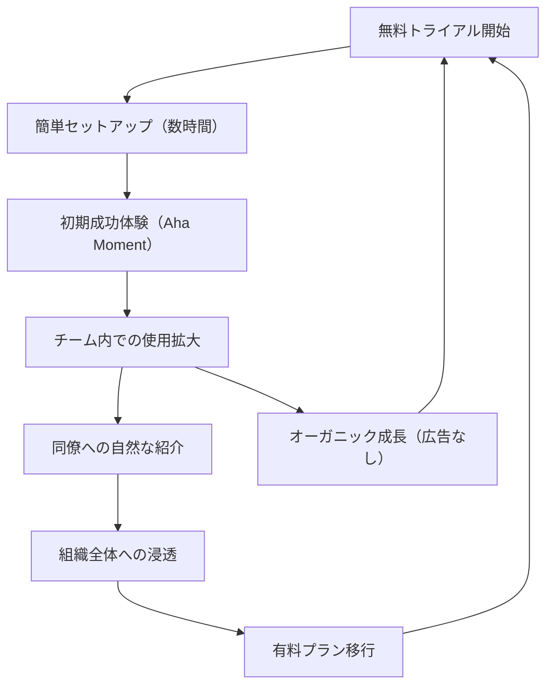

# Freshworks Viral Growth Loop

**企業**: Freshworks (旧Freshdesk)
**創業者**: Girish Mathrubootham
**段階**: IPO企業 (Unicorn)
**IPO評価額**: $12-13B (2021年9月)

---

## Flywheel 構造

### プロダクト主導型成長（PLG）+ バイラル

### ステップ詳細

1. **無料トライアル開始**: 企業メール登録のみ（決裁者不要）
2. **簡単セットアップ**: 30分で初期構築可能（Zendeskは数週間）
3. **初期成功体験**: チケット管理の効率化をすぐ実感
4. **チーム内使用拡大**: サポート部門全体で自然拡散
5. **同僚への紹介**: 他部門の同僚が「これいいね」と参入
6. **組織全体浸透**: HR, Finance, Operations も導入
7. **有料プラン移行**: 年間$3-5K/組織の契約へ

---

## ネットワーク効果評価

| 項目 | スコア | 詳細 |
|------|:-----:|------|
| **直接NE** | 3/5 | 同じ組織内でのユーザー増は価値増（弱い） |
| **間接NE** | 2/5 | 単一買い手市場（SMB企業）で多角化なし |
| **バイラルNE** | 4/5 | プロダクト自体が紹介を促す（PLG） |
| **データNE** | 3/5 | チケット履歴→対応パターン学習（中程度） |
| **総合** | **12/15** | バイラル + スティッキーの組み合わせ |

---

## 成長メカニズム

### なぜ急速に成長したか

**起点**: 2008年 Zendesk の高価格改定に対する不満
- Zendesk 月額 $25 (エージェント/月) → 不満ユーザー多数発生

**Freshworks の戦略**:
1. 価格: 月額 $15 (エージェント/月) - 40%安い
2. 使いやすさ: 30分で導入可能 vs Zendesk数週間
3. 無料プラン: 完全無料で無制限トライアル
4. オーガニック成長: Hacker Newsで話題化 → 24時間で1000ユーザー

**結果**: 初年度で月次成長率30%+、広告費 $0

---

## KPI と段階別成長

| フェーズ | 時期 | MAU | MRR | 月次成長 | 特徴 |
|---------|------|:---:|:---:|:-------:|------|
| 初期 | 2010-2011 | 10K | $50K | 30%+ | Hacker Newsバイラル |
| 成長 | 2012-2014 | 100K | $1M | 20%+ | セルスチーム構築 |
| スケール | 2015-2020 | 1M+ | $50M+ | 15%+ | Series追加 × 8回 |
| 公開 | 2021年 | 3M+ | $100M+ | 15%+ | IPO |

---

## スケーラビリティのポイント

### バイラル係数（K-factor）

**定義**: 1ユーザーが平均何人新規ユーザーを招待するか

| フェーズ | K-factor | 持続性 |
|---------|:-------:|:------:|
| 初期（Hacker News） | 1.5+ | ✅ 持続（有機的） |
| 成長（セルスチーム） | 0.8+ | ⚠️ 減少（営業驅動） |
| スケール（エンタープライズ） | 0.5+ | ❌ 低い（決裁層多層） |

**学習**: PLG企業は初期バイラル > セールス拡張時に成長率鈍化の傾向

---

## このスキルでの活用

**build-flywheel スキル設計時に参照すべき要点**:

- **PLG（プロダクト主導型成長）**: フライホイール の起動に営業部隊不要。プロダクト自体が紹介を促す
- **オーガニック成長の測定**: CAC $0 で月次成長20%+ は極めて稀。Hacker News等でのバイラルが鍵
- **バイラル係数の段階的変化**: K-factor は初期1.5+ から スケール時0.5+ に低下。事前に予測可能
- **セルス拡張時の課題**: PLGで成長してもエンタープライズ顧客は営業が必須（K-factor低下）

---

## 他事例との比較

| 企業 | 初期成長チャネル | K-factor | スケール後課題 |
|------|:-------:|:-------:|:-------:|
| Freshworks | Hacker News | 1.5 → 0.5 | エンタープライズセルス追加必要 |
| Dropbox | リファーラル | 1.6 → 0.8 | 類似 |
| Slack | チームコラボ | 1.3 → 0.4 | 類似 |

---

**参照**: @Founder_Research/documents/02_Unicorn/FOUNDER_060_girish_mathrubootham.md
