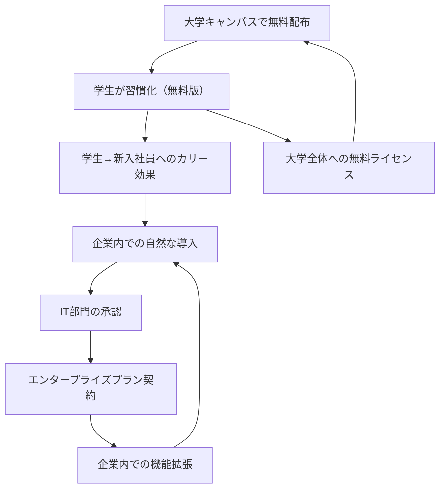

# Box Freemium Flywheel

**企業**: Box
**創業者**: Aaron Levie
**段階**: IPO企業 (Unicorn)
**IPO評価額**: $3.5B (2015年3月)

---

## Flywheel 構造

### フリーミアム → エンタープライズへの段階的価値提供



### ステップ詳細

1. **大学キャンパスで無料配布**: Stanford, UC Berkeley 等でスポンサー
2. **学生が習慣化**: 数千万ファイル保存（無料版）
3. **学生→新入社員へのカリー効果**: 卒業後も同じツール使用継続
4. **企業内での自然な導入**: 学生OB/OGが企業に「Box使いたい」
5. **IT部門の承認**: 既に会社内での利用実績あり→導入判断容易
6. **エンタープライズプラン契約**: 年間$3-10K 契約
7. **機能拡張**: 1000ユーザー規模の組織向けカスタマイズ

---

## ネットワーク効果評価

| 項目 | スコア | 詳細 |
|------|:-----:|------|
| **直接NE** | 2/5 | クラウドストレージは共有ユーザー増が限定的 |
| **間接NE** | 0/5 | 供給側がない（B2B一方向） |
| **バイラルNE** | 4/5 | 学生→社会人への自然な遷移（カリー効果） |
| **スティッキーNE** | 4/5 | 一度習慣化すると乗り換え困難 |
| **総合** | **10/15** | ネットワーク効果よりもスティッキーネス重視 |

---

## 成長メカニズム: Virality × Stickiness

### キャンパス戦略の成功要因

```
大学生の特性:
- ファイル共有が頻繁（卒業論文、プロジェクト）
- 複数の場所（図書館、自宅、学食）からのアクセス
- 複数デバイス（PC、タブレット、スマホ）の使用
→ Box の価値（どこからでもアクセス可能）が最大化
```

### CAC の低さ

| チャネル | CAC | LTV | 比率 | 効率 |
|---------|:---:|:---:|:---:|:---:|
| 大学スポンサー | $5-10 | $5000+ | 500:1 | ⭐⭐⭐⭐⭐ |
| 営業（B2B） | $500-1000 | $5000+ | 5:1 | ⭐⭐⭐ |
| マーケティング | $200-300 | $5000+ | 17:1 | ⭐⭐⭐⭐ |

**学習**: 大学キャンパス戦略で CACLTV 比率が営業の100倍

---

## 段階別成長

### フェーズ分析

| フェーズ | 時期 | ユーザー数 | 月次成長 | 特徴 |
|---------|------|:-------:|:-------:|------|
| シード | 2005-2007 | 10K | 50%+ | 大学キャンパス集中 |
| 初期成長 | 2008-2010 | 100K | 30%+ | 学生→社会人転換 |
| 加速 | 2011-2013 | 1M+ | 20%+ | エンタープライズ本格化 |
| スケール | 2014-2015 | 5M+ | 15%+ | IPO準備 |

### カリー効果の定量化

```
2008年大学キャンパス:
- 学生ユーザー: 50,000人

2015年企業顧客:
- 学生OB/OGが務める企業: 1000社+
- 平均企業規模: 500人
- Box採用率: 30%（学生時代ユーザーの推奨）

→ 学生時代 50K → 企業時代 150K ユーザー獲得（3倍化）
```

---

## KPI 設定

| ステップ | KPI | 初期目標 | 成功指標 |
|---------|-----|---------|---------|
| キャンパス | 大学数 | 月5校追加 | 100校 |
| 学生 | MAU（学生） | 月50%成長 | 5M+ |
| 企業導入 | B2B契約企業 | 月50社追加 | 10K社+ |
| 収益 | ARPU | $10/月→$50/月 | エンタープライズ化 |
| リテンション | Churn Rate | <5%/月 | <2%/月（良好） |

---

## このスキルでの活用

**build-flywheel スキル設計時に参照すべき要点**:

- **フリーミアム + カリー効果の組み合わせ**: 単なるフリーミアムではなく、ライフステージ遷移（学生→社会人）を活用した長期獲得
- **CAC極小化戦略**: 大学スポンサー CAC $5 は営業 CAC $500 の1/100。初期段階での選別が重要
- **ネットワーク効果よりスティッキーネス**: 相互作用がないB2Bツールはネットワーク効果が弱い。代わりにスティッキーネス（一度導入したら乗り換え困難）が鍵
- **段階的価値提供**: 無料（学生）→ 有料（企業）への自然な段階遷移。急激な有料化は避ける

---

## 競合との比較

| 企業 | 初期マーケット | ネットワーク効果 | CAC戦略 | IPO時評価額 |
|------|:------:|:-------:|:-------:|:-------:|
| Box | 大学キャンパス | 低い | スポンサー | $3.5B |
| Dropbox | リファーラル | 中程度 | バイラル | $10B+ |
| Google Drive | Gmail統合 | 高い | プラットフォーム | 非上場（Google内）|

---

**参照**: @Founder_Research/documents/02_Unicorn/FOUNDER_061_aaron_levie.md
