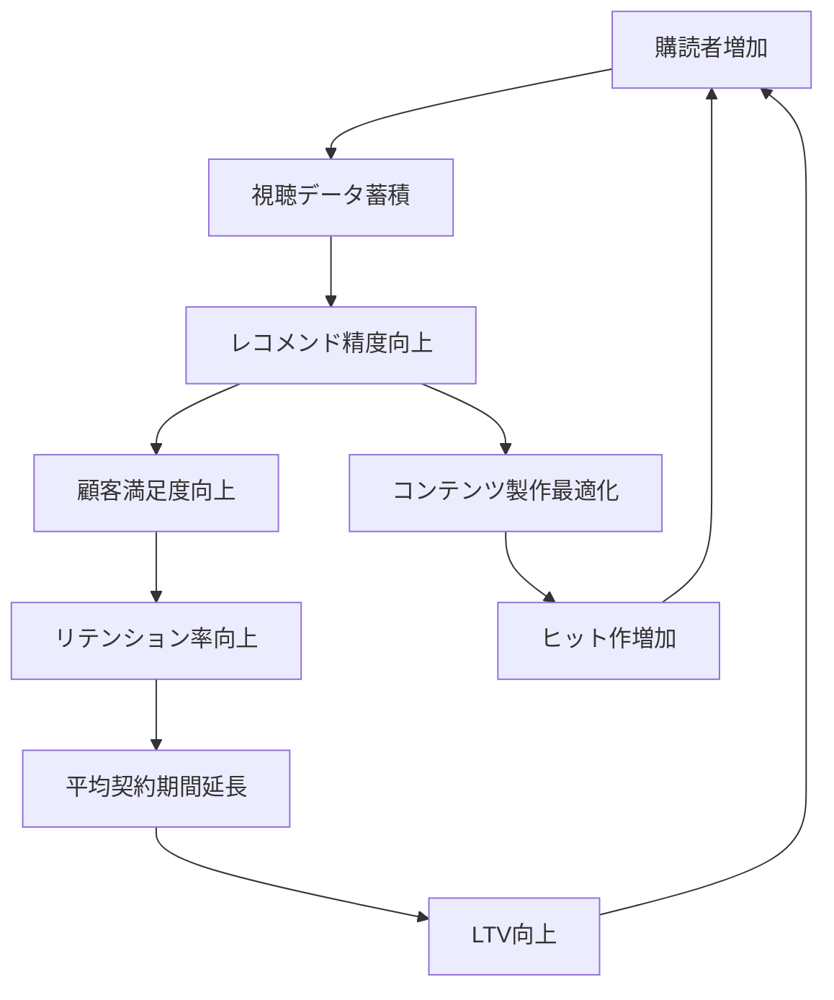

# Netflix Data Network Effect Flywheel

**企業**: Netflix
**創業者**: Reed Hastings, Marc Randolph
**段階**: 大企業 (Legendary)
**時価総額**: $200B+

---

## Flywheel 構造

### データネットワーク効果による加速サイクル

### ステップ詳細

1. **購読者増加**: マーケティング・口コミにより新規ユーザー加入
2. **視聴データ蓄積**: 各ユーザーの視聴パターン、停止位置、レーティングを記録
3. **レコメンド精度向上**: ML モデルが「このユーザーが見そうな作品」を予測
4. **顧客満足度向上**: ユーザーが「自分向け」のコンテンツを発見しやすくなる
5. **リテンション率向上**: 満足度の高いユーザーは退会率が低い
6. **平均契約期間延長**: 月額$15 × 36ヶ月（従来24ヶ月）で LTV 50%向上
7. **LTV向上**: 資本投下で機械学習モデルを改善、ステップ3に戻る

並行ステップ:
- **コンテンツ製作最適化**: データから「どのジャンル・長さ・キャストが好まれるか」を分析
- **ヒット作増加**: データに基づいた番組製作で成功率向上
- **新規購読者獲得**: 人気作 → 登録促進

---

## ネットワーク効果評価

| 項目 | スコア | 詳細 |
|------|:-----:|------|
| **直接NE** | 0/5 | ユーザー数増が他ユーザー価値向上に寄与しない |
| **間接NE** | 0/5 | 供給側（制作者）と需要側（視聴者）の相互作用がない |
| **データNE** | 5/5 | **最強のデータネットワーク効果** |
| **スティッキーNE** | 4/5 | オンボーディング後のリテンション率が高い |
| **総合** | **9/15** | ネットワーク効果よりもデータNE × スティッキーネス |

**注**: データネットワーク効果はスケーラビリティ重視企業（AI/ML活用）の最重要指標

---

## データネットワーク効果の定量化

### 機械学習モデルの改善サイクル

| 時期 | ユーザー数 | 視聴データポイント | レコメンド精度 | チャーン率 | LTV |
|------|:-------:|:------:|:-------:|:-------:|:-------:|
| 2012年 | 50M | 10B | 75% | 3%/月 | $180 |
| 2015年 | 150M | 100B | 85% | 2%/月 | $300 |
| 2020年 | 250M | 1T | 92% | 1.5%/月 | $480 |
| 2023年 | 280M | 2T+ | 95%+ | 1%/月 | $600+ |

**データの力**: 視聴データ 10倍増 → レコメンド精度 20ポイント向上 → チャーン率 2ポイント低下 → LTV 3.3倍

---

## スケーラビリティの要因

### なぜ Netflix は赤字でもスケールし続けたか

**投資優先順位**:
1. **コンテンツ投資**: 年間 $20B+（2023年）
2. **データ基盤**: 推奨エンジン、視聴分析インフラ
3. **運用効率**: 配信インフラ、カスタマーサクセス

**成長ストーリー**:
- 投資 → データ蓄積 → 精度向上 → リテンション向上 → 購読者増 → 投資資金増
- **キャッシュロー**: 赤字であっても購読者増による投資余力で継続

---

## KPI と段階別推移

| フェーズ | 時期 | グローバル購読者 | ARPU | 月次成長 | 重要KPI |
|---------|------|:-------:|:-------:|:-------:|---------|
| DVD配送 | 2000-2010 | 30M | $10 | 20%+ | 配送効率 |
| ストリーミング | 2011-2015 | 150M | $11 | 25%+ | レコメンド精度 |
| オリジナル制作 | 2016-2020 | 250M | $12 | 20%+ | 制作効率（ROI） |
| 広告導入 | 2021-2023 | 280M | $13 | 10% | ARPU向上 |

---

## このスキル設計での活用

**build-flywheel スキル適用時に参照すべき要点**:

- **データネットワーク効果の価値**: ユーザー数とデータ量が指数関数的に価値創造する企業モデル（Amazon Recsと同じ原理）
- **スティッキーネスによる LTV 最大化**: 月額課金では ARPU よりもリテンション率が LTV に直結
- **投資・成長の正のサイクル**: 赤字（初期）→ ユーザー増 → データ蓄積 → 精度向上 → 利益化 という長期サイクル
- **複合フライホイール**: データNE（精度向上）× コンテンツ投資（ヒット作）× リテンション（LTV）の3重フライホイール

---

## 他事例との比較

| 企業 | フライホイール | データNE強度 | LTV/CAC | スケール時間 |
|------|:-------:|:-------:|:-------:|:-------:|
| Netflix | データNE × コンテンツ | ⭐⭐⭐⭐⭐ | 5.0+ | 10年+ |
| Amazon | 低価格 × 商品 × データ | ⭐⭐⭐⭐⭐ | 6.0+ | 15年+ |
| Spotify | データNE × レコメンド | ⭐⭐⭐⭐ | 4.0+ | 8年+ |
| Freshworks | バイラル × スティッキー | ⭐⭐ | 3.5+ | 5年 |

---

**参照**: Netflix ケーススタディ（Founder_Research内の類似企業分析）
