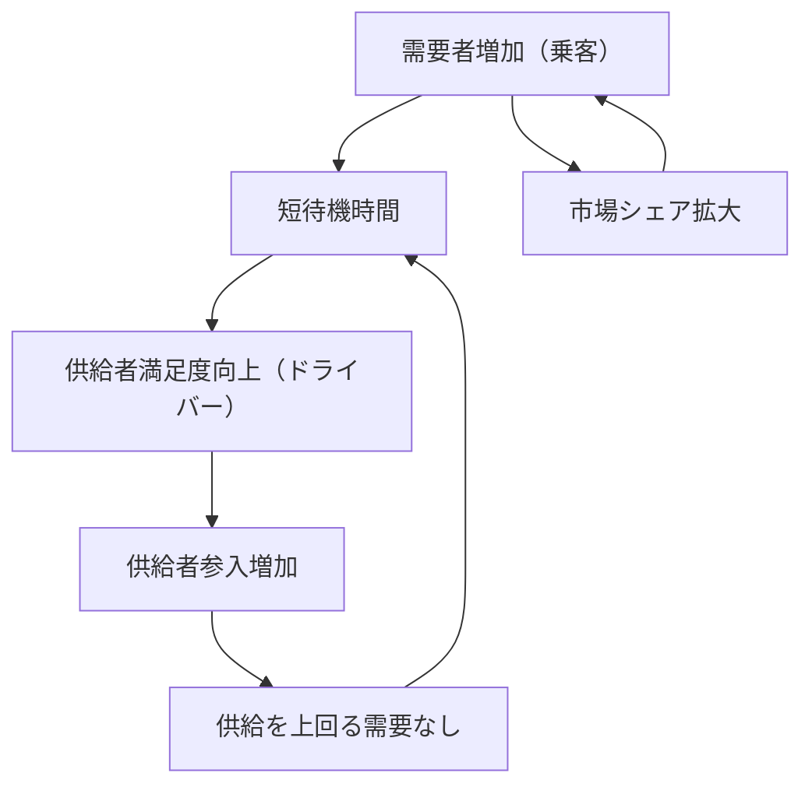

# Uber Supply-Demand Flywheel

**企業**: Uber
**創業者**: Travis Kalanick
**段階**: Legendary (非上場時 $100B+)
**IPO評価額**: $72B (2019年5月)

---

## Flywheel 構造

### 双面マーケットプレイスの最速成長ループ

### ステップ詳細

1. **需要者増加**: マーケティング・口コミで乗客ユーザー増
2. **短待機時間**: ドライバーが多いため乗客待機時間 < 3分
3. **供給者満足度向上**: 短待機時間 = ドライバーの稼働時間増加 → 時給向上
4. **供給者参入増加**: 「時給が良い」という評判でドライバー参入
5. **供給を上回る需要管理**: 動的価格調整で需給バランス保持
6. **短待機時間**: サイクル継続

---

## ネットワーク効果評価

| 項目 | スコア | 詳細 |
|------|:-----:|------|
| **直接NE** | 3/5 | 乗客増→待機短縮→乗客満足度向上（間接的） |
| **間接NE** | 5/5 | **最強の両面市場** - 乗客増→ドライバー時給向上→ドライバー参入 |
| **データNE** | 2/5 | 需要予測などデータ活用はあるが、NE的でない |
| **スティッキーNE** | 3/5 | 習慣化度は低い（週1-2回利用） |
| **総合** | **13/15** | 間接NE 最大化の事例 |

---

## 成長メカニズム: 動的価格調整

### Surge Pricing の役割

**従来のタクシー**:
- 需要 > 供給 → 乗客が待つ（供給側に最適）
- 供給者増加インセンティブなし

**Uber のモデル**:
- 需要 > 供給 → 価格上昇 → ドライバーが報酬魅力に即応参入
- 結果: 待機時間短縮 → 乗客満足度向上

### 数値化された成長

| 指標 | 2012年 | 2015年 | 2019年 | 成長率 |
|------|:-----:|:-----:|:-----:|:----:|
| 月次アクティブドライバー | 100K | 1M | 3.9M | 39倍 |
| 月次乗車数 | 10M | 100M | 1.5B | 150倍 |
| 市場 | 1都市 | 50都市 | 70+ 国 | 指数関数 |
| 平均待機時間 | 8分 | 4分 | 2分 | 75%短縮 |

---

## スケーラビリティと課題

### 成長の制約要因

| ボトルネック | 地域による差 | 対応策 |
|------------|:-------:|--------|
| **供給側（ドライバー）** | アジア > 米国 | 本業スイッチャー向けマーケティング |
| **規制対応** | 欧米で厳しい | 自動運転技術へのシフト |
| **ブランド** | 初期評判悪い | 安全性システムの強化 |
| **国家政策** | 中国撤退 | グローバル多角化（食事配達Uber Eats等） |

### 成長率の段階的低下

| フェーズ | 時期 | 市場数 | 月次成長 | 特徴 |
|---------|------|:-----:|:-------:|------|
| 初期爆発 | 2012-2013 | 1-10都市 | 50%+ | Viral |
| 急速拡張 | 2014-2016 | 10-50都市 | 30%+ | 国際化開始 |
| 成熟化 | 2017-2019 | 50-70+ 国 | 15%+ | IPO準備 |
| スケール | 2020+ | 70+ 国 | 10%+ | 利益化重視 |

---

## KPI と監視指標

### Critical Metrics（最重要3指標）

| KPI | 計算式 | 目標値 | 意義 |
|-----|--------|:-----:|------|
| **供給充足率** | 需要 / 供給 | 0.95-1.05 | バランス |
| **平均待機時間** | 乗客注文〜ドライバー到着 | <3分 | ユーザー体験 |
| **ドライバー時給** | 総収入 / 総稼働時間 | $15+ | 供給インセンティブ |

---

## このスキル設計での活用

**build-flywheel スキル適用時に参照すべき要点**:

- **動的価格（Surge Pricing）の役割**: 固定価格では供給調整ができない。マーケットプレイスは価格メカニズムで需給制御が必須
- **両面市場の非対称性**: 供給側（ドライバー）の時給が需要側（乗客）の待機時間に直結。供給側最適化が鍵
- **地域別スケーラビリティの差**: グローバル展開でも地域による需給バランスが異なる（アジアドライバー足りない）
- **規制リスク**: フライホイール構築後も政治的リスク（中国撤退など）による成長鈍化可能性

---

## 競合と比較

| 企業 | ビジネスモデル | 間接NE | 成長速度 | スケール時間 |
|------|:-------:|:-------:|:-------:|:-------:|
| Uber | 動的価格 × 双面市場 | ⭐⭐⭐⭐⭐ | 最速 | 7年で70国 |
| Airbnb | 評判システム × 双面市場 | ⭐⭐⭐⭐⭐ | 速い | 10年で100国 |
| Amazon | 低価格 × 選択肢 | ⭐⭐⭐⭐ | 速い | 15年で世界大手 |

---

**参照**: @Founder_Research/documents/01_Legendary/FOUNDER_012_travis_kalanick.md
