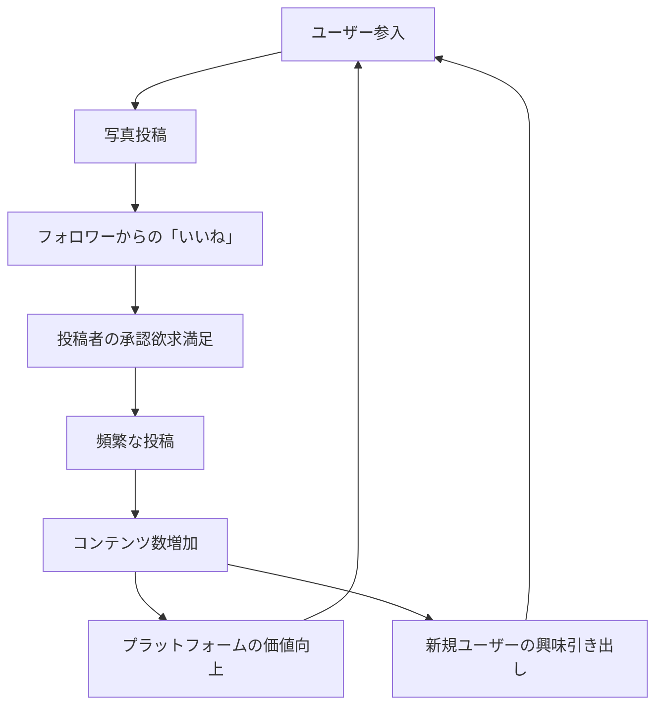

# Instagram Social Content Flywheel

**企業**: Instagram
**創業者**: Kevin Systrom, Mike Krieger
**段階**: Legendary (Facebook 買収 $1B, 2012年)
**現在**: Meta傘下 $500B+

---

## Flywheel 構造

### ユーザー生成コンテンツ（UGC）による自己強化ループ



### ステップ詳細

1. **ユーザー参入**: 友人紹介、SNS広告で新規ユーザー登録
2. **写真投稿**: スマートフォンで撮影・フィルタリング・投稿
3. **「いいね」フィードバック**: フォロワーから即座に反応
4. **投稿者の承認欲求満足**: ドーパミン放出（SNS中毒の原因）
5. **頻繁な投稿**: 毎日複数投稿、ストーリーズ
6. **コンテンツ数増加**: プラットフォームに数十億投稿
7. **プラットフォーム価値向上**: 検索・発見機能の精度向上

---

## ネットワーク効果評価

| 項目 | スコア | 詳細 |
|------|:-----:|------|
| **直接NE** | 5/5 | ユーザー増→コンテンツ増→他ユーザーの価値増（強い） |
| **間接NE** | 0/5 | 供給側（クリエイター）と需要側（視聴者）が同じ |
| **ネットワークピア効果** | 5/5 | フォロワー数 → ステータス（独特のNE） |
| **コンテンツNE** | 4/5 | UGCの量 → 検索・発見精度向上 |
| **総合** | **14/15** | SNS特有の最強ネットワーク効果 |

---

## 成長メカニズム: 承認欲求とアルゴリズム

### ドーパミン・ループ

```
投稿 → いいね通知 → ドーパミン放出 → 依存 → 頻繁投稿
```

### 数値化された成長

| 指標 | 2011年 | 2015年 | 2020年 | 2023年 |
|------|:-----:|:-----:|:-----:|:-----:|
| MAU（月次利用者） | 100M | 500M | 1.2B | 2B+ |
| DAU（日次利用者） | 50M | 300M | 800M | 1.5B+ |
| 日次投稿 | 50M | 500M | 5B+ | 10B+ |
| 月次成長率 | 40%+ | 20%+ | 10%+ | 5%+ |

### Facebook 買収の理由

2012年 $1B 買収時点:
- Instagram: 13ヶ月で 100M ユーザー（最速成長）
- Facebook: 成熟化（成長率 10% 程度）
- **戦略**: Instagram を傘下に入れて成長ドライバーに

---

## スケーラビリティ: フィード・アルゴリズムの進化

### フェーズ別進化

| フェーズ | 時期 | フィード表示 | 特徴 | 成長率 |
|---------|------|:--------:|--------|:----:|
| 初期 | 2010-2012 | 時系列順 | シンプル | 40% |
| 成長 | 2013-2015 | レコメンド開始 | ML導入 | 20% |
| 多角化 | 2016-2018 | ストーリーズ追加 | Snapchat対抗 | 15% |
| リール化 | 2019-2023 | TikTok型動画 | アルゴリズム最大化 | 10% |

### レコメンド・アルゴリズムの価値

```
初期（時系列）:
- 投稿100件 → ユーザーが見る数: 20件（20%）

現在（レコメンド）:
- 投稿100件 → ユーザーが見る数: 80件（80%）
→ 4倍の投稿消費 = コンテンツ需要が4倍に

結果: サーバー負荷 4倍でも、ユーザー満足度も 4倍（エンゲージメント）
```

---

## KPI と監視

### Instagram の最重要 KPI

| KPI | 定義 | 目標値 | 2023年実績 |
|-----|------|:-----:|:-------:|
| **MAU成長率** | 月次成長 | 10%+ | 5-10% |
| **DAU/MAU比率** | デイリー率 | 50%+ | 60%+ |
| **平均セッション時間** | 1日あたり | 45分+ | 50分+ |
| **投稿数（日次）** | UGC量 | 10B+ | 10B+ |
| **いいね数（日次）** | エンゲージメント | 1T+（1兆） | 1T+ |

---

## このスキル設計での活用

**build-flywheel スキル適用時に参照すべき要点**:

- **UGC（ユーザー生成コンテンツ）の力**: 企業が製作するコンテンツではなく、ユーザーが投稿 → その投稿が新規ユーザー獲得につながるフライホイール
- **承認欲求システムの活用**: 「いいね」「フォロワー数」というゲーム的な仕組みがユーザーの頻繁投稿を促進
- **アルゴリズムの段階的改善**: 時系列 → レコメンド → 動画推奨へと進化し続けることで成長鈍化を防止
- **ネットワーク効果の安定化**: MAU 1-2B 到達後も成長率は緩やかだが、エンゲージメント向上で収益化（広告）を加速

---

## 成長率低下の要因

初期 40% → 現在 5% への低下理由:

1. **市場飽和**: スマートフォンユーザー 80%+ が登録済み
2. **プラットフォーム競争**: TikTok（短編動画）との競合
3. **ユーザー疲労**: 毎日の投稿が当たり前 → 新規成長鈍化
4. **規制**: データプライバシー規制による広告効率低下

---

**参照**: @Founder_Research/documents/01_Legendary/FOUNDER_010_kevin_systrom.md
