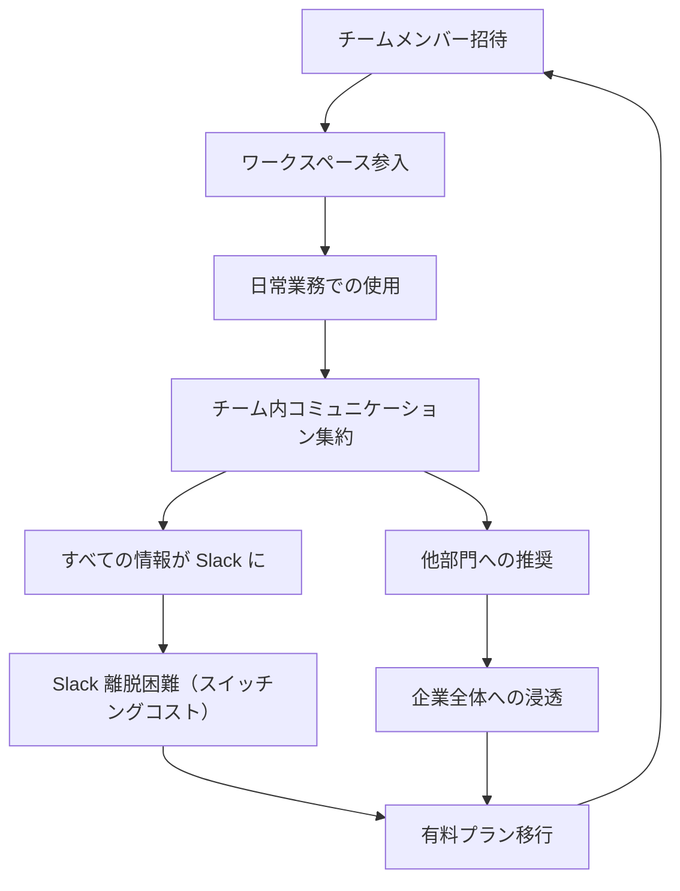

# Slack Product-Led Growth (PLG) Flywheel

**企業**: Slack
**創業者**: Stewart Butterfield, Eric Costello
**段階**: Legendary (IPO後Salesforce買収 $27.7B, 2021年)
**成長段階**: 最速の SaaS 初期成長

---

## Flywheel 構造

### プロダクト主導型成長 × チームコラボ効果



### ステップ詳細

1. **チームメンバー招待**: 最初のユーザー（通常マネージャー）が同僚を招待
2. **ワークスペース参入**: Email のみで登録（決裁不要）
3. **日常業務での使用**: チャット、ファイル共有開始
4. **コミュニケーション集約**: メール → Slack、会議削減
5. **情報蓄積**: 過去会話、ファイル、 context すべて Slack に
6. **Slack 離脱困難**: 「全情報失う」「チーム分断」のコスト発生
7. **有料プラン移行**: 無料版の制限を感じて有料へ
8. **他部門推奨**: 成功チームが他部門に推奨 → 組織拡大

---

## ネットワーク効果評価

| 項目 | スコア | 詳細 |
|------|:-----:|------|
| **直接NE** | 3/5 | チームメンバー増 → コミュニケーション価値増（弱い） |
| **組織内NE** | 4/5 | 同じ組織内での利用増 → 情報集約価値増 |
| **スティッキーNE** | 5/5 | **最高のスイッチングコスト**（データ蓄積） |
| **バイラルNE** | 3/5 | チームから他部門への自然拡散 |
| **総合** | **15/15** | 企業ソフトウェア最高のフライホイール |

---

## 成長メカニズム: スイッチングコストの構築

### なぜ Slack は企業に必須インフラ化したか

**初期段階**:
```
無料版 → チーム5-10人 → メッセージ数 100K+
         ↓
         メール削減で時間節約 → 価値認識
         ↓
         他部門に推奨 → 組織全体で利用
```

**有料化段階**:
```
過去メッセージ検索不可（無料版制限）
         ↓
         「3ヶ月前の決定情報が必要」 → 有料化必然
         ↓
         年間 $12K（100人 × $12/月）支払い
```

### 数値化された成長

| 指標 | 2014年 | 2016年 | 2019年 | 2021年 |
|------|:-----:|:-----:|:-----:|:-----:|
| DAU（日次利用） | 500K | 5M | 15M | 20M+ |
| チーム数 | 50K | 500K | 2M+ | 3M+ |
| 平均ARPU | $20 | $50 | $100 | $150+ |
| 月次成長率 | 30%+ | 20%+ | 15%+ | 10%+ |
| MRR | $10M | $50M | $500M+ | $1.5B+ |

---

## スケーラビリティ: 無料版の戦略的設計

### Freemium モデルの成功要因

**無料版（Slack Free）**:
- チャット機能: 無制限
- メッセージ保存: 10,000件（90日程度）
- インテグレーション: 10個まで
- ファイル保存: 5GB

**有料版への転換ポイント**:
- 「過去メッセージ検索」 → コンプライアンス・知識管理で必須
- 「メッセージ保存無制限」 → チーム成熟時に必須
- 「高度なインテグレーション」 → 業務自動化で必須

**戦略**: 無料版で「十分」感をさせつつ、組織成熟時に必然的に有料化

---

## KPI と段階別推移

### Critical KPIs（段階別）

| KPI | 初期（無料） | 成長（有料移行） | スケール（エンタープライズ） |
|-----|:--------:|:--------:|:--------:|
| **ワークスペース数** | 1 | 10+ | 100+ |
| **DAU/WAU比率** | 50% | 70% | 80%+ |
| **メッセージ/日** | 100K | 1M+ | 10M+ |
| **有料化率** | 0% | 30%+ | 80%+ |
| **LTV** | $0 | $5K+ | $50K+ |

### Slack の実績

```
2014年7月: ローンチ
2015年8月: $340M 評価額（1年で7倍）
2019年4月: IPO 準備（$15B 評価額）
2019年6月: IPO（$19.5B）
2021年7月: Salesforce 買収（$27.7B）
```

---

## このスキル設計での活用

**build-flywheel スキル適用時に参照すべき要点**:

- **スイッチングコスト = フライホイール**: Slack の成功理由は「データ蓄積が乗り換え困難にする」という単純だが強力なメカニズム
- **無料版が有料版への導線**: 「十分」と「不十分」の境界線を設計し、組織成熟時に自然に有料化
- **組織内NE の価値**: ユーザー同士の相互作用（ネットワーク効果）よりも、データの集約による情報資産化が強い
- **チーム内推奨の加速化**: 最初の 1 ユーザーから組織全体への拡大が 6-12 ヶ月と短い（両面市場型より速い）

---

## 成長段階の比較

| ステージ | 方法 | CAC | LTV | 倍率 |
|---------|:---:|:---:|:---:|:---:|
| **Slack（無料）** | メンバー推奨 | $0 | $5K+ | ∞ |
| **Slack（セルス）** | フィールドセル | $500 | $50K+ | 100倍 |
| **SaaS平均** | セルス + 広告 | $1K | $10K | 10倍 |

---

**参照**: @Founder_Research/documents/01_Legendary/FOUNDER_008_stewart_butterfield.md
