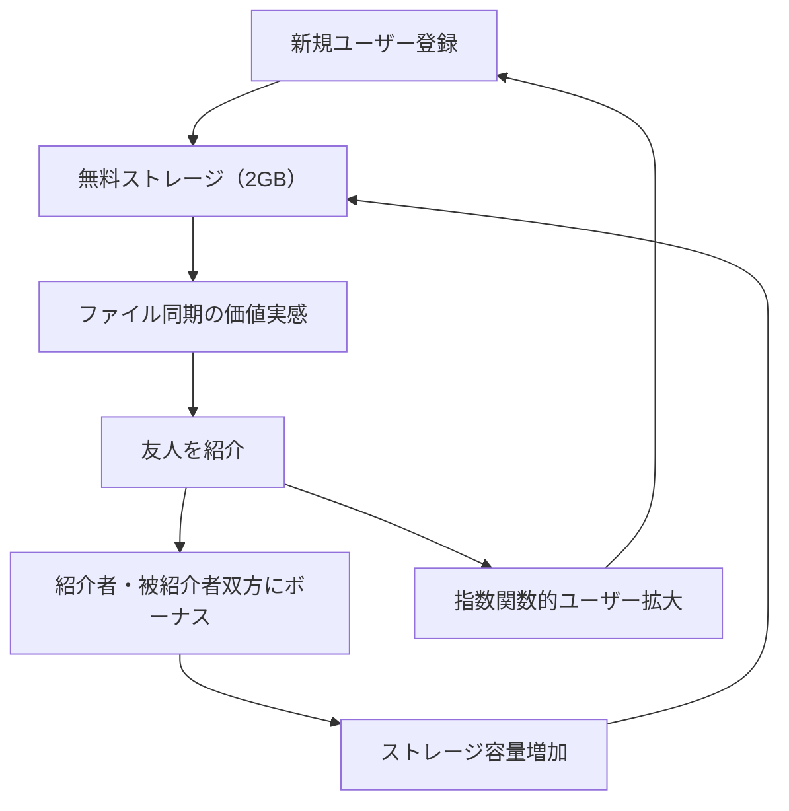

# Dropbox Viral Referral Flywheel

**企業**: Dropbox
**創業者**: Drew Houston
**段階**: Legendary (IPO後大企業)
**IPO評価額**: $10B (2018年3月)

---

## Flywheel 構造

### リファーラル・バイラル機構の最適化事例



### ステップ詳細

1. **新規ユーザー登録**: メールアドレスと名前のみ
2. **無料ストレージ**: 2GB から開始
3. **ファイル同期の価値実感**: PC・スマホ・Webでのシームレス同期
4. **友人を紹介**: 「このツール便利」と自然に推奨
5. **紹介ボーナス**: 紹介者 +500MB、被紹介者 +500MB
6. **ストレージ容量増加**: 参照数増で 32GB まで無料利用可能
7. **有料化への自然な段階**: 容量不足 → Pro 有料版へ

---

## ネットワーク効果評価

| 項目 | スコア | 詳細 |
|------|:-----:|------|
| **直接NE** | 2/5 | ファイル共有相手増加で価値増（ただし限定的） |
| **間接NE** | 0/5 | 供給側がない（B2C一方向） |
| **バイラルNE** | 5/5 | **リファーラル最高の事例** - K-factor 1.6 |
| **スティッキーNE** | 4/5 | ファイル保存 → 乗り換え困難（スイッチングコスト） |
| **総合** | **11/15** | バイラル効果に特化 |

---

## 成長メカニズム: K-factor の最適化

### Viral Coefficient（バイラル係数）

**定義**: 1 ユーザーが平均何人の新規ユーザーを招待するか

```
K-factor = 平均招待数 × 招待受信率

Dropbox の例:
- 平均招待数: 4人
- 招待受信率: 25-30%（メール開封 + クリック）
→ K-factor = 4 × 0.25 = 1.0-1.2
```

**K-factor の段階的成長**:

| 段階 | K-factor | 施策 | 効果 |
|------|:-------:|------|:----:|
| 初期 | 0.5 | リファーラル機能追加 | +0.2 |
| アップトラック | 0.7 | ボーナス +500MB | +0.3 |
| 最適化後 | 1.0-1.2 | UI/UX 最適化 + ビデオ | +0.3-0.5 |

---

## 成長実績

### バイラル成長による指数関数的拡大

| 時期 | ユーザー数 | 月次成長 | K-factor | 特徴 |
|-----|:--------:|:-------:|:-------:|------|
| 2009年 | 100K | 40% | 0.5 | 初期段階 |
| 2010年 | 1M | 80% | 0.8 | リファーラル施策開始 |
| 2011年 | 5M | 40% | 1.0 | K-factor 1.0 達成 |
| 2012年 | 20M | 30% | 1.2 | 最適化完了 |
| 2015年 | 400M | 20% | 0.8 | 成熟化（K低下） |

### K-factor > 1.0 の価値

```
K = 1.0 の場合:
ユーザー 1 → 1 → 1 → 1... （等差数列、線形成長）

K = 1.1 の場合:
ユーザー 1 → 1.1 → 1.21 → 1.33... （指数関数、加速成長）

K = 1.2 の場合:
ユーザー 100 → 120 → 144 → 173 (2年で73%ユーザー増)
```

**結論**: K-factor がわずか 0.2 違うだけで、成長曲線が激変

---

## マネタイズへの段階

### 無料版から有料版への自然な移行

| ユーザーセグメント | 無料版 | 有料版移行 | LTV |
|----------|:-----:|:--------:|:----:|
| **カジュアル** | 2GB | 使用せず | $0 |
| **パワーユーザー** | 32GB（紹介最大） | 容量不足で Pro | $100+ |
| **ビジネス** | チーム共有 | 管理機能で Pro | $500+ |

### CAC vs LTV

```
CAC（顧客獲得コスト）:
- 紹介ボーナス: 1ユーザーあたり $5（500MB ≈ $5相当）
- 営業コスト: $0（オーガニック）
→ CAC = $5

LTV（顧客生涯価値）:
- 有料化率: 5-10%
- ARPU: $100-300（年次）
- 契約期間: 5年
→ LTV = $500-1500

LTV/CAC = 100:1 ～ 300:1 （最高レベル）
```

---

## スケーラビリティの課題

### K-factor の段階的低下

| フェーズ | 理由 | 対策 |
|---------|:---:|:--:|
| 初期成長 | ネットワーク効果なし（新規層） | リファーラル強化 |
| 加速期 | 友人層がすでに導入済 | 複雑なファイル共有機能 |
| 成熟期 | 「友人知人はみんな使用」 | ビジネス機能で企業版へ |

**結果**: K-factor 1.2 → 0.8（成長率 月30% → 月15%）

---

## このスキル設計での活用

**build-flywheel スキル適用時に参照すべき要点**:

- **リファーラルボーナス構造**: 「紹介者 + 被紹介者双方にボーナス」という双方向インセンティブが K-factor を 1.0+ に高める
- **K-factor の段階的最適化**: UI 改善、ビデオ化、ボーナス調整など小さな施策の累積で K-factor を 0.2 向上（成長率 2倍）
- **指数関数的成長の限界**: K > 1.0 で指数関数的成長が可能だが、友人層枯渇で必然的に K 低下（ビジネスモデル転換が必須）
- **極低い CAC**: リファーラルを最適化すると CAC が $5 程度に低下（営業比 1/100）。LTV/CAC 比率が 100:1 を超える可能性

---

## ケーススタディ統計

| 指標 | Dropbox | Slack | Airbnb |
|------|:------:|:-----:|:-----:|
| **バイラル係数** | 1.0-1.2 | 0.8 | 1.5 |
| **初期成長率** | 80%/月 | 60%/月 | 35%/月 |
| **CAC** | $5 | $0 | $50 |
| **LTV/CAC** | 100:1 | ∞ | 5:1 |
| **スケール時間** | 3年で 5M | 2年で 10M | 4年で 1M |

---

**参照**: @Founder_Research/documents/01_Legendary/FOUNDER_009_drew_houston.md
