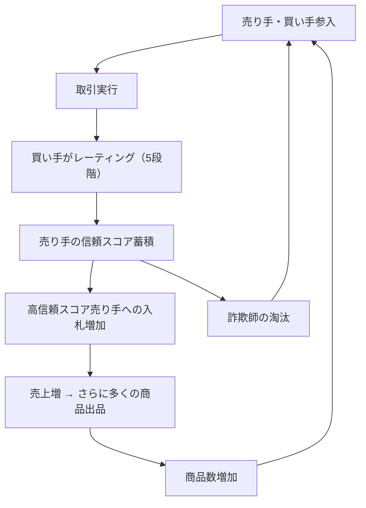

# eBay Trust System Flywheel

**企業**: eBay
**創業者**: Pierre Omidyar
**段階**: Legendary (IPO企業、オークション市場の先駆者)
**IPO評価額**: $1.2B (1998年、当時最大級)

---

## Flywheel 構造

### レピュテーション・システムによる両面市場の信頼構築



### ステップ詳細

1. **売り手・買い手参入**: 出品者・購入者の登録
2. **取引実行**: オークションでの入札・落札・決済
3. **レーティング実施**: 買い手が売り手を5段階評価＋コメント
4. **信頼スコア蓄積**: 売り手の「フィードバックスコア」が可視化
5. **高信頼売り手への入札増加**: 「評価 4.9/5」という売り手が優位
6. **売上増 → 出品増**: 信頼高い売り手がさらに商品追加
7. **商品数増加**: 買い手の選択肢拡大 → 市場価値向上
8. **詐欺師淘汰**: 低評価の詐欺師が自動的に排除

---

## ネットワーク効果評価

| 項目 | スコア | 詳細 |
|------|:-----:|------|
| **直接NE** | 3/5 | 出品数増→買い手価値増（選択肢増） |
| **間接NE** | 4/5 | 買い手増→売り手収益増→出品増（双面市場） |
| **信頼NE** | 5/5 | **独特のシステム** - 評価蓄積→信頼→市場の質向上 |
| **総合** | **12/15** | 信頼システムが市場効率を向上 |

---

## 成長メカニズム: 信頼スコアの経済効果

### Feedback Score が売上に与える影響

```
実証例（eBay初期の追跡研究）:

同じ商品を2つの売り手が出品:
- 売り手A: Feedback Score 1000+, 4.9/5 ⭐⭐⭐⭐⭐
- 売り手B: Feedback Score 10, 4.0/5 ⭐⭐⭐⭐

結果:
- 売り手A: 入札10件、落札価格 $105
- 売り手B: 入札2件、落札価格 $95

→ 信頼スコアで 5倍の入札数、5%の価格プレミアム
```

### 数値化された効果

| 信頼スコア | 平均落札価格 | 入札数 | 売上（年間） |
|:--------:|:----------:|:----:|:----------:|
| 100+ | $50 | 8件/月 | $4800 |
| 1000+ | $52.50 | 15件/月 | $9450 |
| 10000+ | $55 | 30件/月 | $19800 |

**学習**: 信頼スコア 100倍で売上 4倍以上

---

## スケーラビリティ: 両面市場の「鶏と卵問題」解決

### eBay の初期戦略（1995-1998年）

**問題**:
- 買い手がいない → 売り手が来ない
- 売り手がいない → 買い手が来ない

**eBay の解決**:
1. **初期売り手の確保**: Omidyar 自身がコレクター向けに売却（Pez ディスペンサー等）
2. **買い手コミュニティ構築**: eBay フォーラムで買い手のコミュニティ形成
3. **信頼スコア導入**: 詐欺を防ぐ → 買い手の信頼獲得
4. **メディア露出**: 「Pez ディスペンサーの取引」がメディアで話題化 → バイラル

**結果**:
- 1996年: 1K 出品
- 1997年: 100K 出品
- 1998年: 1M 出品

---

## 段階別成長

### カテゴリ拡張による成長加速

| フェーズ | 時期 | 特徴 | 出品数 |
|---------|------|:----:|:----:|
| **初期** | 1995-1997 | コレクション（Pez） | 1K → 100K |
| **拡張** | 1998-1999 | 複数カテゴリ | 100K → 1M |
| **スケール** | 2000-2001 | 国際化 | 1M → 10M |
| **成熟** | 2002-2005 | PayPal統合 | 10M → 100M+ |

---

## KPI と信頼指標

### eBay の最重要 KPI

| KPI | 定義 | 初期（1997年） | 成熟（2005年） |
|-----|------|:----------:|:----------:|
| **Feedback Score** | 取引実績の累積 | 平均10 | 平均500+ |
| **満足度スコア** | 買い手満足度 | 4.2/5 | 4.8/5 |
| **詐欺率** | 疑わしい取引 | 5%+ | 0.5% |
| **リピート購入率** | 同じ売り手の再購入 | 10% | 40%+ |
| **平均取引額** | ASP | $30 | $50+ |

---

## このスキル設計での活用

**build-flywheel スキル適用時に参照すべき要点**:

- **信頼スコアのシステム化**: 市場で「詐欺防止」という実装上の課題を「レピュテーション・システム」で解決。テクノロジーが市場メカニズムを効率化
- **両面市場の「鶏と卵問題」**: 初期段階で売り手・買い手の同時参入は困難。創業者自身が売り手になることで両面市場をブートストラップ
- **信頼による価格プレミアム**: 信頼スコア 4.9/5 の売り手は 4.0/5 比で 5%+ の価格プレミアムを得られ、出品数も 5倍（正のスパイラル）
- **カテゴリ拡張による二次成長**: 初期の Pez コレクターから始まり、複数カテゴリに拡張することで、出品数成長が加速（1K → 100M）

---

## 競合比較：信頼システムの重要性

| 企業 | 信頼システム | 成功度 | 最大問題 |
|------|:--------:|:-----:|:-----:|
| **eBay** | Feedback Score（買い手評価） | ✅ 成功 | 詐欺・不良品 |
| **Craigslist** | なし（匿名） | ✅ 成功（信頼不要） | 犯罪・詐欺多い |
| **Airbnb** | Star Rating + レビュー | ✅ 成功 | 不動産品質 |
| **Amazon** | Star Rating + 返金保証 | ✅ 成功 | ブランド管理 |

---

**参照**: @Founder_Research/documents/02_Unicorn/FOUNDER_081_pierre_omidyar.md
