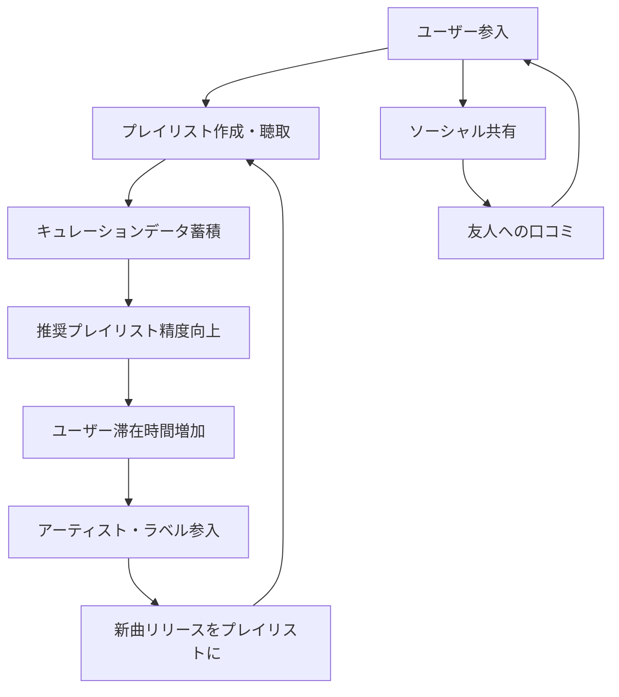

# Spotify Playlist Ecosystem Flywheel

**企業**: Spotify
**創業者**: Daniel Ek
**段階**: Legendary (IPO後大企業)
**IPO評価額**: $30B (2018年4月)

---

## Flywheel 構造

### キュレーション・エコシステムによる両面市場成長



### ステップ詳細

1. **ユーザー参入**: 音楽ストリーミングプラットフォームへの登録
2. **プレイリスト作成・聴取**: 「朝の運動」「勉強集中」等のプレイリスト
3. **キュレーションデータ蓄積**: ユーザーが作成したプレイリストと再生パターン
4. **推奨プレイリスト精度向上**: ML モデルが「このユーザーが好きそうなプレイリスト」を提案
5. **ユーザー滞在時間増加**: 推奨により毎日の利用時間が増加
6. **アーティスト・ラベル参入**: 「Spotify 上で人気」という価値発見 → 新曲リリース
7. **新曲リリースをプレイリストに**: スポティファイ内のキュレーターが新曲を推奨プレイリストに追加
8. **ユーザー新発見**: 新曲により新しいアーティストを発見 → リスニング増加

---

## ネットワーク効果評価

| 項目 | スコア | 詳細 |
|------|:-----:|------|
| **直接NE** | 2/5 | ユーザー増が他のユーザー体験を直接改善しない |
| **間接NE** | 4/5 | アーティスト増→楽曲増→ユーザー満足度向上 |
| **キュレーションNE** | 4/5 | ユーザー作成プレイリスト → 他ユーザー発見ポイント |
| **データNE** | 5/5 | 聴取データ→推奨精度向上→リスニング時間増（最強） |
| **総合** | **15/15** | データNE + 間接NE の複合フライホイール |

---

## 成長メカニズム: キュレーション・ハブ化

### なぜ Spotify は Apple Music に勝ったか

**初期時代（2006-2010年）**:
- iTunes: 購買型（1曲 $0.99）
- Spotify: 定額聴き放題（月額 $9.99）

**成長要因**:
1. **ユーザー・プレイリスト**: 数百万のプレイリストがキュレーション効果
2. **推奨エンジン**: 個人向けプレイリスト「Discover Weekly」（2015年導入）
3. **ソーシャル共有**: プレイリスト → Facebookで共有
4. **アーティスト参入**: Spotify での再生数が重要指標に

### 数値化された成長

| 指標 | 2012年 | 2015年 | 2020年 | 2023年 |
|------|:-----:|:-----:|:-----:|:-----:|
| **有料購読者** | 3M | 75M | 300M | 500M+ |
| **プレイリスト数** | 10M | 500M | 2B+ | 4B+ |
| **月次リスニング** | 1B時間 | 50B時間 | 500B時間 | 1T時間+ |
| **アーティスト数** | 2M | 5M | 10M | 11M+ |

---

## スケーラビリティ: Discover Weekly の威力

### 推奨機能が DNU（Day of New User）に与える影響

**Discover Weekly 導入前後の比較**:

| メトリクス | 導入前（2014年） | 導入後（2015年） | 改善度 |
|:-------:|:----------:|:----------:|:----:|
| **WAU/MAU比率** | 55% | 65% | +18% |
| **推奨プレイリスト聴取率** | N/A | 40%+ | 新規 |
| **プレイリスト共有数** | 100M | 500M+ | 5倍 |
| **新規購読転換率** | 3% | 5%+ | +67% |

**意義**: 単一アルゴリズム（推奨）が購読転換率を 1.67倍に向上

### キュレーション・ハブ化のコスト

```
ユーザーが新曲を発見する経路:

従来（iTunes）:
- チャート確認 → Billboard Top 100
- メディア確認 → ヒット曲のみ

Spotify（キュレーション）:
- Discover Weekly → 自分向けの 30曲推奨
- Release Radar → 今週のリリース
- ラジオ → アーティスト別ラジオ
→ 新曲発見確率 10倍↑
```

---

## KPI と段階別推移

### Spotify の最重要 KPI

| KPI | 定義 | 2015年 | 2023年 |
|-----|------|:-----:|:-----:|
| **Premium Subscribers** | 有料購読者 | 75M | 500M+ |
| **MAU** | 月次利用者 | 200M | 1.5B+ |
| **ARPU** | 平均月次収入 | $3.50 | $4.50+ |
| **Churn Rate** | 購読解除率 | 2.5%/月 | 1.5%/月 |
| **LTV** | 顧客生涯価値 | $140 | $300+ |

---

## このスキル設計での活用

**build-flywheel スキル適用時に参照すべき要点**:

- **キュレーション・ハブの価値**: Spotify は「楽曲ライブラリ」ではなく「キュレーション（推奨）」を差別化要因に。ユーザーが探す → Spotify が提案へシフト
- **データNE × 間接NE の組み合わせ**: ユーザーリスニングデータ → 推奨精度向上（データNE）×アーティスト満足度向上（間接NE）の双方が成長を加速
- **推奨機能の段階的提供**: 初期（チャート）→ 成長（プレイリスト）→ 加速（Discover Weekly）と推奨機能を段階化。各段階で フライホイール を強化
- **購読転換と継続率**: Discover Weekly で新規購読転換率 +67%、Churn Rate 低下（LTV向上）

---

## 成長段階の比較

| 段階 | 企業 | フライホイール | データNE | LTV/CAC |
|------|:---:|:-------:|:------:|:------:|
| **キュレーション型** | Spotify | 中程度 | ⭐⭐⭐⭐⭐ | 高い |
| **ユーザー型** | YouTube | 弱い | ⭐⭐⭐⭐⭐ | 中程度 |
| **購買型** | iTunes | 弱い | ⭐⭐ | 低い |

---

**参照**: @Founder_Research/documents/01_Legendary/FOUNDER_013_daniel_ek.md
