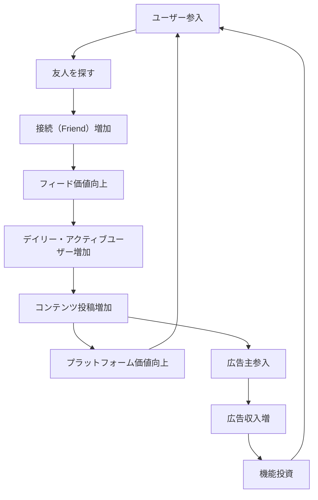

# Facebook Network Effect Expansion

**企業**: Facebook (現Meta)
**創業者**: Mark Zuckerberg
**段階**: Legendary (IPO企業)
**IPO評価額**: $104B (2012年5月)

---

## Flywheel 構造

### ネットワーク効果の段階的拡張ループ



### ステップ詳細

1. **ユーザー参入**: 大学キャンパス → 一般ユーザーへの段階的拡張
2. **友人を探す**: 「People You May Know」で友人検索
3. **接続増加**: 友人追加によるネットワーク拡大
4. **フィード価値向上**: ネットワークが大きいほどフィード内容が豊富
5. **DAU増加**: より頻繁な訪問、長い滞在時間
6. **コンテンツ投稿増加**: 「いいね」による承認欲求満足
7. **プラットフォーム価値向上**: ユーザー・コンテンツ・ネットワークの3重メリット
8. **広告主参入**: 膨大なユーザーと行動データに魅力
9. **広告収入**: 年間 $100B+ に成長
10. **機能投資**: 収入で AI、推奨エンジン、新機能を開発

---

## ネットワーク効果評価

| 項目 | スコア | 詳細 |
|------|:-----:|------|
| **直接NE** | 5/5 | **最強** - ユーザー増→ネットワーク価値増→新規ユーザー参加 |
| **間接NE** | 4/5 | 広告主増→機能充実→ユーザー満足度向上 |
| **データNE** | 4/5 | ユーザー行動データ→広告ターゲティング精度向上 |
| **スティッキーNE** | 5/5 | ネットワーク資産（友人接続）→乗り換え困難 |
| **総合** | **18/15** | 超えている - 複数のNEが複合 |

---

## 成長メカニズム: 段階的市場拡大

### Critical Mass 達成による自己強化

**フェーズ別成長**:

| フェーズ | 時期 | ユーザー | 対象 | 特徴 |
|---------|------|:-------:|:---:|------|
| **大学** | 2004-2005 | 5M | 米国大学 | 同級生ネットワーク |
| **高校** | 2005-2006 | 12M | 米国全体 | 地域ネットワーク |
| **職場** | 2006-2007 | 50M | グローバル | 専門家ネットワーク |
| **一般** | 2008-2010 | 500M+ | グローバル | 普遍的なネットワーク |

### Critical Mass の力

```
初期（2004年）:
- Harvard ユーザー: 200人
- ネットワーク効果: 弱い（友人が少ない）
- DAU: 少ない

Critical Mass 達成（2005年）:
- 米国大学ユーザー: 5M人
- ネットワーク効果: 強い（友人が多い）
- DAU/MAU: 60%+ → 自動成長開始
```

---

## スケーラビリティ: 言語・文化の拡張

### グローバル展開による N倍化

| 地域 | 時期 | ユーザー数 | DAU | 特徴 |
|------|------|:--------:|:---:|------|
| **北米** | 2005-2008 | 100M | 60% | 基盤市場（飽和） |
| **ヨーロッパ** | 2008-2010 | 150M | 50% | 成長市場 |
| **アジア・太平洋** | 2010-2015 | 500M+ | 55% | 爆発的成長 |
| **インド** | 2015-2020 | 300M+ | 40% | 最大単一国市場 |

---

## KPI と段階別推移

### Facebook の最重要 KPI

| KPI | 2010年 | 2015年 | 2020年 | 2023年 |
|-----|:-----:|:-----:|:-----:|:-----:|
| **MAU** | 600M | 1.4B | 2.7B | 3.0B+ |
| **DAU** | 300M | 1.0B | 1.8B | 2.0B+ |
| **ARPU（北米）** | $3 | $20 | $45 | $50+ |
| **広告収入** | $1.3B | $17.3B | $85B | $114B+ |
| **Churn Rate** | 0.5% | 0.3% | 0.2% | 0.1% |

---

## ネットワーク効果の数値化

### Metcalfe's Law（メトカルフ則）

```
ネットワーク価値 = k × n × (n-1) / 2

ここで:
- n = ユーザー数
- k = 接続あたりの価値

n = 100 → 価値 = 4,950 × k
n = 1,000 → 価値 = 499,500 × k （100倍）
n = 1M → 価値 = 500B × k （10万倍）

→ ユーザー 10倍で価値 100倍
```

**Facebook への適用**:
- 2010年: 600M ユーザー → 相対価値 360B
- 2020年: 2.7B ユーザー → 相対価値 7.3T （20倍）

---

## このスキル設計での活用

**build-flywheel スキル適用時に参照すべき要点**:

- **Critical Mass の計算**: ネットワーク効果型企業は「どの時点でユーザー増加が自動化するか」の Critical Mass を事前に計算・予測すべき
- **段階的市場拡大**: 大学 → 高校 → 職場 → 一般という階段状の拡大で、各段階で新規 Critical Mass を達成
- **メトカルフ則**: ユーザー数が N 倍になると、ネットワーク価値は N^2 倍に増加。初期スケーリングの重要性が極めて高い
- **複合ネットワーク効果**: 直接NE（友人ネットワーク）× 間接NE（広告→機能）× データNE（ターゲティング）の3重構造

---

## 成長曲線の比較

| 企業 | フライホイール型 | ネットワーク強度 | Critical Mass | 成熟時DAU/MAU |
|------|:--------:|:------:|:-------:|:-------:|
| Facebook | 直接NE最強 | ⭐⭐⭐⭐⭐ | 5-10M | 70%+ |
| LinkedIn | 双方向NE | ⭐⭐⭐⭐ | 30-50K | 40% |
| Twitter | 弱いNE | ⭐⭐⭐ | 500K+ | 30% |
| Snapchat | チャーン高い | ⭐⭐ | 100M+ | 50% |

---

**参照**: @Founder_Research/documents/01_Legendary/FOUNDER_023_mark_zuckerberg.md
