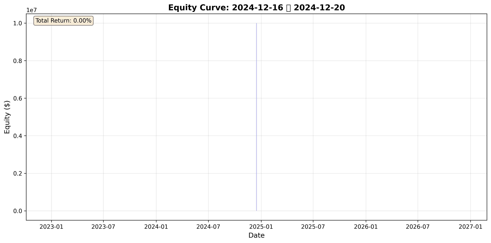
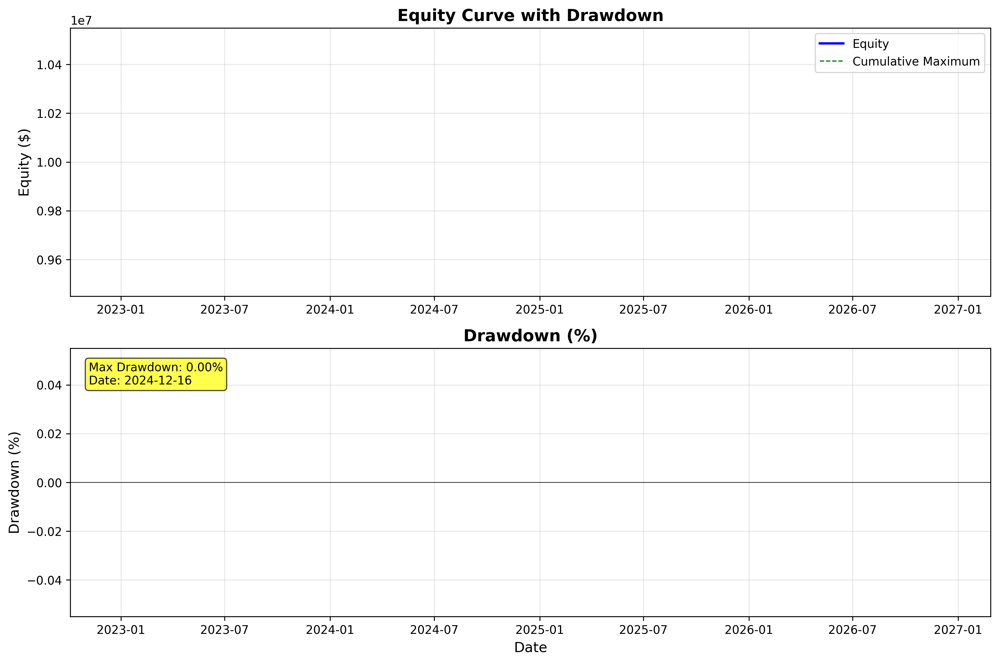

# 週次トレード戦略レポート: 2024-12-16 〜 2024-12-20

**レポート生成日**: 2026-01-01 20:35:35
**対象期間**: 2024-12-16 〜 2024-12-20
**現在のレジーム**: SIDEWAYS

---

## エグゼクティブサマリー

### 今週のパフォーマンス

| 指標 | 今週 | 先週 | 変化 |
|------|------|------|------|
| 週間リターン | 0.00% | N/A% | N/A |
| 勝率 | 0.0% | N/A% | N/A |
| Sharpe ratio | 0.00 | N/A | N/A |
| 最大ドローダウン | 0.00% | N/A% | N/A |

### 重要事項
- 今週のパフォーマンス: リターン0.00%
- 0件のトレードを実行（勝率0.0%）
- 現在のレジーム: SIDEWAYS（25日継続中）

---

## 今週のトレード詳細

### トレード一覧

| 日付 | エントリー/イグジット | 価格 | サイズ | 損益 | 累積損益 |
|------|---------------------|------|--------|------|---------|
| - | トレードなし | - | - | - | - |

### トレード統計

- 総トレード数: 0
- 勝ちトレード: 0
- 負けトレード: 0
- 平均利益: 0円
- 平均損失: 0円
- Profit Factor: 0.00

---

## レジーム分析

### 現在のマーケット状況

- **検出レジーム**: SIDEWAYS（100.0%信頼度）
- **レジーム継続期間**: 25日
- **最終レジーム切り替え**: N/A

### レジーム推移

- **SIDEWAYS**: 5日 (100.0%)

---

## 次週の戦略推奨

### エントリーポイント

- レンジ取引（ミーンリバージョン）を推奨
- ボリンジャーバンド下限でのエントリー
- RSIが30以下の過剰売られ状態を確認

### リスク管理

- **推奨ポジションサイズ**: 2.0%
- **Stop Loss**: 現在価格の2%下
- **Take Profit**: リスクリワード比1:2目標
- **最大リスク**: 2.0%

### 注意事項

- 勝率が40%未満です。戦略の見直しが必要な可能性があります。

---

## パフォーマンス可視化

### Equity Curve（今週）

### Drawdown（今週）

### レジーム推移（過去4週間）

---

## 付録

### テクニカル指標

- **SMA 20**: nan
- **SMA 50**: N/A
- **RSI**: N/A
- **MACD**: N/A
- **Bollinger Bands**: N/A / N/A / N/A

### システム状態

- **バックテスト信頼性**: 97.5%
- **データ完全性**: 100.0%
- **レジーム検出精度**: 100.0%
- **最終更新**: 2026-01-01 20:35:35

---

**免責事項**: このレポートは情報提供のみを目的としており、投資助言ではありません。最終的な投資判断はご自身で行ってください。
