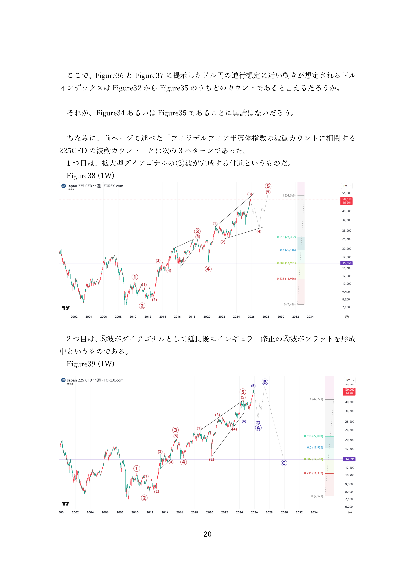
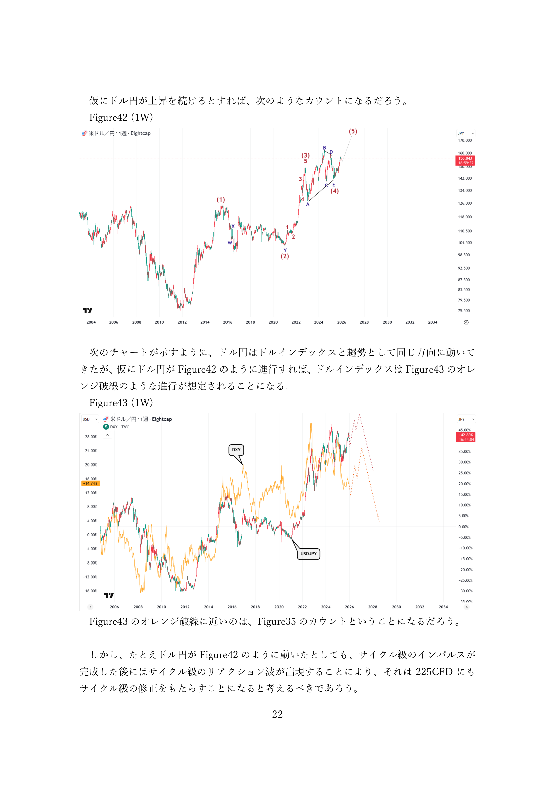
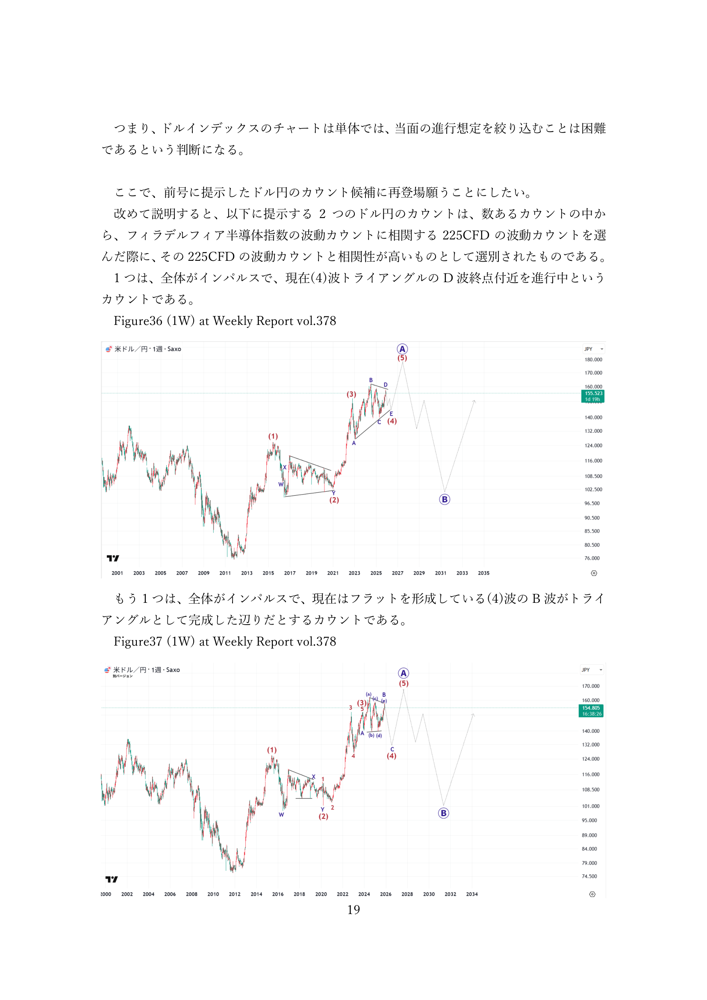

# 週次エリオット波動戦略サマリー (2025-12-21)

> [!NOTE]
> **分析ソース**: Vol.379 (Agent-Native Visionによる画像解析)
> **対象**: 日経225, USD/JPY, S&P500
> **時間軸**: Primary（長期）/ Intermediate（中期）/ Minor（短期）

## 🚨 重要ハイライト
*   **日経225**: 拡大ダイアゴナル進行中。Primary上昇トレンド継続、Intermediateで調整波の可能性。
*   **USD/JPY**: Primary上昇インパルス内でIntermediateトライアングル/フラット修正中。151円台がキー。
*   **S&P500**: Primary/Intermediate共に上昇継続。Minorレベルで調整後に高値更新トライ。

---

## 📊 銘柄別詳細分析

### 1. 日経225 (Nikkei 225)

#### Primary（長期・月足）
*   **波動位置**: Wave (III) or (V) - Expanding Diagonal
*   **方向**: 上昇継続
*   **重要価格**: 38,915（ATH）突破がターゲット

**シナリオ**:

**Main**: 長期上昇トレンドの第3波進行中、38,915突破を目指す

**Sub1**: 拡大ダイアゴナル最終第5波に位置し、高値更新後に大規模調整入り

#### Intermediate（中期・週足）
*   **波動位置**: Wave (4) corrective
*   **方向**: 調整/横ばい
*   **重要価格**: 抵抗帯 38,915 / 支持帯 30,000前半

**シナリオ**:

**Main**: 第(3)波完了後の調整局面、(4)波進行中

**Sub1**: イレギュラーフラット修正でB波が高値を超える展開

**Sub2**: トライアングル修正で時間調整継続

#### Minor（短期・日足）
*   **波動位置**: Wave c or 5
*   **方向**: 短期上昇

**シナリオ**:

**Main**: 調整C波の完了後に新規上昇インパルス形成

**Sub1**: C波延長でさらなる下落

---

### 2. USD/JPY

#### Primary（長期・月足）
*   **波動位置**: Wave (3) Impulse
*   **方向**: 長期上昇
*   **重要価格**: 長期サポート 127.00 - 130.00

**シナリオ**:

**Main**: 2011年底からの大規模インパルス第3波進行中

#### Intermediate（中期・週足）
*   **波動位置**: Wave (4) - Triangle or Flat
*   **方向**: 調整/レンジ
*   **重要価格**: 抵抗帯 151.72-151.90 / 支持帯 140.00

**シナリオ**:

**Main**: トライアングル修正のD波進行中、レンジ継続

**Sub1**: フラット修正のB波完了、C波で140円方向へ下落

**Sub2**: 拡大フラットでB波が152円超え後にC波下落

#### Minor（短期・日足）
*   **波動位置**: Wave d or b
*   **方向**: 短期上昇後に反転リスク

**シナリオ**:

**Main**: レンジ上限でのプライスアクション注視、反転の兆候待ち

---

### 3. S&P 500

#### Primary（長期・月足）
*   **波動位置**: Wave (5) or Y of cycle wave
*   **方向**: 長期上昇
*   **重要価格**: 4,818（ATH）がターゲット

**シナリオ**:

**Main**: サイクル波レベルでの最終上昇波、4,818突破後に大規模調整

**Sub1**: ダブルジグザグのY波として、さらなる延長上昇

#### Intermediate（中期・週足）
*   **波動位置**: Wave (5) or Y
*   **方向**: 上昇チャネル内推移
*   **重要価格**: 抵抗帯 4,800-4,818 / 支持帯 4,500-4,600

**シナリオ**:

**Main**: チャネル上限へのトライ継続

**Sub1**: チャネルブレイクで加速上昇

#### Minor（短期・日足）
*   **波動位置**: Wave v or c
*   **方向**: 短期上昇

**シナリオ**:

**Main**: 高値更新後にPrimary完了、調整入りリスク

**Sub1**: インパルス延長で4,900超えを目指す

