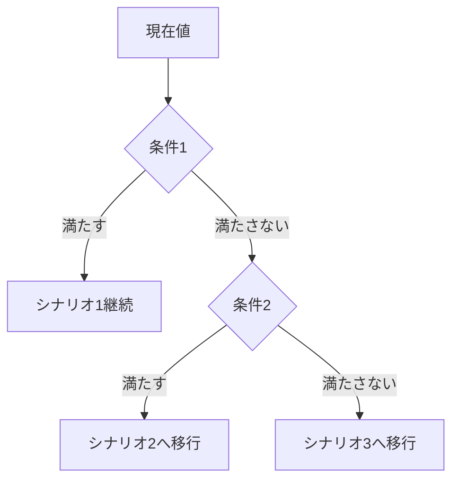

# シナリオ生成プロンプト

> **用途**: 複数の波動シナリオを生成・評価する  
> **対象**: JP225（日経平均先物）

---

## 目的

現在のチャート状況から、複数の波動シナリオを生成し、それぞれの確率と判断基準を提示する。

---

## 入力情報

以下の情報を提供してください：

```
【基本情報】
- 現在値: 
- 時間軸: 日足 / 4時間足 / 1時間足
- 分析期間: 

【価格情報】
- 直近高値: （日付）
- 直近安値: （日付）
- 重要な節目: 

【現在の認識】
- 現在の波動位置（仮説）: 
- 気になる点: 
```

---

## 出力フォーマット

### シナリオ一覧

| # | シナリオ | 確率 | 方向 | 目標 | 損切り |
|---|----------|------|------|------|--------|
| 1 | メイン | XX% | 上昇/下落 | ¥XX,XXX | ¥XX,XXX |
| 2 | 代替A | XX% | 上昇/下落 | ¥XX,XXX | ¥XX,XXX |
| 3 | 代替B | XX% | 上昇/下落 | ¥XX,XXX | ¥XX,XXX |

---

### シナリオ1: [メインシナリオ名]

**確率**: XX%

**波動カウント**:
```
現在: 第X波 → 次: 第Y波
```

**根拠**:
1. [根拠1]
2. [根拠2]
3. [根拠3]

**目標価格**: ¥XX,XXX（フィボナッチXX%）

**損切りライン**: ¥XX,XXX

**シナリオ無効化条件**:
- [条件1] を割り込んだ場合 → シナリオ2へ移行

---

### シナリオ2: [代替シナリオA名]

**確率**: XX%

**このシナリオが有効になる条件**:
- [条件]

**波動カウント**:
```
現在: 第X波 → 次: 第Y波
```

**根拠**:
1. [根拠1]
2. [根拠2]

**目標価格**: ¥XX,XXX

**損切りライン**: ¥XX,XXX

---

### シナリオ3: [代替シナリオB名]

（同様のフォーマット）

---

## シナリオ判断フロー



---

## 判断基準サマリー

| 条件 | 満たす場合 | 満たさない場合 |
|------|-----------|---------------|
| ¥XX,XXXを上抜け | シナリオ1継続 | シナリオ2検討 |
| ¥XX,XXXを下抜け | シナリオ3へ移行 | シナリオ1継続 |
| [条件3] | [アクション] | [アクション] |

---

## 次回確認ポイント

- [ ] ¥XX,XXXに到達したか
- [ ] トレンドラインをブレイクしたか
- [ ] 出来高に変化があったか
- [ ] 時間経過による見直し（XX日後）
